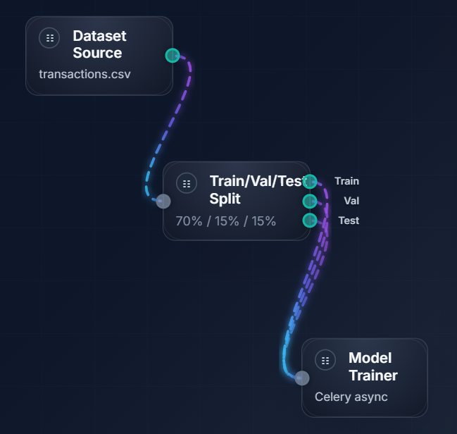

# Skyulf 🐺

[](LICENSE)
[](COMMERCIAL-LICENSE.md)
[](#quick-start)
[](.pre-commit-config.yaml)
[](CONTRIBUTING.md)
[](#key-features)
[](https://codecov.io/gh/flyingriverhorse/Skyulf)
[](https://app.codacy.com/gh/flyingriverhorse/Skyulf/dashboard?utm_source=gh&utm_medium=referral&utm_content=&utm_campaign=Badge_grade)

> ⚠️ **Status:** Active Development. Expect bugs, but also expect rapid progress.

**Machine Learning Operations (MLOps) shouldn't be this hard.**

Skyulf is a self-hosted, privacy-first **MLOps Hub**. It is designed to be the "glue" that holds your data science workflow together—without the glue code. Bring your data, clean it visually, engineer features with a node-based canvas, and train models, all in one place.

Built with a modern stack: **FastAPI** (Backend), **React** (Frontend), **Celery** (Async Jobs), and **Redis**.

## Table of Contents

- [Quick Start](#quick-start)
- [Key Features](#key-features)
- [Roadmap](#roadmap)
- [Version History](#version-history)
- [Workflow Overview](#workflow-overview)
- [Development](#development)
- [Contributing](#contributing)
- [License](#license)

## Quick Start

Prerequisites: **Python 3.10+**

### On Windows PowerShell

**Using pip:**
```powershell
python -m venv .venv
.\.venv\Scripts\Activate.ps1
pip install --upgrade pip
pip install -r requirements-fastapi.txt
python run_fastapi.py
```

**Using uv (Faster):**
```powershell
uv venv
.\.venv\Scripts\Activate.ps1
uv pip install -r requirements-fastapi.txt
python run_fastapi.py
```

The `run_skyulf.py` script will automatically start the FastAPI server.

**Optional: Celery & Redis**
By default, Skyulf uses Celery and Redis for robust background task management. However, for simple local testing or environments where you cannot run Redis, you can disable this dependency.

Add this to your `.env` file:
```ini
USE_CELERY=false
```
When disabled, background tasks (training, ingestion) will run in background threads within the main application process instead of a separate worker.

### With Docker Compose (Recommended)

```powershell
docker compose up --pull=always --build
```

This will start the full stack:
- **FastAPI Backend** (Port 8000)
- **Redis** (Port 6379)
- **Celery Worker** (Background jobs)

**Open:**
- API health — http://127.0.0.1:8000/health
- Docs (dev mode) — http://127.0.0.1:8000/docs

## Skyulf Core Library

The core machine learning logic of Skyulf (preprocessing, modeling, tuning) is available as a standalone library on PyPI. You can use it to build reproducible pipelines in your own scripts or notebooks, independent of the web platform.

```bash
pip install skyulf-core
# or
uv add skyulf-core
```

## Key Features

*   **🎨 Visual Feature Canvas:** A node-based editor to clean, transform, and engineer features without writing spaghetti code. (25+ built-in nodes).
*   **🚀 Modern Backend:** Built on FastAPI for high performance and easy API extension.
*   **⚡ Async by Default:** Heavy training jobs run in the background via Celery & Redis (or background threads)—your UI never freezes.
*   **💾 Flexible Data:** Ingest CSV, Excel, JSON, Parquet, or SQL. Start with SQLite (zero-config) and scale to PostgreSQL.
*   **🧠 Model Training:** Built-in support for Scikit-Learn models with hyperparameter search (Grid/Random/Halving) and optional Optuna integration.
*   **📦 Model Registry & Deployment:** Version control your models, track metrics, and deploy them to a live inference API with a single click.
*   **📊 Experiment Tracking:** Compare multiple runs side-by-side with interactive charts, confusion matrices, and ROC curves.

## Roadmap

We have a clear vision to turn Skyulf into a complete **App Hub** for AI.

*   **Phase 1: Polish & Stability** (Current Focus) - Architecturing, type safety, and documentation.
*   **Phase 2: Deepening Data Science** - Advanced EDA, Ethics/Fairness checks, Synthetic Data, and Public Data Hubs, more models, NLP and more.
*   **Phase 3: The "App Hub" Vision** - Plugin system, GenAI/LLM Builders, and Deployment.
*   **Phase 4: Expansion** - Real-time collaboration, Edge/IoT export, and Audio support.

👉 **[View the full ROADMAP.md](./ROADMAP.md)** for details.

## Version History

We maintain a detailed changelog of all major updates, new features, and architectural changes.

👉 **[View the full VERSION_UPDATE.md](./VERSION_UPDATE.md)** for the complete history.

## Workflow Overview

The high-level flow from dataset to model training inside Skyulf:

<p align="center">
	
	<br />
	<em>Dataset source → train/val/test split → background model training (Celery)</em>
</p>

## Development
- Configuration via `config.py` with sane defaults (SQLite, dev CORS)
- Lifespan hooks initialize the async DB engine automatically
- Tests under `tests/` cover core feature engineering and training helpers
- `docker-compose.yml` to run API + Redis (+ Celery worker)

## Contributing

We welcome contributions! See [CONTRIBUTING.md](CONTRIBUTING.md) for setup and workflow guidance, and read our [Code of Conduct](CODE_OF_CONDUCT.md).

## License

Skyulf uses a split licensing model to balance open standards with sustainable development:

*   **Backend & Core:** [Apache 2.0](LICENSE) (Permissive) - Ideal for integration and enterprise use.
*   **Frontend (Feature Canvas):** [GNU AGPLv3](frontend/feature-canvas/LICENSE) (Copyleft) - Ensures UI improvements are shared back to the community.

**Commercial Use:**
No separate commercial license is required for internal use or building proprietary plugins on the backend.
However, if you are building a proprietary SaaS that modifies the frontend and cannot comply with AGPLv3, please see [`COMMERCIAL-LICENSE.md`](COMMERCIAL-LICENSE.md) for partnership options.

---

If you'd like to contribute, sponsor, or request a commercial license, please star the repo, open a Discussion or issue, or see `.github/FUNDING.yml` for sponsorship options.

---

## 🤝 Join the Journey

I'm building this because I love it, but I can't do it alone forever.
*   **Try it out:** Clone the repo, run it, break it.
*   **Give Feedback:** Tell me what sucks. Tell me what you love.
*   **Contribute:** Even a typo fix in the README helps.

Let's build the simplest, most powerful MLOps hub together.

> "Not all those who wander are lost." — J.R.R. Tolkien 

---

© 2025 Murat Unsal — Skyulf Project  
SPDX-License-Identifier: Apache-2.0

