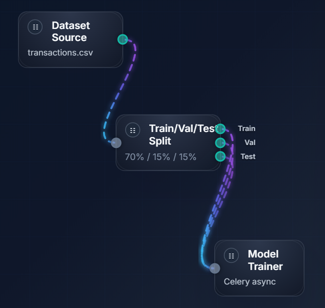

# Skyulf

<p align="center">
  
</p>

[](LICENSE)
[](frontend/ml-canvas/LICENSE)
[](skyulf-core/LICENSE)
[](COMMERCIAL-LICENSE.md)
[](#quick-start)
[](https://github.com/flyingriverhorse/Skyulf/actions/workflows/ci.yml)
[](https://github.com/flyingriverhorse/Skyulf/actions/workflows/docs.yml)
[](.pre-commit-config.yaml)
[](https://github.com/psf/black)
[](CONTRIBUTING.md)
[](#key-features)
[](https://codecov.io/github/flyingriverhorse/Skyulf)
[](https://app.codacy.com/gh/flyingriverhorse/Skyulf/dashboard?utm_source=gh&utm_medium=referral&utm_content=&utm_campaign=Badge_grade)
[](https://pypi.org/project/skyulf-core)
[](https://github.com/flyingriverhorse/Skyulf/issues) 
[](https://github.com/flyingriverhorse/Skyulf/graphs/contributors)

> **Skyulf:** The Visual MLOps Builder

Skyulf is a self-hosted, privacy-first. It is designed to be the "glue" that holds your data science workflow together (soon with export project option). Bring your data, clean it visually, engineer features with a node-based canvas, and train models, all in one place.

## What is the meaning of Skyulf?

I named it Skyulf after two ideas. Sky is the open space above Earth, where the sun, moon, stars, and clouds live. Ulf means “wolf,” with Nordic roots, and the wolf is also a strong symbol in Turkic tradition. Together it fits the project: independent and helpful to community.

## Table of Contents

- [Quick Start](#quick-start)
- [Using Skyulf as a Library](#using-skyulf-as-a-library)
- [Key Features](#key-features)
- [Version History](#version-history)
- [Workflow Overview](#workflow-overview)
- [Development](#development)
- [Contributing](#contributing)
- [License](#license)

## Quick Start

Prerequisites: **Python 3.12**

### Fastest Path (One Command)

**Windows:** Double-click `start.bat`  
**macOS/Linux:** Run `./start.sh`

These scripts auto-create a virtualenv, install deps, generate a `.env` with safe defaults (SQLite, no Redis), and launch the server. Open w when ready.

### On Windows PowerShell (Manual)

**Using pip:**
```powershell
python -m venv .venv
.\.venv\Scripts\Activate.ps1
pip install --upgrade pip
pip install -r requirements-fastapi.txt
python run_skyulf.py
```

**Using uv (Faster):**
```powershell
uv venv
.\.venv\Scripts\Activate.ps1
uv pip install -r requirements-fastapi.txt
python run_skyulf.py
```

The `run_skyulf.py` script will automatically start the FastAPI server.

**Optional: Celery & Redis**
By default, Skyulf uses Celery and Redis for robust background task management. However, for simple local testing or environments where you cannot run Redis, you can disable this dependency.

Add this to your `.env` file:
```ini
USE_CELERY=false
```
When disabled, background tasks (training, ingestion) will run in background threads within the main application process instead of a separate worker.

### S3 Configuration (Optional)
To enable S3 integration for data and artifacts, add these to your `.env`:
```ini
AWS_ACCESS_KEY_ID=your_key
AWS_SECRET_ACCESS_KEY=your_secret
AWS_REGION=us-east-1
S3_BUCKET_NAME=your-bucket
# Optional: Upload local training artifacts to S3
UPLOAD_TO_S3_FOR_LOCAL_FILES=true
# Optional: Force local storage even for S3 data
SAVE_S3_ARTIFACTS_LOCALLY=false
```

### With Docker Compose (Recommended)

```powershell
docker compose up --pull=always --build
```

This will start the full stack:
- **FastAPI Backend** (Port 8000)
- **Redis** (Port 6379)
- **Celery Worker** (Background jobs)

**Open:**
- API health — http://127.0.0.1:8000/health
- Docs (dev mode) — http://127.0.0.1:8000/docs

## Skyulf Core Library

The core machine learning logic of Skyulf (preprocessing, modeling, tuning) is available as a standalone library on PyPI. You can use it to build reproducible pipelines in your own scripts or notebooks, independent of the web platform.

```bash
# Base (lightweight)
pip install skyulf-core

# EDA-focused (recommended for profiling + charts)
pip install skyulf-core[eda,viz]

# Full optional feature set
pip install skyulf-core[eda,viz,tuning,preprocessing-imbalanced,modeling-xgboost]

# or
uv add skyulf-core

# EDA-focused with uv
uv add "skyulf-core[eda,viz]"

# Full optional feature set with uv
uv add "skyulf-core[eda,viz,tuning,preprocessing-imbalanced,modeling-xgboost]"
```

## Using Skyulf as a Library

Skyulf isn't just a web application; its core logic is available as a standalone Python library (`skyulf-core`). You can use it in your own scripts or Jupyter notebooks for powerful EDA and pipeline building. Using EDA is a great way to get started and it is really easy to use.

### Example: Automated EDA

```python
import polars as pl
from skyulf.profiling.analyzer import EDAAnalyzer
from skyulf.profiling.visualizer import EDAVisualizer

# 1. Load Data
df = pl.read_csv("your_dataset.csv")

# 2. Run Analysis
analyzer = EDAAnalyzer(df)
profile = analyzer.analyze(
    target_col="target",
    task_type="Classification", # Optional: Force "Classification" or "Regression"
    date_col="timestamp",       # Optional: Manually specify if auto-detection fails
    lat_col="latitude",         # Optional
    lon_col="longitude"         # Optional
)

# 3. Visualize Results (The Easy Way)
# This single class handles all the rich terminal output and matplotlib plots
viz = EDAVisualizer(profile, df)

# Print the dashboard
viz.summary()

# Show the plots
viz.plot()
```

For detailed examples including **Time Series**, **Geospatial Analysis**, and **Causal Inference**, see the [EDA User Guide](docs/user_guide/eda_profiling.md).

## Key Features

*   **🎨 Visual Feature Canvas:** A node-based editor to clean, transform, and engineer features without writing spaghetti code. (25+ built-in nodes).
*   **Automated EDA:** Professional-grade Exploratory Data Analysis with interactive charts, causal discovery (DAGs), decision trees for rule extraction, segmentation, outlier detection, and statistical alerts.
*   **Drift Analysis** Built on the EDA engine to monitor data and model drift over time with statistical tests and visualizations.
*   **High-Performance Dual Engine:** Built on **FastAPI** and **Polars** for lightning-fast ETL (Extract/Transform/Load) operations. Data strictly bypasses Pandas overhead by using zero-copy Apache Arrow conversions directly to NumPy via our `SklearnBridge` for advanced ML nodes.
*   **⚡ Async by Default:** Heavy training jobs run in the background via Celery & Redis (or background threads)—your UI never freezes.
*   **💾 Flexible Data:** Ingest CSV, Excel, JSON, Parquet, or S3. Backend storage starts with SQLite (zero-config) and scales to PostgreSQL.
*   **☁️ S3 Integration:** Full support for S3-compatible storage (AWS, MinIO) for data ingestion, artifact storage, and model registry.
*   **🧠 Model Training:** Built-in support for Scikit-Learn models with hyperparameter search (Grid/Random/Halving) and optional Optuna integration.
*   **📦 Model Registry & Deployment:** Version control your models, track metrics, and deploy them to a live inference API with a single click.
*   **📊 Experiment Tracking:** Compare multiple runs side-by-side with interactive charts, confusion matrices, and ROC curves.
*   **📓 Notebook Export:** Export any canvas pipeline to a fully self-contained Jupyter notebook with one click — two modes available:
    *   **Full mode** — one cell per preprocessing node so you can tweak parameters, inspect intermediate state, and understand every transformation.
    *   **Compact mode** — single `SkyulfPipeline.fit()` call per branch, ideal for sharing reproducible results or running in CI. Multi-branch canvases get a coloured `(branch × split)` comparison table.
    *   **Advanced Tuning nodes** are properly wired with `TuningCalculator`/`TuningApplier` wrappers so Optuna/grid/random search actually runs in the notebook — with per-trial progress printed to cell output.

## Version History

We maintain a detailed changelog of all major updates, new features, and architectural changes.

👉 **[View the full CHANGELOG.md](./CHANGELOG.md)** for the version index, or browse the detailed series files in [`changelog/`](./changelog/).

## Workflow Overview

The high-level flow from dataset to model training inside Skyulf:

<p align="center">
	
	<br />
	<em>Dataset source → train/val/test split → background model training (Celery)</em>
</p>

## Development
- Configuration via `backend/config/` package with domain mixins (SQLite, dev CORS)
- Lifespan hooks initialize the async DB engine automatically
- Tests under `tests/` cover core feature engineering and training helpers
- `docker-compose.yml` to run API + Redis (+ Celery worker)

## Contributing

We welcome contributions! See [CONTRIBUTING.md](CONTRIBUTING.md) for setup and workflow guidance, and read our [Code of Conduct](CODE_OF_CONDUCT.md).

## License

Skyulf uses a split licensing model to balance open standards with sustainable development:

*   **Backend (FastAPI / API server):** [GNU AGPLv3](LICENSE) (Copyleft) - If you run this as a network service you must release your full stack's source code, or obtain a commercial license.
*   **Frontend (ML Canvas):** [GNU AGPLv3](frontend/ml-canvas/LICENSE) (Copyleft) - Same network-service copyleft requirement.
*   **Core Library (`skyulf-core`):** [Apache 2.0](skyulf-core/LICENSE) (Permissive) - Use freely in any project, open or commercial.

**Commercial Use:**
If you want to run the backend or frontend as part of a proprietary product or SaaS **without** open-sourcing your stack, you need a commercial license exception.
See [`COMMERCIAL-LICENSE.md`](COMMERCIAL-LICENSE.md) for partnership options.

**Existing versions:** Releases v0.5.15 and earlier were published under Apache 2.0. Those versions remain under their original license. AGPLv3 applies from v0.5.16 onwards.

---

If you'd like to contribute, sponsor, or request a commercial license, please star the repo, open a Discussion or issue, or see `.github/FUNDING.yml` for sponsorship options.

---

## 🤝 Join the Journey

I'm building this because I love it, but I can't do it alone forever.
*   **Try it out:** Clone the repo, run it, break it.
*   **Give Feedback:** Tell me what sucks. Tell me what you love.
*   **Contribute:** Even a typo fix in the README helps.

Let's build the simplest, most powerful MLOps hub together.

> "Not all those who wander are lost." — J.R.R. Tolkien 

---

© 2025–2026 Murat Unsal — Skyulf Project  
SPDX-License-Identifier: AGPL-3.0-or-later (backend/frontend) AND Apache-2.0 (skyulf-core)

