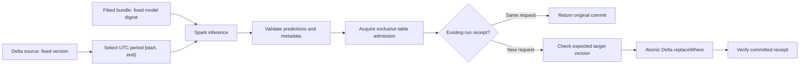

# Monthly Spark inference and Delta publication

`run_batch` reads a pinned Delta snapshot, applies a fitted inference bundle,
and atomically replaces the requested period in a precreated Delta table.
It reuses both [Spark inference modes](inference_flow.md), without refitting
feature engineering or the model. Scheduling remains the caller's responsibility.

Validation covers **local Spark 4.0.3 with Delta Lake 4.0.0 on Linux** and a live
Databricks serverless Spark Connect 4.2.0 regression probe using Unity Catalog
tables. The live probe verified monthly replacement, replay, empty protection,
prior-period preservation and worker wheel contents. Separate live jobs verified
exclusive admission and a restricted principal's target-write denial, with
unchanged data/version and released ownership afterward. This is a bounded
regression workflow, not certification of every runtime or production workload.
Tracking and registry remain optional and independent of the engine.

This runner currently requires Spark. Delta itself can also be written from
pandas/Polars through [Arrow and delta-rs](https://delta-io.github.io/delta-rs/usage/writing/); a local-engine Skyulf Delta sink
with the same period/retry guarantees is planned separately as SM-15L. Choosing
Delta as the output format should not force the inference engine to be Spark.
Unity Catalog access and supported Delta features need validation for each writer.

The runner caches predictions when the runtime supports `persist()`. If
Databricks serverless rejects that operation with its specific structured
restriction, validation and publication use the distributed frame without a
cache, and no `unpersist()` call is made. Separate actions can recompute
predictions from the pinned source and frozen bundle; this trades repeated work
for compatibility and never collects the dataset into driver memory. Other
cache failures propagate before publication.



## Prepare the inputs

Use an existing raw `InferenceBundle`, produced through
[local or Spark feature engineering](inference_flow.md). Its supported FE and
input schema restrictions still apply. A table name is required as `source`;
an arbitrary DataFrame cannot prove which snapshot it represents.

Both tables must already exist and use Delta. For a regression model with one
`double` prediction, this is an example target schema:

```sql
CREATE TABLE analytics.customer_predictions (
    customer_id BIGINT,
    event_time TIMESTAMP,
    prediction DOUBLE,
    __skyulf_run_id STRING,
    __skyulf_model_name STRING,
    __skyulf_model_version STRING
) USING DELTA;
```

Use the actual prediction columns and types from the bundle for classification,
including class-ordered probability columns. The runner checks exact names and
types against the target, then uses the target's column order. It does not create
or evolve tables. Source keys must be non-null and unique within the selected
period. `event_time` must be Spark `timestamp`, not a date, string or
`timestamp_ntz`. Null period timestamps are rejected anywhere in the source.

## Run a period

This example assumes source version `42` was committed before the explicit
February 2 cutoff, and the target's current version is `0`. Supply the actual
versions for your data. Resolve any registry alias once before constructing
the spec, then bind its concrete version and digest to the downloaded bundle.
The runner checks the bundle digest; it does not independently contact the
registry to verify the caller's model name/version association.

```python
from datetime import UTC, datetime
from importlib.metadata import version

from skyulf.core.execution import ExecutionOptions
from skyulf.integrations.databricks import BatchSpec, run_batch
from skyulf.integrations.databricks.admission import LocalTableLock

spec = BatchSpec(
    period_start=datetime(2026, 1, 1, tzinfo=UTC),
    period_end=datetime(2026, 2, 1, tzinfo=UTC),
    as_of=datetime(2026, 2, 2, tzinfo=UTC),
    row_keys=("customer_id",),
    output_table="analytics.customer_predictions",
    model_name="customer-risk",
    model_version="7",
    model_digest=bundle.semantic_digest,
    source_version=42,
    code_version=version("skyulf-core"),
    run_id="customer-risk-2026-01-v7",
    expected_target_version=0,
    mode="native_features",  # alternatively: "python_pipeline"
)

result = run_batch(
    spark,
    spec,
    source="analytics.customer_features",
    bundle=bundle,
    options=ExecutionOptions("spark"),
    admission=LocalTableLock("/var/lib/skyulf/publish-locks"),
)
print(result.commit_version, result.output_count, result.replayed)
```

`LocalTableLock` is for local Spark drivers on **one host**, all sharing the same
lock directory. Use a writable directory managed for this purpose. Lock files
are intentionally retained; do not delete them while publishers may run. The
OS releases ownership when the process exits. This implementation is rejected
on distributed Spark masters, including `local-cluster`.

### Shared Delta admission

`DeltaTableAdmission` coordinates participating publishers through one shared
Delta control table. Real local Delta tests cover independent Spark sessions and
simultaneous claims. A live serverless test also rejected a second job while the
first held ownership, then allowed the first job to commit. Operators must
provision the authority once, before starting publishers:

```python
from skyulf.integrations.databricks.delta_admission import DeltaTableAdmission

target_id = spark.sql(
    "DESCRIBE DETAIL analytics.customer_predictions"
).first()["id"]
# One-time provisioning only; do not overwrite an existing authority.
spark.createDataFrame(
    [(target_id, None)], "target_id string, owner string"
).write.format("delta").mode("errorifexists").saveAsTable(
    "analytics.customer_predictions_admission"
)

admission = DeltaTableAdmission(spark, "analytics.customer_predictions_admission")
# Supply admission=admission to run_batch(...).
```

The provider requires exactly one row with the immutable output table ID and a
nullable string owner. It uses a conditional Delta UPDATE to claim ownership,
checks the committed token before entering, and clears only its own token after
publication and receipt verification. A competing publisher fails with
`BatchConflictError`; the provider does not automatically retry it.

Every publisher must use the same authority. Keep its identity, schema and
target binding fixed. External control-row edits, DDL and writers bypassing this
protocol are outside the guarantee. Grant operators provisioning rights and
publishers only the required read/update access under your platform's policy.

In Unity Catalog, the scoring identity needs `USE CATALOG` and `USE SCHEMA`,
`SELECT` on the source, and `SELECT`/`MODIFY` on the target and control tables.
Loading a registered model additionally needs its own model access, including
`EXECUTE`; table access does not grant model access. Provisioning new tables is
an operator step, so the scoring identity does not need schema-wide creation
rights for an existing source, target and authority.

Admission does not bypass target permissions. A caller may acquire the control
row and still be denied `MODIFY` on the prediction table. The sink preserves the
underlying runtime error as the cause of `DeltaPublishError`, and the admission
context releases its claim when that write fails normally.

Ownership never expires. A driver crash or an uncertain acquisition can leave a
claim behind: inspect the job and prove that the original driver can no longer
publish before an operator clears it. Never clear a live owner's claim to unblock
another job. The sink has no fencing-token mechanism, so time-based expiry would
allow an old publisher to write after a new publisher acquired ownership.

The provider uses Spark SQL parameter markers (Spark 3.4+) without a SparkContext
or data caching requirement. Classic Spark explicitly refreshes the control
table before identity reads. When serverless rejects `REFRESH TABLE` with its
specific unsupported-operation condition, the provider proceeds with fresh
Delta identity/ownership reads; user-managed cache APIs are unavailable there.
Conditional updates and unique-token verification still control ownership.
Other errors propagate. The platform gate records tested environments rather
than assuming all compute types support the same APIs.

## Time and reproducibility

The period is half-open: the start is included and the end is excluded. Aware
datetimes are converted to UTC instants independently of the Spark session's
timezone. For a business calendar month, construct boundaries explicitly:

```python
from zoneinfo import ZoneInfo

zone = ZoneInfo("Europe/Vilnius")
start = datetime(2026, 3, 1, tzinfo=zone)  # 2026-02-28 22:00 UTC
end = datetime(2026, 4, 1, tzinfo=zone)    # 2026-03-31 21:00 UTC
# Pass these as period_start/period_end and business_timezone="Europe/Vilnius".
```

`business_timezone` records calendar intent; it does not reinterpret the supplied
instants. Naive datetimes and nonexistent local DST times are rejected. For an
ambiguous local time, select the intended `fold` when constructing the datetime.

`as_of` is a **snapshot availability cutoff**. The runner checks the selected
Delta version's commit timestamp and then reads that exact `versionAsOf`. A newer
snapshot or expired history fails. This does not establish point-in-time
correctness of upstream feature joins: the source producer must implement its
own historical feature and availability rules. No timestamp-column filter can
retroactively reconstruct overwritten source rows. For a backfill, explicitly
choose the intended model version and source snapshot; scheduler time is never
silently substituted for either the period or cutoff.

The Delta commit's `userMetadata` records the full request fingerprint, UTC
period/cutoff, source table ID/version/commit time, model name/version/digest,
installed Skyulf version, run ID and input/output counts. Only the three
`__skyulf_*` columns shown above are repeated on each output row.

## Retries, conflicts and empty periods

- Reuse the **same spec and logical run ID** for a retry. A matching committed
  receipt returns its original version and counts with `replayed=True`. It does
  not write again, even if a newer run has since recomputed the same period.
  The runner still reads and validates the source and bundle before checking
  the sink receipt, so retries require those inputs to remain available.
- Reusing a run ID with a changed request raises `BatchConflictError`.
- To intentionally recompute a period, choose a new run ID and explicitly set
  `expected_target_version` to the version you have reviewed. Any intervening
  target commit makes that expectation stale. Do not automatically refresh it
  and retry a conflict: that would silently authorize replacing another run.
- Empty output fails unless `allow_empty=True`. With that explicit setting,
  the same atomic replacement removes the selected period and records a receipt.
  Other periods remain unchanged. Out-of-period/null output and incorrect run
  metadata are rejected before writing.
- Success is returned only after verifying the committed receipt. If the client
  loses contact after commit, the outcome may be unknown: retry the unchanged
  request to check the receipt. Preserve Delta history and transaction retention
  for the supported retry window; this is not unlimited replay storage.

The first mode is `replace_period`. Append, key `MERGE`, automatic schema
evolution, streaming and endpoint deployment remain unsupported here. The sink
helper is lower-level: direct callers must supply output and a manifest with
the same provenance guarantees as `run_batch`.

## Local verification

The repository's `skyulf-core/examples/databricks_delta_smoke.py` accepts an
existing Spark session, a pinned raw `y=2*x` regression bundle and an existing
test namespace. Its `run_smoke(...)` creates and prints three unique Delta table
names, verifies monthly publication/replay and explicit empty replacement, and
retains the tables for inspection. Use only a test namespace where you are
authorized to create and modify tables. The returned report includes table IDs,
versions and receipts and deliberately keeps `platform_gate_complete=False`.
Unexpected runtime failures propagate; the probe does not change runtime settings
or replace admission with a no-op provider.

Use Linux (or WSL) with Python 3.12 and Java 17. Windows Spark inference alone
does not establish that Hadoop's filesystem support can write Delta locally.
Keep this test environment separate from Databricks Runtime's bundled packages.

```bash
uv venv .venv-delta
uv pip install --python .venv-delta/bin/python -r requirements-delta.txt
SKYULF_REQUIRE_DELTA=1 .venv-delta/bin/python -m pytest \
  skyulf-core/tests/integrations/test_batch_contract.py \
  skyulf-core/tests/integrations/test_batch_admission.py \
  skyulf-core/tests/integrations/test_delta_publish.py -q -o addopts=
```

The fixture configures the Delta extension/catalog and creates only temporary
test tables. Its first launch downloads the matching Maven jars. For an offline
run, `SKYULF_DELTA_JARS` may point to a prepared directory containing compatible
Delta and transitive dependency jars. Required lanes fail when Delta is missing;
the base environment skips optional Delta tests.

Relevant upstream behavior: [Delta selective overwrite and idempotent writes](https://docs.delta.io/delta-batch/)
and [Delta concurrency control](https://docs.delta.io/concurrency-control/).
