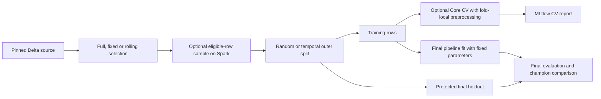

# Local-engine Databricks Bundle

For job-screen instructions and lifecycle diagrams, use the
[operator walkthrough](databricks_bundle_walkthrough.md).

The custom Skyulf template generates one editable Bundle with `dev`, `test`,
`syst` and `prod` targets. It fits and predicts with pandas or Polars. Spark
reads bounded Unity Catalog Delta rows and publishes predictions; local
feature engineering and model prediction are not distributed Spark work.

Initialize a project from a Skyulf checkout:

```powershell
databricks bundle init skyulf-core/templates/databricks --output-dir ./generated
```

Initialization follows five sections: **data, model,
evaluation CV, lifecycle, compute**. It asks for existing record keys (including
composite keys), source columns, independent data-window/split choices, optional
training sampling, date parsing, scoring/promotion policies and job settings. Serverless is the default. Reviewable
noninteractive examples are in `skyulf-core/templates/databricks/examples/`. The generated
project has its own `databricks.yml`; Skyulf's root has no Bundle config.

Regression starts with Core `linear_regression` and `heldout_rmse`;
classification starts with `logistic_regression` and `heldout_accuracy`.
The pipeline remains editable: add registered Core preprocessing nodes and
choose a task-compatible model. With a JSON init file, `max_rows` and
`max_input_mb` are positive integer **strings**; the generated workflow stores
them as numbers. Enter `record_key_columns` as `customer_id, observation_id`
and `input_columns` as `income, age`, with no brackets or quotes. The generated
workflow stores ordered JSON arrays automatically. Init examples now use these
plain-text fields and task-specific `regression_model`/`classification_model`
and `regression_metric`/`classification_metric`; regenerate old init inputs.

Saved-artifact holdout evaluation uses sequential joblib prediction so parallel
Random Forest tree summation does not introduce last-bit metric differences into
exact approval evidence. This affects evaluation only: model hyperparameters and
normal training/batch inference parallelism are retained. Arbitrary numerical
runtimes may still be nondeterministic and must pass replay checks.

### Guided setup and offline preview

Setup follows your answers; it does not inspect source tables or sample rows.
Random full-snapshot training hides observation-date questions. Result-availability
questions appear only when you enable that separate filter. CV, scheduled training
and policy-cluster details likewise appear only when selected.

For each date column you actually use, declare how it is stored:

| Your answer | Follow-up questions |
| --- | --- |
| `timestamp`: database timestamp representing an instant | No text format, source timezone or date-only question |
| `local_timestamp`: database clock time without a timezone | Which timezone this clock belongs to |
| `date`: day with no clock time | Source timezone, then whether to treat the day as midnight or reject it |
| `text`: dates stored as strings | Whether the text contains a date only, local date/time, or date/time with an offset; then its format and only the applicable timezone/date-only questions |

For example, date-only text `2026-08-10` asks for its format, timezone and
permission to use 00:00. Text `2026-08-10T14:30:00+02:00` asks for its format
but not another timezone or midnight rule. Initialization fields
`event_time_kind`/`result_time_kind` and `event_text_kind`/`result_text_kind`
control these questions only; the generated workflow keeps the existing parsing
contract. Runtime still validates actual values against your declared rules.

The initializer asks for two **input** tables. `source_table_name` contains the
training examples and known answers. `score_source_table_name` contains records
to predict; leave it blank to reuse the training input. Neither is the output.
Choose the result name in the `prediction_table_name` setup question, for example
`customer_predictions`. It becomes `prediction_table` in the configured output
schema, with any target resource suffix. Blank uses `<project_name>_predictions`.

| Question | Meaning and example |
| --- | --- |
| Training version | A saved Delta table snapshot from the table's History, such as version 12. This pins the input data for repeatable manual training; it is not model v12. `null` means fill it before manual training. Scheduled training resolves the latest snapshot. |
| Source selection | `full_snapshot`: use all eligible rows from that snapshot. `fixed_window`: use observation dates between your boundaries. `rolling_calendar`: derive recent complete months per scheduled invocation. `auto`: full snapshot for random splitting, rolling calendar for temporal splitting. |
| Result availability column | A column such as `claim_confirmed_at`, recording when that row's answer became known. Only needed if availability filtering is enabled. |
| Result cutoff | Keep answers known **by** this instant, including equality. For a cutoff of September 15, an answer confirmed September 20 is excluded even if the observation occurred in August. Scheduled runs use their invocation time. |
| Date format | For a text value `10/08/2026 14:30`, use `%d/%m/%Y %H:%M` (day/month/year hour:minute). For `2026-08-10`, use `%Y-%m-%d`. Database timestamp/date columns do not need a text format. |
| Source timezone | For values such as `2026-08-10 14:30` with no offset, specify where that clock time belongs, e.g. `Europe/Copenhagen`. Offset-bearing values such as `2026-08-10T14:30:00+02:00` identify their offset already. |
| Date-only policy | `reject` stops on values without clock time. `midnight` interprets `2026-08-10` as 00:00 in the explicitly selected source timezone. |
| Training sample | `10000` selects up to 10,000 eligible rows before splitting; with a 20% test split this usually means 8,000 train and 2,000 test. `null` uses all eligible rows within read limits. Prediction never samples. |
| CV | With five folds, train/evaluate five fold-specific copies using training rows only. Learned preprocessing is fitted within each fold. The final test set remains separate; this does not search for better model settings. |
| Cron timezone | The timezone of the job clock. A 03:00 schedule with `Europe/Copenhagen` uses Copenhagen time, including daylight saving. This does not interpret source dates or change the selected data window. |

For training every six months on January 1 and July 1 at 03:00, choose
`scheduled` and enter `0 0 3 1 1,7 ?`. The cron is the schedule; nothing
overrides it with a second monthly timer. The current runtime action name
`train_monthly` describes automatic snapshot/window selection and does not impose
monthly execution. `monthly_lookback_months` separately controls how many complete
months of data a rolling window reads. Independent score scheduling is SM-34.

| Section | What you choose |
| --- | --- |
| Basics/data | Engine/task, UC names, keys/features/target, snapshot pin, final holdout, independent source window, availability/date parsing, input limits and optional sample |
| Model | A menu containing only models for the selected regression/classification task; defaults remain editable in the generated file |
| Evaluation CV | Enable, folds, method, shuffle and seed; evaluates fixed parameters with fold-local preprocessing |
| Lifecycle | Metric/gates, manual/automatic promotion, score selector/handoff and enabled retraining cron |
| Compute | Serverless or approved policy cluster and cost tags |

Preprocessing is edited in the generated **`src/preprocessing.py`** file, not in
the initializer or JSON. `build_preprocessing()` returns normal Core steps in
execution order. Keep the JSON `pipeline.preprocessing` list empty.

```python
def build_preprocessing():
    """Fit numeric cleanup and scaling with the selected Core engine."""
    return [
        {"name": "impute", "transformer": "SimpleImputer",
         "params": {"columns": ["income", "age"], "strategy": "mean"}},
        {"name": "scale", "transformer": "StandardScaler",
         "params": {"columns": ["income", "age"]}},
    ]
```

Select per-step columns when mixing numeric and categorical features. For your
own logic, define top-level Calculator/Applier classes in the same file and add
`custom_step("my_step", MyCalculator, MyApplier, params={...})` to this list.
The generated file includes a working mean-centering example for pandas/Polars;
add `example_custom_step("income")` to enable it. Fit returns learned state;
apply uses it without learning again. Preserve row count/order and implement
the engines your project uses. CV refits the custom step within every fold.

Training saves the exact Python source with the fitted artifact. Both local
and MLflow loading restore this saved source, including custom classes. Changing
the project file affects future training; score, approve and rollback continue
using saved model code/state. Different source versions use distinct module
identities. This supports a self-contained file up to 64 KiB, with imports from
installed packages. Sibling files and new package dependencies are not packaged
automatically. Only load trusted code/models, as with existing pickle artifacts.
Broader project packaging, row filtering/output rules, Optuna and multiple model
branches remain later tasks.

From the generated project, with the matching Core wheel installed locally:

```powershell
python src/preview.py
python src/preview.py --list-models
python src/preview.py --list-preprocessors
python src/preview.py --action train
```

Preview executes the trusted Python recipe to resolve its steps. Keep data access
and training out of module-level code and `build_preprocessing()`. The preview
shows the actual pipeline, input selection, final holdout, CV and
score/promotion policies. The default allows a draft with missing training pins
and reports what is missing. `--action train` checks manual readiness;
`--action train_monthly` checks automatic window selection. Both reuse job preflight.
This is an offline configuration check, not a test of data values, parameter
combinations, permissions or worker dependencies. Model/node metadata comes from
Core rather than a duplicated Bundle algorithm catalog.

Preview defaults to the generated dev bindings. To inspect another target, pass
`--catalog`, `--input-schema`, `--output-schema`, `--metadata-schema` and
`--resource-suffix` matching that target's resolved Bundle variables. Preview does
not resolve target YAML or workspace `${...}` substitutions. Run the real Bundle's
`validate --strict` as well before deployment.

Editable model parameters, for example:

```json
"modeling": {
  "type": "random_forest_regressor",
  "params": {"n_estimators": 100, "max_depth": 8, "random_state": 42}
}
```

Published initializer examples now include
`guided-classification-init.example.json` (Polars, random forest,
stratified CV and explicit sample) and `random-window-init.example.json`
(random holdout inside an observation window, separate Copenhagen event and
Vilnius result parsing). Replace example table/column names and snapshot pins
with real values. A default model ID or empty parameter object uses Core defaults.

### Local input limits

`max_rows` bounds the rows read into the local process before train/test splitting.
Without sampling it applies after any observation-window selection, but before
result-availability filtering. An overflow fails; the reader never silently
truncates data. Explicit sampling is available as described below.

`max_input_mb` defaults to `64`. One unit is 1 MiB (1,048,576 bytes). It bounds
measured decoded input/serialized row sizes and local frames; it does not cap
Spark's scan, total process RAM, preprocessing expansion or model training RAM.
The existing scoring services also check bounded prediction frames. Row count
alone cannot predict size: wide numeric tables and long strings cost more.

```json
{
  "max_rows": 100000,
  "max_input_mb": 256
}
```

These are illustrative limits, not a claim that every 100,000-row dataset fits
256 MiB. Training, scoring and approval convert this value to bytes internally.
Approval may tighten but never relax the saved training budget. The lower-level
Python SDK still accepts `max_bytes`; Bundle workflow settings use only
`max_input_mb`. Replace an old Bundle `"max_bytes": 67108864` with
`"max_input_mb": 64`; no legacy alias is accepted. In an initializer file use
`"max_input_mb": "64"`; generated workflow JSON stores the number `64`.

### Record identity and result availability

New workflow JSON uses the following names:

```json
{
  "record_key_columns": ["customer_id", "observation_id"],
  "event_column": "observation_date",
  "target_column": "claim_amount",
  "result_available_at_column": "result_confirmed_at"
}
```

The key columns identify a source record and are copied to prediction output.
They do not create an ID, become features, or implicitly define CV groups.
`event_column` names the source observation timestamp; `start`, `holdout_start`
and `cutoff` are boundaries applied to that column. `result_available_at_column`
names each row's actual result-availability timestamp. Different rows can have
different availability dates. With `filter_unavailable_results: true`, exclude
unknown results and results later than the independent `result_cutoff`. Skyulf does not invent
those timestamps or fill them with the job's execution time.

Use `record_key_columns` and `result_available_at_column` in initialization
files. The default example identity column is `entity_id`; date mappings default
to null. Initialization does not create columns or generate timestamps.

The same names are used throughout the library and saved training settings.
This is an intentional pre-production breaking rename: regenerate projects and
retrain test models created with the previous column settings. There is no
field-alias adapter or automatic conversion of earlier training evidence.

### Choose the evaluation split and result availability

The default `split_strategy: "random"` needs only existing keys, features and a
nonnull target. `training_version` pins the source Delta snapshot; it is unrelated
to dates. Set it before manual training. This example shows the training-related
part of the generated `config/workflow.json`:

```json
{
  "split_strategy": "random",
  "training_version": 12,
  "record_key_columns": ["customer_id"],
  "input_columns": ["income", "age"],
  "target_column": "claim_amount",
  "test_size": 0.2,
  "random_state": 42,
  "stratify": false,
  "event_column": null,
  "start": null,
  "holdout_start": null,
  "cutoff": null,
  "monthly_lookback_months": null,
  "filter_unavailable_results": false,
  "result_available_at_column": null,
  "result_cutoff": null
}
```

| Split | Availability filter | Required date settings |
| --- | --- | --- |
| Random | Disabled | None; all supplied targets must be known. |
| Random | Enabled | `result_available_at_column`, `result_cutoff`, and source parsing rules when needed. |
| Temporal | Disabled | `event_column`, `start`, `holdout_start`, `cutoff`, and source parsing rules when needed. |
| Temporal | Enabled | Both sets above; observation and result cutoffs are independent. |

For random splitting with delayed outcomes, keep the event fields null and set
`filter_unavailable_results: true`, `result_available_at_column: "confirmed_at"`
and an aware `result_cutoff`, for example `2026-09-15T00:00:00+00:00`. Each row
is eligible only if its own result date is known and no later than that instant.
A future snapshot/cutoff can admit results that became available later. Null
availability is excluded; a known, eligible result with a null target fails.
With filtering disabled, any null target fails: Skyulf does not manufacture labels.

Core `DataSplitter` selects the random holdout after sorting by the complete
record key. The same snapshot, keys, seed and split settings retain membership
when input row order changes. `stratify: true` is for classification; insufficient
class counts or an impossible partition fail instead of silently disabling it.
A different snapshot may produce different membership even with the same seed.
The final holdout never fits preprocessing or the model.

Saved training settings include the split policy and a holdout-key digest.
`holdout_membership.json` records the key-column names, count and digest without
labels. Approval replays the saved snapshot and verifies that membership before
comparison; changing today's workflow cannot silently replace the evaluation set.
Old experimental training evidence must be recreated. Optional training CV and
independent source-window controls are described below.

Inactive fields must stay null/default: full-snapshot selection rejects event
fields; random splitting rejects `holdout_start`. A random split can use an
explicit event window without becoming a temporal split. A result column with
availability filtering disabled is rejected. Missing temporal dates never switch
training to random.
Initialization hides irrelevant prompts but preserves explicitly supplied values
so validation can identify conflicts. The examples folder contains
`date-free-init.example.json`, `random-delayed-results-init.example.json` and
`temporal-delayed-results-init.example.json`. Replace their table/feature names
and snapshot before using them. Their date examples assume native timestamp
instants; edit parsing rules for other source types. In initializer JSON,
`test_size`, `random_state`, `stratify` and `filter_unavailable_results` are
strings; generated workflow JSON stores numbers and booleans.

### Optional Basic-model cross-validation

Edit the generated `config/workflow.json`. These are runtime settings; the
guided initializer sections remain separate work.

```json
{
  "cv_enabled": true,
  "cv_folds": 2,
  "cv_type": "stratified_k_fold",
  "cv_shuffle": true,
  "cv_random_state": 42
}
```

This matches Basic training with fixed model parameters. CV trains independent
fold models using Core `StatefulEstimator.cross_validate`; it neither searches
hyperparameters nor changes the model saved for scoring. The final pipeline is
fitted independently on the complete training partition. Preprocessing is learned
again inside each fold using Core `FeatureEngineerFoldAdapter`. The outer holdout
is never passed to CV or preprocessing fit. pandas and Polars both use this path.

- Default: CV disabled, five folds, K-fold, shuffle enabled, seed 42.
- `cv_folds` supports 2 through 20; each fold needs at least two training and
  validation rows. Stratified CV requires classification and at least as many
  training rows per class as folds.
- Methods: `k_fold`, `stratified_k_fold`, `shuffle_split`, `time_series_split`.
  Shuffle Split uses Core's 20% validation proportion and requires shuffle.
- Time-series CV requires an explicit selected window with `event_column` and
  `cv_shuffle: false`. Its normalized timestamps order the folds and are removed
  before preprocessing/model fit. Equal timestamps across a fold boundary fail;
  choose appropriate folds or aggregate observations rather than leaking time.
- Splitter nodes inside preprocessing are rejected when Bundle CV owns the split.
  Unsupported methods fail instead of falling back. Core's diagnostic `nested_cv`
  is not offered as nested hyperparameter search.

MLflow stores `cross_validation.json` with each fold's metrics, aggregate metrics,
fold-refit counts, source/split dataset identity and engine. Experiment metrics
include `cv_rmse_mean`, `cv_rmse_std` and equivalent supported metrics. The
`heldout_*` metrics remain the separate candidate/champion promotion evidence.
CV disabled means no additional fold fits. Advanced search/Optuna integration is
still SM-36; enabling this section does not enable tuning.

### Explicit training sampling

```json
{
  "training_sample_rows": 10000,
  "training_sample_seed": 42,
  "max_rows": 10000,
  "max_input_mb": 64
}
```

`training_sample_rows: null` keeps the full selected input and fails on budget
overflow. When enabled, Spark selects up to the requested number of eligible
records using a seeded SHA-256 ordering of complete record keys. Selection occurs
before local transfer, after window and result-availability filtering. Changing
partition layout does not change the sample. A different seed or source snapshot
may change it. The requested count must be 4 through `max_rows`.

The count includes the final holdout: a 10,000-row sample with `test_size: 0.2`
produces 8,000 training and 2,000 test rows. Sampling is without replacement and
is not class-balanced; split/CV class-count guards still apply. For temporal
splits it samples within the chosen window; both partitions must remain usable.
It never samples inference rows. Record keys must be nonnull and unique across
the selected source, and eligible targets must be nonnull before sampling.

`training_selection.json` records source/eligible/selected counts, seed, algorithm
and membership digest. Saved training evidence pins both sample and holdout
membership; approval replays those choices. Row/memory budgets remain enforced.
Sampling bounds transfer, not Spark scans: validation, counts and hash ordering
can scan the selected source several times.

### Source windows are independent of splitting and scheduling

| `training_window_mode` | Source selection | Settings |
| --- | --- | --- |
| `full_snapshot` | All eligible rows from the pinned snapshot | Random split; event fields, lookback and window timezone null. |
| `fixed_window` | Explicit `[start, cutoff)` observations | Event column and boundaries; random or temporal split; lookback and window timezone null. |
| `rolling_calendar` | Completed calendar months, derived for `train_monthly` | Event column, explicit `window_timezone` and `monthly_lookback_months`; random or temporal split. |

New random projects default to `full_snapshot`; temporal projects start with an
editable `rolling_calendar`, four months and `window_timezone: "UTC"`. Existing
temporal project configs must explicitly select their window mode. For manual
`train`, pin `training_version` and window boundaries; the action does not derive
them from today's date. For `train_monthly`, each mode pins the latest Delta
version; only `rolling_calendar` derives new observation boundaries. Fixed
windows stay fixed even if a job runs again a month later.

This is a pre-production contract change: recreate candidates produced before
SM-33D. Added sampling fields participate in the saved dataset identity even when
sampling is disabled; earlier evidence is not silently upgraded for approval.

For example, `window_timezone: "Europe/Vilnius"` uses Vilnius month boundaries,
including the correct seasonal UTC offsets. Four months includes the temporal
holdout month: three months for fit, the last completed month for final test.
Random splitting instead divides the selected four-month data by `test_size`
and leaves `holdout_start` null. Temporal lookback is 2–120 months; random is
1–120. Source parsing timezone, window timezone and cron timezone serve different
purposes. Neither the cron day nor the source timestamp format determines the
calendar implicitly. Availability cutoff remains the invocation instant for
`train_monthly` when that independent filter is enabled.



### Source date formats and timezones

Column names and time boundaries serve different purposes. `event_column`
selects the source column; `event_time_parsing` explains its values. The
`start`, `holdout_start` and `cutoff` boundaries are timezone-aware instants.
They do not need to use the same UTC offset as source values.

Edit these settings in the generated `config/workflow.json`:

```json
{
  "split_strategy": "temporal",
  "filter_unavailable_results": true,
  "event_column": "observation_date",
  "event_time_parsing": {
    "format": "%d/%m/%Y %H:%M:%S",
    "timezone": "Europe/Copenhagen",
    "date_only": "reject"
  },
  "result_available_at_column": "result_confirmed_at",
  "result_time_parsing": {
    "format": "%Y-%m-%dT%H:%M:%S%z",
    "timezone": null,
    "date_only": "reject"
  },
  "start": "2026-06-01T00:00:00+00:00",
  "holdout_start": "2026-08-01T00:00:00+00:00",
  "cutoff": "2026-09-01T00:00:00+00:00",
  "result_cutoff": "2026-09-15T00:00:00+00:00"
}
```

In this example `01/08/2026 02:00:00` in Copenhagen and
`2026-08-01T03:00:00+03:00` represent the same instant: August 1 at 00:00 UTC.
An event at that instant belongs to the holdout. The window includes `start`
and excludes `cutoff`; the holdout includes `holdout_start`.

| Source values | Parsing settings |
| --- | --- |
| Native Spark `TIMESTAMP` instants | Keep defaults: `format: null`, `timezone: null`, `date_only: "reject"`; the stored instant is retained. |
| Native `TIMESTAMP_NTZ` or naive local datetimes | Set the source IANA `timezone`; leave `format: null`. |
| Strings containing UTC offsets | Set an explicit `format` with `%z`; leave `timezone: null`. |
| Strings containing local clock times | Set an explicit `format` and source `timezone`. |
| Native `DATE` or date-only strings | Set `date_only: "midnight"` and source `timezone`; strings also need a date `format`. |

Formats use Python numeric directives: `%Y`, `%m`, `%d`, `%H`, `%M`, `%S`,
`%f` and `%z`, with literal separators. A complete four-digit year, month and
day are required. They are not Spark/Java patterns such as `yyyy-MM-dd`.
The same parser handles formatted source values and local validation, so
pandas and Polars training receive the same instants. Precision is limited to
microseconds; submicrosecond pandas timestamps are rejected. Local month names,
missing years and guessed day/month order are not supported. An explicit
`%d/%m/%Y` resolves day/month order; a string without a format does not.

Date-only values are not automatically interpreted as UTC. For example,
`2026-08-01` with `date_only: "midnight"` and `Europe/Copenhagen` means
July 31 at 22:00 UTC, before the holdout boundary above. Ambiguous or nonexistent
local times at daylight-saving transitions fail; supply an offset-bearing
source timestamp to make the intended instant explicit.

Source dates are normalized in Spark before filtering. Invalid/null event
values fail validation even if a window filter would otherwise hide them.
A null result-availability value remains unavailable, while a malformed value
fails. Normalized instants cross the Spark/Python boundary as integer
microseconds; session and process timezone settings do not reinterpret them.
The local row/byte limits still apply after filtering. Date validation may scan
the pinned source snapshot in Spark; these limits bound driver materialization,
not the amount of distributed source validation.

Keep driver, worker and replay environments' timezone data aligned. Saved rules
record zone identifiers, not a copy of the IANA timezone database.

Parsing rules are saved with the candidate's training specification and dataset
identity. Approval replays those saved rules. The job's cron timezone only
controls when it runs; it does not define the source timestamps' timezone.
For Python APIs, use `TrainingDateSpec` in the
[local training guide](databricks_local_sdk.md#train-a-candidate-when-labels-are-ready).
The supported format vocabulary is a subset of Python's
[strptime directives](https://docs.python.org/3/library/datetime.html#strftime-and-strptime-format-codes);
source timezone rules use [IANA zoneinfo](https://docs.python.org/3/library/zoneinfo.html).

Manual `training_version` defaults to `null`; set a concrete Delta version before
`train`. Date boundaries default to null and are required only by their active
policy. Scoring and saved-evidence actions do not require a new training window.
`train_monthly` pins the latest snapshot automatically; its policy is described below.

### Configuration validation and migration

New projects declare `config_version: 1` and `task`. The notebook validates
the resolved configuration before training, registry access or output writes:
resource names, distinct columns, reserved metadata names, budgets, model/task
compatibility, metric/threshold domains and action-specific snapshot inputs.
Actual source schema, keys and artifact compatibility are checked by the
existing data-read and scoring services against the real data.

The same check can run locally, without Spark or registry access:

```python
from skyulf.integrations.databricks.local_workflow import resolve_target_config
from skyulf.integrations.databricks.workflow_config import validate_workflow_config

resolved = resolve_target_config(config, {
    "catalog": "workspace",
    "input_schema": "my_inputs",
    "output_schema": "my_outputs",
    "metadata_schema": "my_models",
    "resource_suffix": "",
})
validate_workflow_config(resolved, action="train")  # Or score, approve, etc.
```

For an older project's loaded JSON, migrate explicitly:

```python
from skyulf.integrations.databricks.workflow_config import migrate_workflow_config

updated = migrate_workflow_config(
    config, task="regression", score_handoff="after_alias_change"
)
```

Review/save `updated`, regenerate both job definitions and entrypoints, then
validate and redeploy together. Migration returns a copy; it does not upload
files, invent training dates, or change aliases. Legacy `auto_champion` maps
to champion/automatic; legacy `pinned_version` maps to pinned/manual approval.
Mixed policies, unknown config versions and contradictory existing task or
handoff settings are rejected. The notebook checks the deployed
`workflow_contract` and `deployed_score_handoff` markers against the JSON.
These detect stale generated definitions; they are not workspace permissions
or a complete audit of manually edited Jobs settings.

`dev` uses the selected CLI profile's workspace host. `test`, `syst` and
`prod` each have a different placeholder host and catalog in the generated
file. Edit each target's host, catalog and input/output/metadata schema
bindings, then validate with its designated profile. No Danske, Danica or
personal-workspace value is built into those three targets. Policy-backed
compute uses the policy name, runtime, node type and cost tag supplied at
initialization. Serverless compute needs none of those fields.

For a company policy requiring `PayingRegNo`, select that value as
`cost_tag_key` and supply the approved registration number as `cost_tag_value`.
The `paying-reg-no-init.example.json` example demonstrates both settings;
the generic default remains `CostCenter`. This tag applies to policy-cluster
compute. Selecting it does not assign a model risk category.

Initialization also asks for an optional `risk_category`, such as `Low`,
`Medium`, or `High`. Leave it blank to omit the tag. The value remains editable
in `config/workflow.json` and is recorded on future training runs and model
versions; it does not change promotion gates or relabel existing versions.

## Where the workflow lives

The generated `src/workflow.py` and `src/score.py` are small entrypoints with
fixed lifecycle and score roles. The installed `job_runtime` adapter reads
widgets/configuration, validates operator inputs and publishes task values.
It delegates target resolution and execution to `local_workflow`; training,
evaluation, registry changes and prediction use existing Core services.
`prediction_output` creates output tables and safely switches full-rebuild
views. Imports do not create a Spark session or cloud resource.

Edit preprocessing in `src/preprocessing.py` and model/workflow settings in
`config/workflow.json`. These remain project choices; common workflow fixes ship in the
Skyulf wheel instead of requiring edits to every generated notebook.

### Independent scoring and promotion policies

Generated Bundles and direct `run_action` callers separate these decisions:

| `score_model_selection` | `promotion_policy` | Behavior |
| --- | --- | --- |
| `pinned_version` | `manual_approval` | Register/evaluate the contender; score keeps the configured version |
| `pinned_version` | `automatic` | Apply promotion gates; score still keeps the configured version |
| `champion` | `manual_approval` | Register/evaluate the contender; score follows the existing champion |
| `champion` | `automatic` | Apply promotion gates; the next score follows the resulting champion |

For example, a library configuration containing `model_version: "2"`,
`score_model_selection: "pinned_version"` and `promotion_policy: "automatic"`
continues scoring with v2 after a successful promotion of v4. Selecting
`champion` instead resolves the controlled alias once per score run. A missing
champion fails before output preparation; there is no fallback to latest.

Both new fields are required together. Remove `model_selection_mode` when
using them; mixed or partial configurations fail before training or scoring.
Legacy `auto_champion` retains champion/automatic behavior, and legacy
`pinned_version` retains pinned/manual behavior, with a deprecation warning.
Automatic promotion still requires `quality_threshold`, including when
scoring is pinned. Scoring never updates the caller's configured version.

New Bundles require both policy fields and `score_handoff`. Migrate an older
project's configuration, both notebook entrypoints and job graph together;
changing only JSON is insufficient. Core direct callers retain the legacy
compatibility path described above. Generated projects use the new policies.

### Operator actions through Run now

The existing `train` job is the serialized lifecycle writer. In **Run now with
different parameters**, choose `lifecycle_action`:

| Action | Required job parameters |
| --- | --- |
| `train` / `train_monthly` | No operator evidence; leave other parameters empty |
| `approve` | `candidate_version`, `expected_champion_version`; comparison proof resolves automatically |
| `reject` | Same as approve, plus `rejection_reason` |
| `rollback` | `promotion_receipt_json`, `expected_champion_version` |

Manual training returns copyable `next_actions.approve` and `next_actions.reject`
fields. Review the comparison and copy its exact values; add a reason for
rejection. `expected_champion_version=none` explicitly selects first-champion
initialization; an empty value fails. Configure the metric and absolute quality
threshold **before training** so saved evidence matches the approval policy.
A completed promotion returns `next_actions.rollback`, including its complete
receipt JSON. Copy that receipt rather than reconstructing it from alias names.
These operator actions reuse the existing candidate; they do not fit a model.

`score_handoff=after_alias_change` requests the existing score job after a
successful initialization, promotion or rollback. `disabled` leaves scoring to
an explicit score run or its schedule. Rejection and training without a champion
transition never trigger score. Handoff preserves the score selector: a pinned
scorer still uses its configured version even after champion changes.

There are still two jobs. The lifecycle job contains three tasks: execute the
action, check `score_requested`, and conditionally call the score job. Both jobs
queue runs with `max_concurrent_runs: 1`. Score's fixed notebook role ignores inherited
lifecycle parameters and cannot dispatch alias actions; this is input isolation, not a replacement for exclusive
registry write permissions. A failed/uncertain alias action never publishes a
successful score request. If the alias change succeeded but score failed, retry
score directly; no retraining is needed.

Local tests and strict generated-project validation cover this wiring. The
personal serverless SM-32 rehearsal verified manual approval, rejection,
rollback/retry, automatic promotion, score handoff and pinned selection.
The score entrypoint filters inherited parent-job evidence before dispatching
score. Company targets and production identities remain separate acceptance work.

### Approve an existing candidate without training

Use an explicit manual policy and the comparison returned by the earlier
training job. Review that saved result before passing its version and digest:

```python
import hashlib
import json
from dataclasses import asdict

from skyulf.integrations.databricks.local_workflow import run_action

# candidate is the result of an earlier training job; no training runs here.
comparison = asdict(candidate.comparison)
comparison_sha256 = hashlib.sha256(
    json.dumps(comparison, sort_keys=True, allow_nan=False).encode()
).hexdigest()
receipt = run_action(
    spark,
    config,  # promotion_policy="manual_approval" and both independent fields
    "approve",
    candidate_version=candidate.model_version,
    comparison_sha256=comparison_sha256,
    expected_champion_version=candidate.comparison.champion_version,
)
```

Approval downloads `candidate_comparison.json` and `candidate_training_spec.json`
from the run associated with that registered version. It verifies the digest,
current metric policy, expected champion and controlled challenger receipt.
It then reads the original Delta version and evaluation window and rechecks
quality using the existing Core comparison/promotion services. The original
engine is preserved; current read budgets may tighten the saved limits.

The action does not train, register or upload a model, rewrite `model_version`,
or publish predictions. A later score run follows the configured selector.
Retrying an unchanged successful approval returns its original committed
receipt; changed champion, pending writes or incompatible evidence fail.
Training runs created before the saved specification was introduced cannot
use this action without explicitly supplying that missing provenance through
a separately reviewed migration; there is no fallback to current training dates.
Use the same externally serialized lifecycle writer as training. The Bundle
operator parameters above provide that path with optional score handoff.

### Reject a candidate or roll back a promotion

To decline the candidate above, use the same version and evidence digest with
an explicit manual policy. This is an alternative to approving that candidate:

```python
decision = run_action(
    spark,
    config,
    "reject",
    candidate_version=candidate.model_version,
    comparison_sha256=comparison_sha256,
    expected_champion_version=candidate.comparison.champion_version,
    rejection_reason="Business review requires another candidate",
)
```

Rejection retains both aliases and the evaluation metrics/status. It records
`approval_status=rejected` and the human-readable `approval_reason` separately.
The reason must be nonempty and at most 256 UTF-8 bytes. A rejected version
cannot be implicitly approved, restaged, renominated or made the first champion.
There is no reopen action in this slice; a later training run creates a new candidate.
Neither rejection nor rollback reads training rows, fits or registers a model.

To undo an earlier completed promotion, pass that promotion's receipt:

```python
reversal = run_action(
    spark,
    config,
    "rollback",
    promotion_receipt=receipt,  # kind="promotion", not first-champion initialization
    expected_champion_version=receipt.new_version,
)
```

Rollback is available under either promotion policy. It restores the previous
champion only when the saved transition still matches controlled registry state.
A separately verified challenger is retained. Repeating an unchanged rejection
or rollback returns the same committed receipt; incompatible evidence,
conflicting alias state and unresolved writes stop the action.

All lifecycle actions must use the same externally serialized writer as training.
No additional control table is created. Direct `run_action` calls do not launch
score or rewrite its version pin; the Bundle adapter can request score afterward. A later `champion` score follows the restored alias;
a `pinned_version` score continues using its configured version. Rollback does
not undo predictions already written; scoring's model-change policy still applies.

### Recent challenger history

The Core lifecycle keeps the last displaced contender as `previous_challenger`:

| Action | Champion | Challenger | Previous challenger |
| --- | --- | --- | --- |
| Starting state | v2 | v3 | unset |
| Nominate v4 | v2 | v4 | v3 |
| Repeat nomination of v4 | v2 | v4 | v3 |
| Promote v4 | v4 | unset | v3 |

Only replacing an existing contender rotates this pointer. Evaluation and
promotion retain it, and promotion still puts the old champion in
`previous_champion`. If the historical version becomes champion through
rollback, or becomes challenger again, its history alias is cleared. The
version and its earlier event records remain available.

This alias is neither a complete history nor a scoring fallback. It creates
no table or job. History changes share the lifecycle's pending-event checks
and writer ownership; manual alias/receipt disagreement stops further actions,
including retries. Partial writes require reconciliation before proceeding.
This history extension passed local and personal-serverless Bundle verification,
including replacement, explicit rejection and rollback while retaining a contender.

## What is created

`bundle deploy` creates only two jobs and uploads their code:

| Job | Purpose | UC objects created when run |
| --- | --- | --- |
| `train` | Train/evaluate a candidate or execute approve/reject/rollback | Model/version only for training |
| `score` | Score initial and later CDF rows | Prediction output and rows |

The default project has no schedule. Choosing `scheduled` at initialization
adds an enabled schedule to the existing `train` job, without adding a third
job or running it at deployment. The Quartz cron and timezone are selected
at initialization and remain editable Bundle variables. No endpoint or Unity Catalog table is
created by deployment alone.
The generated `schedule.pause_status: UNPAUSED` also overrides development mode's
default pause. Once deployed, the job runs at the next matching cron time.
Initialization alone does not deploy or start any job.
`promotion_policy=automatic` uses the same train job to compare candidate and
champion on the same pinned holdout, independently of the score selector. The
selected `metric`, `min_improvement`, and absolute `quality_threshold` stay
editable in `config/workflow.json`. A first champion requires a numeric
absolute threshold because no prior version exists for comparison. Later
versions must pass that threshold and improve on champion by the chosen
minimum. A passing candidate is staged and promoted through checked registry
receipts; an ineligible candidate leaves champion unchanged. The train job
calls the existing score job only after a champion transition when handoff is
enabled. No third job or control table is added.

In both modes, registration nominates `@challenger` before comparison. A tied
or worse candidate retains that alias with `validation_status=rejected` and
a reason; comparison errors retain it with `validation_status=error`.
New contenders replace the pointer without deleting earlier version evidence.
Manual approval records these results without automatically promoting the candidate.
Training resolves the current champion; a stale explicit `champion_version`
fails before fit. Generic Core training remains alias-free unless a caller
supplies the explicit `on_registered` lifecycle callback.

Training runs and model versions share readable metadata: `train_data_version`,
`test_data_version`, `train_data_destination`, `test_data_destination`,
`model_type`, `candidate_date_tag`, and `engine`. Optional `risk_category` is
editable in workflow.json. Since fit and evaluation split one Delta snapshot,
their table names and versions match; `train_start`, `test_start`, and
`data_end` explain the split. The exact dataset identity is saved in
`training_data.json`. Run tags use `task=training`.

Validation reasons use plain English. Technical event tags retain unique IDs
and evidence hashes for rollback/recovery; their JSON fields are `action`,
`from_version`, `proof`, `parent`, `state`, and `previous`. `from_version`
identifies the version previously held by the affected alias, not necessarily
the previous champion. These are audit records,
not settings to edit. Earlier compact receipts remain supported.

With `score_model_selection=champion`, score resolves the alias once to a
concrete version per run, under either promotion policy. Only the serialized
train job identity may write this
model's aliases; other alias-write grants must be removed before training.
Alias promotion and Delta scoring are separate transactions. If scoring fails
after promotion, the last successful prediction output remains and the score
job must be retried. Unknown alias outcomes need receipt reconciliation.
Skyulf marks an alias transition as pending before writing it; automatic
training and scoring stop until that pending event is reconciled. An existing
champion alias set outside this controlled lifecycle also needs reconciliation
before controlled champion scoring or promotion can use it.

For example, a regression project can select its gate in the generated config:

```json
{
  "engine": "polars",
  "score_model_selection": "champion",
  "promotion_policy": "automatic",
  "score_handoff": "after_alias_change",
  "metric": "heldout_rmse",
  "min_improvement": 0.1,
  "quality_threshold": 5.0,
  "model_change_mode": "incremental_append"
}
```

These example values mean RMSE must be at most `5.0`; a later candidate must
reduce champion's RMSE by at least `0.1` on the same holdout. Improvement is
an absolute metric difference, not a percentage. Skyulf derives the direction
from the metric: RMSE/MAE/log loss are minimized, while R²/accuracy/F1 are
maximized. Use a metric supported by the configured model task. The first
comparison reports `reason=no_champion` and `eligible=false` because no
baseline exists; successful bootstrap is recorded separately as
`result.alias_change.kind=initial` in the Bundle output after the absolute gate passes.

If promotion succeeds but scoring fails, the train job reports a failed
dependent score task. Correct the scoring problem and run `score` again;
retraining is unnecessary. Full-rebuild output continues to expose the last
successfully activated generation during this recovery.

The four relevant Unity Catalog names have different roles:

| Name | Meaning |
| --- | --- |
| `training_table` | Existing labeled input table, pinned to a Delta version for training |
| `score_source_table` | Existing CDF-enabled source of rows to predict |
| `prediction_table` | The output table in append mode, or the stable active view in full-rebuild mode |
| `model_name` | Registered Unity Catalog model, not a table |

The first two references point to **the same existing table by default**.
Neither reference creates a table. Separate them only when labeled training
data and new scoring data have different lifecycles. If they stay together,
the first `score` run predicts all existing rows, including historical labeled
rows; review whether that is intended for your use case.

In `full_rebuild`, a version-specific physical table records the model name,
version and artifact digest. Scoring rejects an existing table at that name
when its model provenance differs. A new model with the same numeric version
needs a different logical prediction name or a new model version.

The initialization question `record_key_columns` accepts `customer_id`
or `customer_id, observation_id`. It becomes an ordered JSON array in the generated
configuration, and the same column appears in the prediction table. It must
be non-null, `STRING` or `BIGINT`, and unique across the initial data and all
later inserts. For multiple predictions per customer, edit the generated
configuration to a composite key such as
`"record_key_columns": ["customer_id", "observation_id"]` before deployment. The Bundle
does not create an ID in the source. Keep keys out of `input_columns`. With
`customer_id` in the output, a query
can find a customer's predictions:

```sql
SELECT customer_id, prediction, model_version
FROM catalog.schema.predictions
WHERE customer_id = 'C123';
```

## First run

Build and place the matching Skyulf wheel in the generated project's `dist/`,
then edit `config/workflow.json` for real source columns, model, split policy
and size limits, and `src/preprocessing.py` for feature engineering.
The JSON values are an example, not a dataset.
Enable Change Data Feed on the scoring source before later inserts arrive.

```powershell
databricks bundle validate --strict -t dev --profile <profile>
databricks bundle deploy -t dev --profile <profile>
databricks bundle run train -t dev --profile <profile>
```

For pinned scoring, inspect the registered version, put that concrete value
in `model_version`, redeploy the changed JSON, then run `score`. For champion
scoring, approve manually or use automatic promotion gates, then run score or
enable the optional handoff. Inspect both lifecycle and score task results. The first score
rejects a missing source, disabled CDF, unsuitable row keys, a model output
mismatch or an existing target schema mismatch before creating prediction
output. It checks initial row count against `max_rows`; each score
also checks decoded transfer size against the `max_input_mb` budget. Existing tables are
never overwritten. The first score processes the current source
snapshot; later runs process only new inserts since the committed Delta
receipt. A repeat without new rows is a no-op. No monthly date or source
version is entered for each run.

With manual approval, the first candidate requires explicit approval to become
champion. Pinned scoring can use a registered version without that approval. At initialization, choose
`incremental_append` to keep
v1 predictions and score only later source inserts with pinned v2. Choose
`full_rebuild` to write a new physical `<prediction_table>_v2` generation,
switch the stable `prediction_table` view after a successful complete score,
and append future inserts to v2. The previous generation remains available;
a failed rebuild leaves the active view unchanged. Full mode needs view
creation/ownership privileges and cannot silently turn an existing append-mode
physical table into a view. `max_concurrent_runs: 1` serializes the generated score job, but
does not coordinate other jobs. Grant prediction-table writes only to this
job's identity. For multiple publishers, use Skyulf Core's shared admission
provider. Online endpoints and Spark-native FE/model execution remain
separate work.

The optional `scheduled` mode starts the train schedule enabled after deployment,
including the dev target. Its default is 03:00 UTC on day three of each month;
edit the cron and timezone to choose another cadence, including every six months.
The default `manual` mode creates no schedule. Each scheduled run pins the source's
latest Delta version.
The separate `training_window_mode` selects full data, a fixed window or completed
calendar months. Rolling selection uses `window_timezone`; a temporal split holds
out the last completed month, included in `monthly_lookback_months`. The schedule
timezone controls execution only. Sampling and CV are independent optional settings.
When availability filtering is enabled, the separate result cutoff is the job's
invocation instant. The source must truthfully record per-row availability. `@champion` is resolved to a
concrete version for comparison if present. Manual approval leaves champion
unchanged; automatic promotion applies its metric gates. Score handoff follows
only a successful champion transition when enabled. The source version is
pinned at run start; it is not a historical snapshot as of the observation cutoff.

The older SM-20a personal serverless rehearsal passed, but its jobs and test
schemas were removed at the user's request. The subsequent clean generic
`dev` rehearsal trained a Polars model from 600 real taxi rows, wrote 600
initial and 50 later predictions to one table, and replayed without another
commit. The later two-job design passed a separate personal serverless
rehearsal: 650 existing source rows, one later insert, and a no-op replay
left one prediction table with 651 rows. The `test`, `syst` and `prod`
placeholders have not been deployed in a company workspace.

### Explicit retry policy

Generated notebook tasks set `max_retries: 0`; serverless tasks additionally set
`disable_auto_optimization: true` because serverless auto-optimization can add
retries independently. A training retry can register another candidate version.
Inspect failed run evidence and registry state before rerunning; retry score
separately after an already-committed approval. This is not an exactly-once
training guarantee. See the [Databricks serverless retry behavior](https://docs.databricks.com/aws/en/jobs/run-serverless-jobs).
