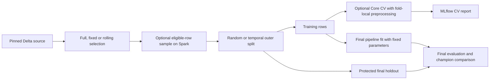

# Databricks Bundle: local training and selectable inference

For job-screen instructions and lifecycle diagrams, use the
[operator walkthrough](databricks_bundle_walkthrough.md).

For optional weight columns, class weights, SMOTE settings and supported models,
see [Weighted Training & Support](weighted_training.md).

The custom Skyulf template generates one editable Bundle with `dev`, `test`,
`syst` and `prod` targets. Training stays local. New projects independently choose
`inference_mode=local` or `spark` based on the expected rows and bytes per scoring
run and available memory. Local mode trains and scores with pandas or Polars.
Spark mode trains with pandas and scores through `mlflow.pyfunc.spark_udf` on
workers, retaining keyed predictions in Spark through Delta publication.
Older configurations default to local inference; explicit Spark with Polars is
rejected. Monitoring already runs on Spark and has no additional engine choice.

### Distributed inference settings

```json
{
  "engine": "pandas",
  "inference_mode": "spark",
  "spark_udf_env_manager": "local",
  "spark_udf_prediction_batch_rows": 10000
}
```

`max_rows` and `max_input_mb` continue to bound local training. They do not cap
the distributed scoring population. `spark_udf_prediction_batch_rows` bounds
each model prediction call to 1–100000 rows by slicing the received worker frame.
It does not bound Arrow transport allocation: Databricks manages that separately,
and serverless does not allow changing `spark.sql.execution.arrow.maxRecordsPerBatch`.
Each worker needs memory for the model, incoming Arrow frame and prediction slices.
There is no universal row threshold for choosing Spark. A failed distributed
run does not fall back to collecting the population locally.

Initial support covers SimpleImputer mean/constant and StandardScaler with
LinearRegression or LogisticRegression, including reviewed built-in tuning
wrappers. Single and competition layouts score the pinned model or winner.
Model sets validate every component and support independent outputs without
custom composition. Unsupported steps, models, callbacks, temporal history and
tuning feature exclusions fail before predictions are published. The model menus
also serve local projects; Bundle validation does not certify a fitted artifact.

For serverless, the template selects MLflow `env_manager=local`: Spark workers use
the declared Bundle task environment containing the exact wheel and dependencies.
This setting concerns worker environment reuse, not driver-side scoring.
Artifact loading checks fitted runtime versions and the certificate checks the
exact Skyulf source hash. Verify driver/worker versions on the target compute.
Policy-cluster projects select `virtualenv`, which installs the embedded wheel
and saved dependency pins into an isolated worker environment. Validate that
option on the chosen runtime: the tested serverless runtime rejects MLflow 3.16.1
virtualenv archives containing absolute interpreter symlinks. No automatic
environment or scoring fallback occurs.

For measured capacity and a repeatable benchmark, see
[Measuring inference capacity](spark.md#measuring-inference-capacity).
SM-58 compares native FE, worker Python preprocessing and this Bundle's pyfunc
route with 1–5 million rows. These timings include a correctness aggregate and
exclude Delta publication; they are not complete score-job latency estimates.
The benchmark stores reports in its own schema/volume and leaves project jobs,
monitoring tables and the shared dashboard unchanged. The initial validation
workspace supports only serverless, so classic executor RSS and `virtualenv`
packaging still require a classic-enabled workspace.

Certified MLflow packages carry a safety certificate, source hash and exact-source
Skyulf wheel. Existing whole-frame
packages need a newly logged certified version; a pickle alone grants no Spark
capability. Nullable integer and Boolean transport occurs before Arrow conversion.

In **Workflows → score job → score task**, inspect the concrete model/version,
input/output counts, source watermark and receipt. Spark receipts include
`inference_mode`, environment manager and prediction batch size. Initial snapshots,
insert-only CDF windows, no-op replay, model-change policies and optional
`recover_predictions` use the same guarded Delta publication lifecycle. All model
set outputs commit together. Successful scoring retains the monitoring child-job
and native dashboard-refresh handoff.

Initialize a project from a Skyulf checkout:

```powershell
databricks bundle init skyulf-core/templates/databricks --output-dir ./generated
```

Initialization follows five sections: **data, model,
evaluation CV, lifecycle, compute**. It asks for existing record keys (including
composite keys), source columns, split strategy, applicable date parsing,
scoring/promotion policies and job settings. Serverless is the default. Reviewable
noninteractive examples are in `skyulf-core/templates/databricks/examples/`. The generated
project has its own `databricks.yml`; Skyulf's root has no Bundle config.

Choose the training layout, then edit its generated model file:

| Layout | Model settings |
| --- | --- |
| `single_model` | `src/modeling/single_model.py`: `MODELING` owns model parameters and tuning/search space |
| `model_competition` | `src/modeling/model_competition.py`: `MODELS` compares candidates for one shared target |
| `multi_target` | `src/modeling/multi_model.py`: `MODELS` defines independent targets, models, training/CV, preprocessing and quality limits |

For multiple targets, `src/modeling/model_set.py` separately defines the coherent
release: registered set name, promotion policy and scoring table/view destinations.
For example, define revenue and cost models in `multi_model.py`, then configure
`model_set.py` to approve them together and publish their predictions under one
set version. Define the profit calculation (`revenue - cost`) in
`src/features/scoring.py`.

The model files contain plain editable Python dictionaries. Library helpers run
at initialization to populate settings from your choices; afterward edit the
generated values directly using Python `True`, `False` and `None`. Keep
`config/workflow.json` for shared data, validation/CV, size limits and lifecycle
settings. For `single_model`, its `pipeline.modeling` stays empty; the loader
supplies the selected model definition. Other layouts retain an internal task
placeholder there and load the actual model definitions from their Python file.

Legacy compatibility: existing projects can retain inline `pipeline.modeling`
in `workflow.json`, `src/modeling/candidates.py` or `src/modeling/branches.py`.
When migrating, remove the old definition: both old and new filenames, or a
single-model file alongside a nonempty inline model, fail validation.

Regression starts with Core `linear_regression` and `heldout_rmse`;
classification starts with `logistic_regression` and `heldout_accuracy`.
The pipeline remains editable: add registered Core preprocessing nodes and
choose a task-compatible model. With a JSON init file, `max_rows` and
`max_input_mb` are positive integer **strings**; the generated workflow stores
them as numbers. Enter `record_key_columns` as `customer_id, observation_id`
and `input_columns` as `income, age`, with no brackets or quotes. The generated
workflow stores ordered JSON arrays automatically. Init examples now use these
plain-text fields and task-specific `regression_model`/`classification_model`
and `regression_metric`/`classification_metric`; regenerate old init inputs.

Saved-artifact holdout evaluation uses sequential joblib prediction so parallel
Random Forest tree summation does not introduce last-bit metric differences into
exact approval evidence. This affects evaluation only: model hyperparameters and
normal training/batch inference parallelism are retained. Arbitrary numerical
runtimes may still be nondeterministic and must pass replay checks.

### Guided setup and offline preview

Setup follows your answers; it does not inspect source tables or sample rows.
Random full-snapshot training hides observation-date questions. Result-availability
questions appear only when you enable that separate filter. Schedule and
policy-cluster details likewise appear only when selected.

Advanced settings use defaults without additional questions. Set them with
`--config-file` using an existing example, or edit the generated
`config/workflow.json` before running preview:

| Advanced fields | Default |
| --- | --- |
| `training_version` | `null`: pin latest snapshot at run start |
| `training_window_mode` | `auto`: full snapshot for random, rolling calendar for temporal |
| `test_size`, `random_state`, `stratify` | `0.2`, `42`, `false` |
| `training_sample_rows`, `training_sample_seed` | `null` (all eligible rows within limits), `42` |
| `cv_folds`, `cv_type`, `cv_shuffle`, `cv_random_state` | `5`, `k_fold`, `true`, `42`; prompted when CV is enabled |
| `min_improvement`, `risk_category` | `0.0`, empty (generated as `null`) |

Existing init-file names, values and validation remain supported. Most init
values are strings, including `"true"`, `"42"` and `"null"`; `min_improvement`
is a JSON number. Generated workflow JSON uses native booleans/numbers/null.
For fixed dates, start from
`random-window-init.example.json` or `temporal-delayed-results-init.example.json`.
For stratified CV and sampling, use `guided-classification-init.example.json`.
From the Skyulf checkout, for example:

```powershell
databricks bundle init skyulf-core/templates/databricks --config-file skyulf-core/templates/databricks/examples/guided-classification-init.example.json --output-dir ./generated
```

Review table and feature names in the example first. If editing generated JSON,
use `full_snapshot`, `fixed_window` or `rolling_calendar` for the window mode;
`auto` is resolved during initialization. Run `python src/tools/preview.py --action train`
from the generated project to validate the resulting combination.

For each date column you actually use, declare how it is stored:

| Your answer | Follow-up questions |
| --- | --- |
| `timestamp`: database timestamp representing an instant | No text format, source timezone or date-only question |
| `local_timestamp`: database clock time without a timezone | Which timezone this clock belongs to |
| `date`: day with no clock time | Source timezone, then whether to treat the day as midnight or reject it |
| `text`: dates stored as strings | Whether the text contains a date only, local date/time, or date/time with an offset; then its format and only the applicable timezone/date-only questions |

For example, date-only text `2026-08-10` asks for its format, timezone and
permission to use 00:00. Text `2026-08-10T14:30:00+02:00` asks for its format
but not another timezone or midnight rule. Initialization fields
`event_time_kind`/`result_time_kind` and `event_text_kind`/`result_text_kind`
control these questions only; the generated workflow keeps the existing parsing
contract. Runtime still validates actual values against your declared rules.

The initializer asks for two **input** tables. `source_table_name` contains the
training examples and known answers. `score_source_table_name` contains records
to predict; leave it blank to reuse the training input. Neither is the output.
Choose the result name in the `prediction_table_name` setup question, for example
`customer_predictions`. It becomes `prediction_table` in the configured output
schema, with any target resource suffix. Blank uses `<project_name>_predictions`.

| Setting | Meaning and example |
| --- | --- |
| Training version | A saved Delta table snapshot from the table's History, such as version 12. This pins input data, not model v12. `null` or missing resolves latest once at run start; an explicit nonnegative integer pins that snapshot for manual and scheduled runs. |
| Source selection | `full_snapshot`: use all eligible rows from that snapshot. `fixed_window`: use observation dates between your boundaries. `rolling_calendar`: derive recent complete months at every invocation. `auto`: full snapshot for random splitting, rolling calendar for temporal splitting. |
| Result availability column | A column such as `claim_confirmed_at`, recording when that row's answer became known. Only needed if availability filtering is enabled. |
| Result cutoff | Keep answers known **by** this instant, including equality. For a cutoff of September 15, an answer confirmed September 20 is excluded even if the observation occurred in August. An explicit cutoff is honored in every run; null derives invocation time minus `result_availability_lag_hours`. |
| Date format | For a text value `10/08/2026 14:30`, use `%d/%m/%Y %H:%M` (day/month/year hour:minute). For `2026-08-10`, use `%Y-%m-%d`. Database timestamp/date columns do not need a text format. |
| Source timezone | For values such as `2026-08-10 14:30` with no offset, specify where that clock time belongs, e.g. `Europe/Copenhagen`. Offset-bearing values such as `2026-08-10T14:30:00+02:00` identify their offset already. |
| Date-only policy | `reject` stops on values without clock time. `midnight` interprets `2026-08-10` as 00:00 in the explicitly selected source timezone. |
| Training sample | `10000` selects up to 10,000 eligible rows before splitting; with a 20% test split this usually means 8,000 train and 2,000 test. `null` uses all eligible rows within read limits. Prediction never samples. |
| CV | With five folds, score each search candidate using five training folds. Learned preprocessing is fitted within each fold. The final test set remains separate. |
| Cron timezone | The timezone of the job clock. A 03:00 schedule with `Europe/Copenhagen` uses Copenhagen time, including daylight saving. This does not interpret source dates or change the selected data window. |

For training every six months on January 1 and July 1 at 03:00, choose
`scheduled` and enter `0 0 3 1 1,7 ?`. The cron is the schedule; nothing
overrides it with a second monthly timer. Manual and scheduled runs use the same
`train` action with identical snapshot/window selection rules.
`monthly_lookback_months` separately controls how many complete
months of data a rolling window reads. Independent score scheduling is SM-34.

| Section | What you choose |
| --- | --- |
| Basics/data | Engine/task, UC names, keys/features/target, split strategy, availability/date parsing and input limits; advanced snapshot/window/sampling settings use config |
| Model | A menu containing only models for the selected regression/classification task; defaults remain editable in the generated file |
| Evaluation CV | Enable evaluation with fold-local preprocessing; select folds, method, shuffle and seed |
| Lifecycle | Metric/gates, manual/automatic promotion, score selector/handoff and enabled retraining cron |
| Compute | Serverless or approved policy cluster and cost tags |

Preprocessing is edited in **`src/features/preprocessing.py`**.
`build_preprocessing()` returns normal Core steps in
execution order. Keep the JSON `pipeline.preprocessing` list empty.
Use **`src/features/pre_split.py`** for `build_pre_split_steps()` and keep the
JSON `pre_split_steps` list empty. The package exports both builders separately.

```python
def build_preprocessing():
    """Fit numeric cleanup and scaling with the selected Core engine."""
    return [
        {"name": "impute", "transformer": "SimpleImputer",
         "params": {"columns": ["income", "age"], "strategy": "mean"}},
        {"name": "scale", "transformer": "StandardScaler",
         "params": {"columns": ["income", "age"]}},
    ]
```

### Custom preprocessing recipes

Select per-step columns when mixing numeric and categorical features. Generated
projects contain small, domain-independent custom examples written as plain
pandas functions:

| Custom module | Examples | Configuration location |
| --- | --- | --- |
| `src/features/custom/pre_split_custom.py` | `minimum_completeness`, `value_range`, `allowed_values` row filters | `src/features/pre_split.py` |
| `src/features/custom/preprocessing_custom.py` | `log_feature` (new column), `frequency_encoding` and `rare_categories` (learned per fold) | `src/features/preprocessing.py` |
| `src/features/custom/advanced_class_step.py` | The same `rare_categories` written as a Calculator/Applier pair, to compare | — |

Each example is a pair of functions plus a factory that wraps them with one
helper from `skyulf.preprocessing`. Each factory returns a normal Core step
dictionary. Both recipe files also have an `example_all` recipe that runs them
together. Each custom file ends with an inactive Example 4 that reads a small
data file (asset); `src/features/assets.json` explains the three steps to enable it. The parent recipe files show
these calls directly beside the built-in steps in the returned list. Uncomment
the matching import and step, then adapt the columns:

```python
# src/features/pre_split.py
from .custom.pre_split_custom import minimum_completeness


def build_pre_split_steps():
    return [
        minimum_completeness(columns=["field_a", "field_b", "field_c"], min_present=2),
    ]
```

```python
# src/features/preprocessing.py
from .custom.preprocessing_custom import frequency_encoding


def build_preprocessing():
    return [
        frequency_encoding(columns=["category"]),
    ]
```

The list order is the execution order. Add Core operations to the same list.
The template starts with commented steps because source column names vary across
projects. There are no separate column-selection variables or enable switches.
Keep both JSON recipe lists empty.

Completeness treats null/NaN as missing; blank strings and infinity count as
values. With three selected fields and `min_present=2`, rows with two or three
observed values survive without any value or order changes. Required filter
columns are read automatically and need not be model inputs. Use only data known
at the observation cutoff; do not make eligibility depend on future information.

Frequency encoding learns `count / training_rows` per observed string category.
For training values `["A", "A", "B", null]`, scoring `["A", "B", "NEW", null]`
produces `[0.5, 0.25, 0.0, 0.0]`. It replaces selected columns in place, preserving
other columns and row order. Each CV fold learns its own mapping; saved-model
inference never recomputes frequencies on the score batch. Missing/unseen values
map to zero. Cast numeric category identifiers to strings upstream if needed.
Select these columns in workflow `input_columns`, excluding target/record keys.

```bash
python src/tools/preview.py --action train
```

The tests configure these actual parent builders, then run filtering, training,
CV and fresh-process model reload on pandas and Polars. No separate demonstration
files need to be copied into a project.

#### Writing your own step

Write top-level pandas functions and wrap them with one of three helpers:

| Helper | Your functions | Use for |
| --- | --- | --- |
| `column_step(name, fn, output=...)` | `fn(df)` returns the new column(s) | Row-by-row calculations; nothing is learned |
| `fitted_step(name, learn, apply, output=...)` | `learn(df, y)` returns a small dict; `apply(df, state)` returns column(s) | Anything learned from training rows (means, bounds, mappings) |
| `filter_step(name, fn, columns=[...])` | `fn(df)` returns True for rows to keep | Pre-split row filters |

```python
# src/features/custom/preprocessing_custom.py
from skyulf.preprocessing import fitted_step


def learn_bounds(df, y, params):
    """Learn clip limits from the training fold only."""
    values = df[params["column"]]
    return {"low": float(values.quantile(0.01)), "high": float(values.quantile(0.99))}


def clip_values(df, state, params):
    """Clip every later batch with the saved training limits."""
    return df[params["column"]].clip(state["low"], state["high"])


def clip_outliers(column):
    """Replace column with its value clipped to training 1%-99% quantiles."""
    params = {"column": column}
    return fitted_step(f"clip_{column}", learn_bounds, clip_values,
                       output=column, replace=True, params=params)
```

`learn` runs on the training rows of every CV fold and of the final fit; its
dict is saved with the model and `apply` reuses it for validation and scoring
rows, so there is no leakage. `y` is the training target; the target column is
removed from `df` in both functions, so `apply` can never depend on it. Rules:

- Use top-level `def` functions, not lambdas or nested functions.
- `df` is a pandas copy, also for Polars models; changing it has no effect.
- Return one value per row in the same order. Filters return True/False per
  row; decide missing values explicitly, e.g. `(df["x"] > 0).fillna(False)`.
- Learned dicts must be JSON-like: string keys and no NaN. NumPy numbers are
  converted automatically.
- `params={...}` is passed to every function as its last argument.
- Use `replace=True` to overwrite existing columns; otherwise outputs must be new.

Errors name the failing function, e.g. `Project function ...:learn_bounds failed:
KeyError: 'income'`.

Most former Calculator/Applier pairs fit in these helpers. Keep a class pair
(see `advanced_class_step.py`) only when the learned state is not a small dict
(for example a fitted scikit-learn object), the step changes the number of rows
during preprocessing, or it needs native Polars/Spark code for performance.
These helper steps are project code only: the web canvas and backend API reject
them, because a graph must never name an arbitrary server function.

Custom pre-split steps remain declared fixed filters: they must preserve survivor
values/order and cannot learn statistics. They do not run on unlabeled score
input. Custom value transformations belong in preprocessing; its learn function
runs inside each CV training fold and its apply function reuses that state during
inference.

Training saves the exact Python source with the fitted artifact. Both local
and MLflow loading restore this saved source, including custom classes. Changing
the project file affects future training; score, approve and rollback continue
using saved model code/state. Different source versions use distinct package
identities. All Python files under `src/features/` are captured in a bounded
64 KiB snapshot. Use relative imports and an `__init__.py` in every subpackage.
Non-Python assets and third-party dependencies are not embedded; install external
dependencies explicitly in both training and scoring environments. Keep jobs and
modeling hooks outside the feature package. Only load trusted code/models, as
with existing pickle artifacts. Scoring exclusions, historical feature context
and post-prediction business rules remain separate work.

### Source layout and existing projects

| Directory | Responsibility |
| --- | --- |
| `src/jobs/` | Databricks notebook entrypoints, referenced by the two job YAMLs |
| `src/features/` | Saved pre-split and preprocessing recipes, custom pairs/helpers |
| `src/modeling/` | Generated single-model, competition and multi-model settings plus model-set policies |
| `src/tools/` | Offline `preview.py` CLI |

Existing single-file projects and their saved models remain supported. To migrate,
move your builders into the two feature recipe files, move custom pairs into
`features/custom/`, and add relative imports. Pass the `src/features` directory
to `load_project_workflow`; update `initialize_run.py` to use
`preprocessing_path="../src/features"` (relative to the configuration directory).
If retaining legacy tuning/ensemble hooks, move them into `src/modeling/`. New
projects keep those settings in each model definition. Update YAML notebook paths to
`../src/jobs/<name>.py` and sync the new directories. Run the new preview command
before deploying. Keep only one active copy of each builder. Newly trained models
capture the new package; older model versions retain their original snapshot.

From the generated project, with the matching Core wheel installed locally:

```powershell
python src/tools/preview.py
python src/tools/preview.py --list-models
python src/tools/preview.py --list-preprocessors
python src/tools/preview.py --action train
```

Preview executes the trusted Python recipe to resolve its steps. Keep data access
and training out of module-level code and `build_preprocessing()`. The preview
shows the actual pipeline, input selection, final holdout, CV and
score/promotion policies. The default shows the setup; `--action train` checks
training readiness using job preflight, including automatic source/window
selection when configured. The same rules apply to manual and scheduled runs.
This is an offline configuration check, not a test of data values, parameter
combinations, permissions or worker dependencies. Model/node metadata comes from
Core rather than a duplicated Bundle algorithm catalog.

Preview defaults to the generated dev bindings. To inspect another target, pass
`--catalog`, `--input-schema`, `--output-schema`, `--metadata-schema` and
`--resource-suffix` matching that target's resolved Bundle variables. Preview does
not resolve target YAML or workspace `${...}` substitutions. Run the real Bundle's
`validate --strict` as well before deployment.

Editable model parameters, for example:

```json
"modeling": {
  "type": "random_forest_regressor",
  "params": {"n_estimators": 100, "max_depth": 8, "random_state": 42}
}
```

Published initializer examples now include
`guided-classification-init.example.json` (Polars, random forest,
stratified CV and explicit sample) and `random-window-init.example.json`
(random holdout inside an observation window, separate Copenhagen event and
Vilnius result parsing). Replace example table/column names and snapshot pins
with real values. A default model ID or empty parameter object uses Core defaults.

### Local input limits

`max_rows` bounds the rows read into the local process before train/test splitting.
Without sampling it applies after any observation-window selection, but before
result-availability filtering. An overflow fails; the reader never silently
truncates data. Explicit sampling is available as described below.

`max_input_mb` defaults to `64`. One unit is 1 MiB (1,048,576 bytes). It bounds
measured decoded input/serialized row sizes and local frames; it does not cap
Spark's scan, total process RAM, preprocessing expansion or model training RAM.
The existing scoring services also check bounded prediction frames. Row count
alone cannot predict size: wide numeric tables and long strings cost more.

```json
{
  "max_rows": 100000,
  "max_input_mb": 256
}
```

These are illustrative limits, not a claim that every 100,000-row dataset fits
256 MiB. Training, scoring and approval convert this value to bytes internally.
Approval may tighten but never relax the saved training budget. The lower-level
Python SDK still accepts `max_bytes`; Bundle workflow settings use only
`max_input_mb`. Replace an old Bundle `"max_bytes": 67108864` with
`"max_input_mb": 64`; no legacy alias is accepted. In an initializer file use
`"max_input_mb": "64"`; generated workflow JSON stores the number `64`.

### Record identity and result availability

New workflow JSON uses the following names:

```json
{
  "record_key_columns": ["customer_id", "observation_id"],
  "event_column": "observation_date",
  "target_column": "claim_amount",
  "result_available_at_column": "result_confirmed_at"
}
```

The key columns identify a source record and are copied to prediction output.
They do not create an ID, become features, or implicitly define CV groups.
`event_column` names the source observation timestamp; `start`, `holdout_start`
and `cutoff` are boundaries applied to that column. `result_available_at_column`
names each row's actual result-availability timestamp. Different rows can have
different availability dates. With `filter_unavailable_results: true`, exclude
unknown results and results later than the independent `result_cutoff`. Skyulf does not invent
those timestamps or fill them with the job's execution time.

Use `record_key_columns` and `result_available_at_column` in initialization
files. The default example identity column is `entity_id`; date mappings default
to null. Initialization does not create columns or generate timestamps.

The same names are used throughout the library and saved training settings.
This is an intentional pre-production breaking rename: regenerate projects and
retrain test models created with the previous column settings. There is no
field-alias adapter or automatic conversion of earlier training evidence.

### Choose the evaluation split and result availability

The default `split_strategy: "random"` needs only existing keys, features and a
nonnull target. `training_version` pins the source Delta snapshot; it is unrelated
to dates. Leave it null to resolve latest once at run start, or set a nonnegative
integer to pin that version. This example shows the training-related
part of the generated `config/workflow.json`:

```json
{
  "split_strategy": "random",
  "training_version": 12,
  "record_key_columns": ["customer_id"],
  "input_columns": ["income", "age"],
  "target_column": "claim_amount",
  "test_size": 0.2,
  "random_state": 42,
  "stratify": false,
  "event_column": null,
  "start": null,
  "holdout_start": null,
  "cutoff": null,
  "monthly_lookback_months": null,
  "filter_unavailable_results": false,
  "result_available_at_column": null,
  "result_cutoff": null
}
```

| Split | Availability filter | Required date settings |
| --- | --- | --- |
| Random | Disabled | None; all supplied targets must be known. |
| Random | Enabled | `result_available_at_column`; explicit `result_cutoff` or invocation time minus lag; source parsing rules when needed. |
| Temporal | Disabled | `event_column`; `start`, `holdout_start`, `cutoff` for `fixed_window`, or rolling calendar settings; source parsing rules when needed. |
| Temporal | Enabled | Both sets above; observation and result cutoffs are independent. |

For random splitting with delayed outcomes, keep the event fields null and set
`filter_unavailable_results: true`, `result_available_at_column: "confirmed_at"`
and an aware `result_cutoff`, for example `2026-09-15T00:00:00+00:00`, or leave
it null to derive invocation time minus `result_availability_lag_hours`. Each row
is eligible only if its own result date is known and no later than that instant.
A future snapshot/cutoff can admit results that became available later. Null
availability is excluded; a known, eligible result with a null target fails.
With filtering disabled, any null target fails: Skyulf does not manufacture labels.

Core `DataSplitter` selects the random holdout after sorting by the complete
record key. The same snapshot, keys, seed and split settings retain membership
when input row order changes. `stratify: true` is for classification; insufficient
class counts or an impossible partition fail instead of silently disabling it.
A different snapshot may produce different membership even with the same seed.
The final holdout never fits preprocessing or the model.

Saved training settings include the split policy and a holdout-key digest.
`holdout_membership.json` records the key-column names, count and digest without
labels. Approval replays the saved snapshot and verifies that membership before
comparison; changing today's workflow cannot silently replace the evaluation set.
Old experimental training evidence must be recreated. Optional training CV and
independent source-window controls are described below.

Inactive fields must stay null/default: full-snapshot selection rejects event
fields; random splitting rejects `holdout_start`. A random split can use an
explicit event window without becoming a temporal split. A result column with
availability filtering disabled is rejected. Missing temporal dates never switch
training to random.
Initialization hides irrelevant prompts but preserves explicitly supplied values
so validation can identify conflicts. The examples folder contains
`date-free-init.example.json`, `random-delayed-results-init.example.json` and
`temporal-delayed-results-init.example.json`. Replace their table/feature names
and snapshot before using them. Their date examples assume native timestamp
instants; edit parsing rules for other source types. In initializer JSON,
`test_size`, `random_state`, `stratify` and `filter_unavailable_results` are
strings; generated workflow JSON stores numbers and booleans.

<a id="optional-basic-model-cross-validation"></a>

### Search and cross-validation

The initializer selects a task, its model (including voting/stacking ensembles),
then a tuning strategy and default or custom strategy settings. There is no
Basic/Advanced mode flag. The generated model definition uses Core's
`hyperparameter_tuner` with the selected `base_model`.

| Strategy | Budget and custom settings |
| --- | --- |
| `grid` | `max_candidates` bounds the full parameter combination count |
| `random` | `n_trials` bounds sampled candidates; separate search seed |
| `halving_grid` | Candidate limit, factor, resource, minimum/maximum resource |
| `halving_random` | Sampled candidate limit and the same halving controls |
| `optuna` | Trial limit, sampler, pruner, pruning and optional soft timeout |

Search spaces come from Core's model/strategy catalog or ensemble builder. Bundle
initialization writes editable finite lists into each model's `search_space`.
For a single model, edit `MODELING` in `src/modeling/single_model.py`; for competition,
edit the candidate's `modeling` in `MODELS` in `src/modeling/model_competition.py`;
for multiple targets, edit the branch's `workflow.pipeline.modeling` in `MODELS`
in `src/modeling/multi_model.py`. Each definition owns its model params, strategy,
trial budget and search space. The generated lists are editable snapshots of
initialization defaults. Set `search_space` to `{}` to use the installed Core's
current automatic defaults. Changing the definition affects future training;
scoring uses the saved fitted model and captured recipe.

Legacy `src/modeling/tuning.py::build_search_space(model_type, strategy, params)`
hooks remain supported: `None` preserves the configured space, while returned finite
lists override it. New projects do not generate this hook.
Fixed scalar model parameters remain fixed during search. Ensemble structural
settings stay on the base model. Estimator-specific value compatibility is checked
when Core fits the model; offline preview validates structure and budgets.

Training is sequential (`n_jobs=1`). Grid admission fails if the full space exceeds
the configured limit; it does not truncate it. Optuna requires its optional sklearn
integration. Its timeout is a soft search deadline and cannot interrupt an active
model fit. Nested binary search can select a decision threshold from training-only
inner out-of-fold predictions with `"tune_threshold": True` in the model definition.

### Optional classification decision thresholds

New projects keep decision thresholds **off**. Edit `DECISION_THRESHOLD` in
`src/modeling/single_model.py`. In a competition, edit each candidate's
`decision_threshold` in `MODELS`; for independent targets, edit each branch's
`workflow.pipeline.decision_threshold` in `src/modeling/multi_model.py`.
These are model settings; the Bundle initialization wizard does not ask for them.
SDK configurations use `pipeline.decision_threshold` directly.

```python
# Native classifier decisions; no calibration partition is reserved.
DECISION_THRESHOLD = {"mode": "off"}

# Binary: predict "churn" when its probability is >= 0.7, including exact ties.
DECISION_THRESHOLD = {"mode": "manual", "positive_class": "churn", "value": 0.7}

# Multiclass: exactly one class wins argmax(probability / class value).
DECISION_THRESHOLD = {
    "mode": "manual",
    "thresholds": [
        {"class": "low", "value": 0.5},
        {"class": "medium", "value": 0.3},
        {"class": "high", "value": 0.2},
    ],
}

# Binary or multiclass: select thresholds on a reserved part of training data.
DECISION_THRESHOLD = {
    "mode": "auto",
    "metric": "balanced_accuracy",
    "validation_fraction": 0.2,
    "random_state": 42,
}
```

Use original target labels, preserving their types (e.g. integer `1` versus
string `"1"`), even when preprocessing encodes the target. The fitted encoder
chain maps these labels to the model's probability columns. Saved local models
return original labels and record them in `manifest.classes`; evaluation uses
the same mapping. This covers LabelEncoder and OrdinalEncoder, including explicit
category order and repeated encoding around resampling. Feature-only encoders
do not change target labels. Multiclass entries must cover every class exactly once, with
positive finite values; they are relative decision weights, not minimum confidence
requirements. The result always has one class, even if all probabilities are low.
Binary manual cutoffs permit both endpoints, zero and one.

Automatic mode reserves 20% of the training partition by default, **before fitting
preprocessing or selecting model parameters**. It fits the model on the remaining
rows, selects thresholds on calibration rows, and saves that fitted model without
refitting on the calibration population. Final holdout labels never select an
estimator, preprocessing state or threshold. Random calibration is stratified;
group CV keeps groups separate; temporal workflows use a chronological calibration
tail and honor the configured CV gap. Every class must occur in both partitions,
otherwise training fails with an actionable error. Small datasets can therefore
require a different split or manual mode.

For random row splitting, `validation_fraction: 0.25` fits the saved model on
approximately 75% of the training rows and uses the remainder only to choose
its decision threshold. With group splitting, the fraction selects **groups**,
not rows: unequal group sizes can produce very different row proportions.
Whole groups stay together; inspect `fitting_rows` and `calibration_rows` in
the threshold evidence for the actual populations.
There is no final full-training refit in this mode. `off` and `manual` do not
reserve this extra calibration population. Full-data refitting is a different
policy and can change the probabilities to which a selected threshold applies.

Supported automatic objectives are `balanced_accuracy`, binary `f1`, `f1_macro`,
`f1_weighted`, and `matthews_corrcoef`. For binary selection, `positive_class` is
optional and defaults to the fitted model's second class. The existing heldout
binary precision/recall/F1 and probability metrics retain that second-class
reporting convention, even when a different label owns the decision cutoff.
Sample weights affect estimator fitting, but calibration objectives and their
reported scores remain **unweighted**, as do the other evaluation metrics.
`f1_weighted` means class-support averaging, not row-weighted scoring. Automatic
threshold selection currently has no row-cost/sample-weight objective option;
it should not be interpreted as optimizing weighted business costs.
Thresholds change class predictions; they do not calibrate or alter probabilities.
An improved calibration score does not guarantee a better independent holdout score.

CV and competition independently refit the complete model-and-threshold policy
inside every outer training fold. Parameter searches also run inside those folds;
their extra work counts toward `competition_max_trials`. The original model-search
scores in `tuning.json` describe base-model selection, while `cross_validation.json`
and `competition_evaluation.json` evaluate the final decision policy.
`decision_threshold.json` records fitting/calibration counts, selected values,
the positive class and calibration scores. Model reload, registry evaluation,
batch prediction preserve the saved decision rule. For an additional standalone
inference bundle export, pass `use_tuned_thresholds=True` to `build_bundle`.
That separate portable format retains its existing supported-node restrictions;
target-encoder pipelines use the full local artifact saved by the Bundle.

Prediction columns retain stable positional names: `probability_0` belongs to
`manifest.classes[0]`, `probability_1` to `manifest.classes[1]`, and so on.
For example, `manifest.classes = ["no", "yes"]` maps `probability_1` to `"yes"`.
This mapping uses the original labels even when the target was encoded. Do not
infer a class from its spelling or assume the positive class always has index 1
when explicitly configuring a different `positive_class`.

Regression and classifiers without `predict_proba` cannot enable thresholds.
Legacy nested binary `modeling.tune_threshold` remains supported; do not enable it
alongside `manual` or `auto`. An explicit `off` policy leaves that independently
requested legacy behavior intact. Promotion `quality_threshold` remains a separate
acceptance gate.

Edit shared CV settings in the generated configuration:

```json
{
  "cv_enabled": true,
  "cv_folds": 2,
  "cv_type": "stratified_k_fold",
  "cv_shuffle": true,
  "cv_random_state": 42
}
```

For a tuner these settings control candidate evaluation. Preprocessing is fitted
inside each fold, then the selected pipeline is fitted on the complete training
partition. The final holdout never enters search or preprocessing fit. pandas
and Polars both use this path. Existing ordinary model configurations remain
supported; their CV evaluates independent fixed-parameter models.

- Default: CV disabled, five folds, K-fold, shuffle enabled, seed 42.
- `cv_folds` supports 2 through 20; each fold needs at least two training and
  validation rows. Stratified CV requires classification and at least as many
  training rows per class as folds.
- Methods: `k_fold`, `stratified_k_fold`, `shuffle_split`, `time_series_split`,
  `group_k_fold`, `stratified_group_k_fold`, `nested_cv`.
  Shuffle Split uses Core's 20% validation proportion and requires shuffle.
- Time-series CV requires an explicit selected window with `event_column` and
  `cv_shuffle: false`. Its normalized timestamps order the folds and are removed
  before preprocessing/model fit. Equal timestamps across a fold boundary fail;
  choose appropriate folds or aggregate observations rather than leaking time.
- Splitter nodes inside preprocessing are rejected when Bundle CV owns the split.
  Unsupported methods fail instead of falling back.
- `nested_cv` repeats the chosen strategy inside every outer training fold and
  scores that fold's selected model on untouched outer rows. `cv_folds` selects
  outer folds; optional `cv_inner_folds` selects inner folds (2-20). When omitted,
  inner folds are `min(3, cv_folds - 1)`, or 2 for two outer folds. A separate
  search on all training rows selects the saved model. Trial budgets and Optuna
  timeouts apply per search, so five outer folds require six searches in total.
  `tuning.json` and `cross_validation.json` retain the outer scores, per-fold
  selected parameters and aggregate mean/std separately from the final search
  score. Ordinary fixed-model configurations retain Core's stability diagnostics;
  historical artifacts without nested search evidence remain labeled diagnostic.
  `cv_nested_type: "auto"` uses stratified classification folds and regression
  K-fold. Explicit policies are `k_fold`, `stratified_k_fold`, `time_series_split`,
  `group_k_fold` and `stratified_group_k_fold`.
- Temporal policies use `cv_gap` (default 0), `cv_test_size` and
  `cv_max_train_size` (both default null) as **row counts** at both nested levels
  and the separate final search. Null maximum training size expands the window;
  an integer rolls it. Nested temporal CV requires a temporal final holdout.
  Events are stable-sorted; missing times and ties across fold boundaries fail.
- Group policies require `cv_group_column`, excluded from model inputs. The
  final random holdout selects whole groups using the saved split seed;
  `test_size` is the held-out proportion of groups. Set `stratify: false` for
  this final split. A temporal final holdout must also have disjoint groups.
  Missing group identities, insufficient groups and missing classes fail before
  fitting. Row filtering and staged Parquet retain aligned group/time metadata.
- Nested binary classification supports `"tune_threshold": True` in the model definition
  (initializer: `search_tune_threshold: "true"`). Each selected recipe generates
  inner out-of-fold probabilities for its threshold. Outer labels and final
  holdout labels never select thresholds. Ranking/probability scores still use
  probabilities. Multiclass and models without probabilities fail explicitly.
  `tuning.json` saves fold thresholds, provenance and the independent final
  threshold; saved artifact predictions apply that threshold by default.
  This decision threshold is distinct from the promotion quality threshold.

During initialization, CV method/policy questions precede the data-window questions.
Choosing ordinary or nested temporal CV fixes the generated final split to
`temporal`, hides the random split and shuffle/seed questions, and opens the
clock/window questions. With the default window mode, this produces a rolling
calendar holdout. Explicit fixed-window settings still retain their date pins.
Group and non-temporal CV preserve the chosen final split. These initializer
rules do not rewrite an existing `config/workflow.json`.

Initializer examples: `templates/databricks/examples/nested-temporal-init.example.json`
and `templates/databricks/examples/nested-group-threshold-init.example.json`.
These settings keep the existing two jobs and graph contract 3. Local tests do
not establish cloud acceptance; record actual Databricks run evidence separately.

MLflow stores `cross_validation.json` with fold results, aggregate metrics,
source/split dataset identity and engine. Ordinary CV includes fold-refit counts
and metrics such as `cv_rmse_mean` and `cv_rmse_std`. Nested search reports its
selection scorer, for example `cv_neg_mean_squared_error_mean`; negative loss
scores remain negative, with larger scores better. The
`heldout_*` metrics remain the separate candidate/champion promotion evidence.
With CV disabled, search uses one training-only 80/20 validation split; an ordinary
model adds no fold fits. Search runs save `tuning.json` with effective settings,
trials, best parameters and the actual scorer. Negative loss scores remain negative
and higher is better. `train_and_tune` displays a compact search summary.

Optional `pipeline.explainability` accepts `{"method": "shap", "max_samples": 100,
"max_features": 30, "max_display_samples": 10}`. It uses bounded training rows and
already fitted preprocessing, without fitting again. `explanations.json` records
results or an explicit unavailable reason. Limits are 200 samples, 50 transformed
features and 50 displayed samples; explanations are disabled when this field is absent.

To enable SHAP in a generated project, add this entry inside the existing
`pipeline` object in `config/workflow.json` (alongside the empty `modeling` and
`preprocessing` entries):

```json
"explainability": {
  "method": "shap",
  "max_samples": 100,
  "max_features": 30,
  "max_display_samples": 10
}
```

The training runtime also needs the optional `shap>=0.46.0,<1.0.0` dependency
declared by Core's `explainability` extra. The generated wheel/MLflow dependency
list does not install this extra automatically. For serverless training, add SHAP
to the training environment's `dependencies` in `resources/train.job.yml`;
for classic compute, include it in the training task's PyPI libraries.

Run the normal training job; do not execute `local_explanations.py` directly.
`train_and_tune` reports the explanation status, sample count and artifact name.
Open that training run in MLflow and read **Artifacts > explanations.json** for
global feature importance and the bounded per-row explanations. The Bundle
currently publishes JSON evidence and a status summary, not SHAP charts.
`max_features` is a guard on the transformed feature count, not a top-feature
selector. Exceeding it, missing SHAP or an unsupported explanation returns an
explicit `unavailable` reason.

### Ensemble recipes

Select `voting_classifier`, `stacking_classifier`, `voting_regressor` or
`stacking_regressor` for your task. Bundle asks for that ensemble's base models,
weights, stacking and calibration settings and writes them to its own
`modeling.base_model.params`. Competition candidates and model-set branches each
receive independent settings. No separate `ensemble.py` or activation flag is needed.
Legacy ensemble hooks remain supported for existing projects.

| Setting from Canvas | Bundle ensemble recipe |
| --- | --- |
| Base Models | `base_estimators`: Core member keys such as `random_forest`, `ridge`, `sgd_classifier` |
| Voting Type | Classifier `voting`: `soft` or `hard` |
| Model Weights | `weights`: a model-name map or an ordered list; missing map entries use 1 |
| Base Model Hyperparameters | `base_estimator_params`: model-name maps of fixed parameters |
| Calibrate base models | Classification `calibrate_base_models`, `calibration_method`, `calibration_cv` |
| Stacking meta-learner | `final_estimator`, `final_estimator_params`, `passthrough` |
| Stacking OOF folds | Ensemble `cv`, independent of the shared search `cv_*` settings |
| Tune component hyperparameters | `tune_base_models` defaults to `True` for all four ensembles in Bundle search; `False` opts out of automatic component spaces |
| Search strategy / search CV | Each model's tuning definition and its workflow's `cv_*` settings |

Use task-compatible member keys from Core; optional XGBoost/LightGBM require the
corresponding runtime dependency. Invalid members, duplicates, weights, parameter
names and inapplicable family settings fail explicitly. Fixed component parameters
remain fixed even with automatic component tuning. Conflicting manual search axes
are rejected. Search and estimator workers remain sequential.

Generated search spaces contain the selected components' nested parameter keys.
After changing component models or calibration, update those keys or clear
`search_space` to `{}` to rebuild automatic axes from the new composition.
Explicit nonempty search spaces remain user-owned. Grid searches still enforce
the configured candidate limit when combining component spaces.

Soft voting predicts probabilities. Hard voting predicts class labels only;
use label-based metrics such as accuracy/F1. Probability metrics and probability
thresholds are unavailable for hard voting. Artifact metadata, MLflow signatures
and the local SDK output schema record that difference. Existing artifacts remain
loadable. The GUI's auto task inference and connected-node selection are represented
by explicit task/model/member selections in a generated project.

### Explicit training sampling

```json
{
  "training_sample_rows": 10000,
  "training_sample_seed": 42,
  "max_rows": 10000,
  "max_input_mb": 64
}
```

`training_sample_rows: null` keeps the full selected input and fails on budget
overflow. When enabled, Spark selects up to the requested number of eligible
records using a seeded SHA-256 ordering of complete record keys. Selection occurs
before local transfer, after window and result-availability filtering. Changing
partition layout does not change the sample. A different seed or source snapshot
may change it. The requested count must be 4 through `max_rows`.

The count includes the final holdout: a 10,000-row sample with `test_size: 0.2`
produces 8,000 training and 2,000 test rows. Sampling is without replacement and
is not class-balanced; split/CV class-count guards still apply. For temporal
splits it samples within the chosen window; both partitions must remain usable.
It never samples inference rows. Record keys must be nonnull and unique across
the selected source, and eligible targets must be nonnull before sampling.

`training_selection.json` records source/eligible/selected counts, seed, algorithm
and membership digest. Saved training evidence pins both sample and holdout
membership; approval replays those choices. Row/memory budgets remain enforced.
Sampling bounds transfer, not Spark scans: validation, counts and hash ordering
can scan the selected source several times.

### Source windows are independent of splitting and scheduling

| `training_window_mode` | Source selection | Settings |
| --- | --- | --- |
| `full_snapshot` | All eligible rows from the pinned snapshot | Random split; event fields, lookback and window timezone null. |
| `fixed_window` | Explicit `[start, cutoff)` observations | Event column and boundaries; random or temporal split; lookback and window timezone null. |
| `rolling_calendar` | Completed calendar months, derived at every `train` invocation | Event column, explicit `window_timezone` and `monthly_lookback_months`; random or temporal split. |

New random projects default to `full_snapshot`; temporal projects start with an
editable `rolling_calendar`, four months and `window_timezone: "UTC"`. Existing
temporal project configs must explicitly select their window mode. Every `train`
invocation resolves latest once when `training_version` is null or missing;
an explicit version is honored regardless of trigger. Only `rolling_calendar`
derives new observation boundaries, including for manual runs. Fixed
windows stay fixed even if a job runs again a month later.

This is a pre-production contract change: recreate candidates produced before
SM-33D. Added sampling fields participate in the saved dataset identity even when
sampling is disabled; earlier evidence is not silently upgraded for approval.

For example, `window_timezone: "Europe/Vilnius"` uses Vilnius month boundaries,
including the correct seasonal UTC offsets. Four months includes the temporal
holdout month: three months for fit, the last completed month for final test.
Random splitting instead divides the selected four-month data by `test_size`
and leaves `holdout_start` null. Temporal lookback is 2–120 months; random is
1–120. Source parsing timezone, window timezone and cron timezone serve different
purposes. Neither the cron day nor the source timestamp format determines the
calendar implicitly. When availability filtering is enabled, an explicit
`result_cutoff` is honored; null derives invocation time minus
`result_availability_lag_hours`, equally for manual and scheduled runs.


```mermaid
flowchart LR
    Source["Pinned Delta source"] --> Window["Full, fixed or rolling selection"]
    Window --> Sample["Optional eligible-row sample on Spark"]
    Sample --> Split["Random or temporal outer split"]
    Split --> Train["Training rows"]
    Split --> Test["Protected final holdout"]
    Train --> CV["Optional Core CV with fold-local preprocessing"]
    Train --> Fit["Final pipeline fit with fixed parameters"]
    CV --> Report["MLflow CV report"]
    Fit --> Evaluation["Final evaluation and champion comparison"]
    Test --> Evaluation
```

### Source date formats and timezones

Column names and time boundaries serve different purposes. `event_column`
selects the source column; `event_time_parsing` explains its values. The
`start`, `holdout_start` and `cutoff` boundaries are timezone-aware instants.
They do not need to use the same UTC offset as source values.

Edit these settings in the generated `config/workflow.json`:

```json
{
  "split_strategy": "temporal",
  "training_window_mode": "fixed_window",
  "monthly_lookback_months": null,
  "holdout_months": null,
  "window_timezone": null,
  "filter_unavailable_results": true,
  "event_column": "observation_date",
  "event_time_parsing": {
    "format": "%d/%m/%Y %H:%M:%S",
    "timezone": "Europe/Copenhagen",
    "date_only": "reject"
  },
  "result_available_at_column": "result_confirmed_at",
  "result_time_parsing": {
    "format": "%Y-%m-%dT%H:%M:%S%z",
    "timezone": null,
    "date_only": "reject"
  },
  "start": "2026-06-01T00:00:00+00:00",
  "holdout_start": "2026-08-01T00:00:00+00:00",
  "cutoff": "2026-09-01T00:00:00+00:00",
  "result_cutoff": "2026-09-15T00:00:00+00:00"
}
```

In this example `01/08/2026 02:00:00` in Copenhagen and
`2026-08-01T03:00:00+03:00` represent the same instant: August 1 at 00:00 UTC.
An event at that instant belongs to the holdout. The window includes `start`
and excludes `cutoff`; the holdout includes `holdout_start`.

| Source values | Parsing settings |
| --- | --- |
| Native Spark `TIMESTAMP` instants | Keep defaults: `format: null`, `timezone: null`, `date_only: "reject"`; the stored instant is retained. |
| Native `TIMESTAMP_NTZ` or naive local datetimes | Set the source IANA `timezone`; leave `format: null`. |
| Strings containing UTC offsets | Set an explicit `format` with `%z`; leave `timezone: null`. |
| Strings containing local clock times | Set an explicit `format` and source `timezone`. |
| Native `DATE` or date-only strings | Set `date_only: "midnight"` and source `timezone`; strings also need a date `format`. |

Formats use Python numeric directives: `%Y`, `%m`, `%d`, `%H`, `%M`, `%S`,
`%f` and `%z`, with literal separators. A complete four-digit year, month and
day are required. They are not Spark/Java patterns such as `yyyy-MM-dd`.
The same parser handles formatted source values and local validation, so
pandas and Polars training receive the same instants. Precision is limited to
microseconds; submicrosecond pandas timestamps are rejected. Local month names,
missing years and guessed day/month order are not supported. An explicit
`%d/%m/%Y` resolves day/month order; a string without a format does not.

Date-only values are not automatically interpreted as UTC. For example,
`2026-08-01` with `date_only: "midnight"` and `Europe/Copenhagen` means
July 31 at 22:00 UTC, before the holdout boundary above. Ambiguous or nonexistent
local times at daylight-saving transitions fail; supply an offset-bearing
source timestamp to make the intended instant explicit.

Source dates are normalized in Spark before filtering. Invalid/null event
values fail validation even if a window filter would otherwise hide them.
A null result-availability value remains unavailable, while a malformed value
fails. Normalized instants cross the Spark/Python boundary as integer
microseconds; session and process timezone settings do not reinterpret them.
The local row/byte limits still apply after filtering. Date validation may scan
the pinned source snapshot in Spark; these limits bound driver materialization,
not the amount of distributed source validation.

Keep driver, worker and replay environments' timezone data aligned. Saved rules
record zone identifiers, not a copy of the IANA timezone database.

Parsing rules are saved with the candidate's training specification and dataset
identity. Approval replays those saved rules. The job's cron timezone only
controls when it runs; it does not define the source timestamps' timezone.
For Python APIs, use `TrainingDateSpec` in the
[local training guide](databricks_local_sdk.md#train-a-candidate-when-labels-are-ready).
The supported format vocabulary is a subset of Python's
[strptime directives](https://docs.python.org/3/library/datetime.html#strftime-and-strptime-format-codes);
source timezone rules use [IANA zoneinfo](https://docs.python.org/3/library/zoneinfo.html).

`training_version` defaults to `null`, resolving latest once at the start of
each `train` invocation. Set an explicit version for a repeatable snapshot.
Date boundaries default to null and are required only for `fixed_window`;
`rolling_calendar` derives them at invocation. Scoring and saved-evidence actions
do not require a new training window.

### Configuration validation and migration

New projects declare `config_version: 1` and `task`. The notebook validates
the resolved configuration before training, registry access or output writes:
resource names, distinct columns, reserved metadata names, budgets, model/task
compatibility, metric/threshold domains and action-specific snapshot inputs.
Actual source schema, keys and artifact compatibility are checked by the
existing data-read and scoring services against the real data.

The same check can run locally, without Spark or registry access:

```python
from skyulf.integrations.databricks.local_workflow import resolve_target_config
from skyulf.integrations.databricks.workflow_config import validate_workflow_config

resolved = resolve_target_config(config, {
    "catalog": "workspace",
    "input_schema": "my_inputs",
    "output_schema": "my_outputs",
    "metadata_schema": "my_models",
    "resource_suffix": "",
})
validate_workflow_config(resolved, action="train")  # Or score, approve, etc.
```

For an older project's loaded JSON, migrate explicitly:

```python
from skyulf.integrations.databricks.workflow_config import migrate_workflow_config

updated = migrate_workflow_config(
    config, task="regression", score_handoff="after_alias_change"
)
```

Review/save `updated`, regenerate both job definitions and entrypoints, then
validate and redeploy together. Migration returns a copy; it does not upload
files, invent training dates, or change aliases. Legacy `auto_champion` maps
to champion/automatic; legacy `pinned_version` maps to pinned/manual approval.
Mixed policies, unknown config versions and contradictory existing task or
handoff settings are rejected. The notebook checks the deployed
`workflow_contract` and `deployed_score_handoff` markers against the JSON.
These detect stale generated definitions; they are not workspace permissions
or a complete audit of manually edited Jobs settings.

`dev` uses the selected CLI profile's workspace host. `test`, `syst` and
`prod` each have a different placeholder host and catalog in the generated
file. Edit each target's host, catalog and input/output/metadata schema
bindings, then validate with its designated profile. No Danske, Danica or
personal-workspace value is built into those three targets. Policy-backed
compute uses the policy name, runtime, node type and cost tag supplied at
initialization. Serverless compute needs none of those fields.

For a company policy requiring `PayingRegNo`, select that value as
`cost_tag_key` and supply the approved registration number as `cost_tag_value`.
The `paying-reg-no-init.example.json` example demonstrates both settings;
the generic default remains `CostCenter`. This tag applies to policy-cluster
compute. Selecting it does not assign a model risk category.

Advanced configuration accepts an optional `risk_category`, such as `Low`,
`Medium`, or `High`. Leave it blank to omit the tag. The value remains editable
in `config/workflow.json` and is recorded on future training runs and model
versions; it does not change promotion gates or relabel existing versions.

## Where the workflow lives

The generated notebooks have fixed lifecycle steps or the score role.
`initialize_run` freezes the request; `load_data` reads bounded pinned data;
`prepare_dataset` applies fixed cleanup and saves the split. `train_and_tune`
fits learned preprocessing within training folds and runs configured CV/search.
`select_best_model` currently verifies a single candidate; multiple candidates
in one run are not implemented yet. `register_model` evaluates the fitted
artifact before registration; `evaluate_model` compares registered versions.
`model_decision` applies the saved policy or an explicit approve/reject/rollback
request. Manual actions skip the data and training stages. `training_report`
closes training even on failure and publishes only a verified successful result.

Tasks exchange durable MLflow references. Source and split datasets are bounded
Parquet artifacts under `lifecycle/data/`, with digests and membership metadata
checked before reuse. The experiment therefore stores training rows as well as
model evidence; its access and retention policies apply to those rows.
Computation and lifecycle changes reuse existing Core services; no additional
control tables or jobs are introduced. See the
[task graph and operator walkthrough](databricks_bundle_walkthrough.md#the-two-jobs-and-their-tasks).
`prediction_output` creates output tables and switches full-rebuild views.
Imports do not create a Spark session or cloud resource.

Regenerate and deploy notebooks, graph and wheel together for graph contract 3.
Existing graph-2 bundles retain their legacy runtime path; changing only a
contract marker does not migrate a bundle.
The workflow configuration schema remains version 1.

Notebook entrypoints are explicit: generated `src/score.py` calls
`job_runtime.run_score_notebook`; lifecycle notebooks call
`job_runtime.run_lifecycle_notebook` with a fixed phase. Deploy new entrypoints
with the matching wheel. Existing direct `run_notebook(task_role=...)` callers
remain supported: score delegates to the score entrypoint, while lifecycle keeps
its sequential behavior and does not acquire durable phase/retry semantics.
`run_bundle_action`, `run_action` and `train_local_candidate` retain their APIs.

Edit preprocessing in `src/features/preprocessing.py`, model settings in the
selected `src/modeling/` file, and shared workflow settings in `config/workflow.json`.
These remain project choices; common workflow fixes ship in the Skyulf wheel
instead of requiring edits to every generated notebook.

### Independent scoring and promotion policies

Generated Bundles and direct `run_action` callers separate these decisions:

| `score_model_selection` | `promotion_policy` | Behavior |
| --- | --- | --- |
| `pinned_version` | `manual_approval` | Register/evaluate the contender; score keeps the configured version |
| `pinned_version` | `automatic` | Apply promotion gates; score still keeps the configured version |
| `champion` | `manual_approval` | Register/evaluate the contender; score follows the existing champion |
| `champion` | `automatic` | Apply promotion gates; the next score follows the resulting champion |

For example, a library configuration containing `model_version: "2"`,
`score_model_selection: "pinned_version"` and `promotion_policy: "automatic"`
continues scoring with v2 after a successful promotion of v4. Selecting
`champion` instead resolves the controlled alias once per score run. A missing
champion fails before output preparation; there is no fallback to latest.

Both new fields are required together. Remove `model_selection_mode` when
using them; mixed or partial configurations fail before training or scoring.
Legacy `auto_champion` retains champion/automatic behavior, and legacy
`pinned_version` retains pinned/manual behavior, with a deprecation warning.
Automatic promotion still requires `quality_threshold`, including when
scoring is pinned. Scoring never updates the caller's configured version.

New Bundles require both policy fields and `score_handoff`. Migrate an older
project's configuration, all notebook entrypoints and job graph together;
changing only JSON is insufficient. Core direct callers retain the legacy
compatibility path described above. Generated projects use the new policies.

### Operator actions through Run now

The existing `train` job is the serialized lifecycle writer. In **Run now with
different parameters**, choose `lifecycle_action`:

| Action | Required job parameters |
| --- | --- |
| `train` | No operator evidence; leave other parameters empty |
| `approve` | `candidate_version`, `expected_champion_version`; comparison proof resolves automatically |
| `reject` | Same as approve, plus `rejection_reason` |
| `rollback` | `promotion_receipt_json`, `expected_champion_version` |

Manual training returns copyable `next_actions.approve` and `next_actions.reject`
fields. Review the comparison and copy its exact values; add a reason for
rejection. `expected_champion_version=none` explicitly selects first-champion
initialization; an empty value fails. Configure the metric and absolute quality
threshold **before training** so saved evidence matches the approval policy.
A completed promotion returns `next_actions.rollback`, including its complete
receipt JSON. Copy that receipt rather than reconstructing it from alias names.
These operator actions reuse the existing candidate; they do not fit a model.

`score_handoff=after_alias_change` requests the existing score job after a
successful initialization, promotion or rollback. `disabled` leaves scoring to
an explicit score run or its schedule. Rejection and training without a champion
transition never trigger score. Handoff preserves the score selector: a pinned
scorer still uses its configured version even after champion changes.

There are still two jobs. The lifecycle job contains three tasks: execute the
action, check `score_requested`, and conditionally call the score job. Both jobs
queue runs with `max_concurrent_runs: 1`. Score's fixed notebook role ignores inherited
lifecycle parameters and cannot dispatch alias actions; this is input isolation, not a replacement for exclusive
registry write permissions. A failed/uncertain alias action never publishes a
successful score request. If the alias change succeeded but score failed, retry
score directly; no retraining is needed.

Local tests and strict generated-project validation cover this wiring. The
personal serverless SM-32 rehearsal verified manual approval, rejection,
rollback/retry, automatic promotion, score handoff and pinned selection.
The score entrypoint filters inherited parent-job evidence before dispatching
score. Company targets and production identities remain separate acceptance work.

### Approve an existing candidate without training

Use an explicit manual policy and the comparison returned by the earlier
training job. Review that saved result before passing its version and digest:

```python
import hashlib
import json
from dataclasses import asdict

from skyulf.integrations.databricks.local_workflow import run_action

# candidate is the result of an earlier training job; no training runs here.
comparison = asdict(candidate.comparison)
comparison_sha256 = hashlib.sha256(
    json.dumps(comparison, sort_keys=True, allow_nan=False).encode()
).hexdigest()
receipt = run_action(
    spark,
    config,  # promotion_policy="manual_approval" and both independent fields
    "approve",
    candidate_version=candidate.model_version,
    comparison_sha256=comparison_sha256,
    expected_champion_version=candidate.comparison.champion_version,
)
```

Approval downloads `candidate_comparison.json` and `candidate_training_spec.json`
from the run associated with that registered version. It verifies the digest,
current metric policy, expected champion and controlled challenger receipt.
It then reads the original Delta version and evaluation window and rechecks
quality using the existing Core comparison/promotion services. The original
engine is preserved; current read budgets may tighten the saved limits.

The action does not train, register or upload a model, rewrite `model_version`,
or publish predictions. A later score run follows the configured selector.
Retrying an unchanged successful approval returns its original committed
receipt; changed champion, pending writes or incompatible evidence fail.
Training runs created before the saved specification was introduced cannot
use this action without explicitly supplying that missing provenance through
a separately reviewed migration; there is no fallback to current training dates.
Use the same externally serialized lifecycle writer as training. The Bundle
operator parameters above provide that path with optional score handoff.

### Reject a candidate or roll back a promotion

To decline the candidate above, use the same version and evidence digest with
an explicit manual policy. This is an alternative to approving that candidate:

```python
decision = run_action(
    spark,
    config,
    "reject",
    candidate_version=candidate.model_version,
    comparison_sha256=comparison_sha256,
    expected_champion_version=candidate.comparison.champion_version,
    rejection_reason="Business review requires another candidate",
)
```

Rejection retains both aliases and the evaluation metrics/status. It records
`approval_status=rejected` and the human-readable `approval_reason` separately.
The reason must be nonempty and at most 256 UTF-8 bytes. A rejected version
cannot be implicitly approved, restaged, renominated or made the first champion.
There is no reopen action in this slice; a later training run creates a new candidate.
Neither rejection nor rollback reads training rows, fits or registers a model.

To undo an earlier completed promotion, pass that promotion's receipt:

```python
reversal = run_action(
    spark,
    config,
    "rollback",
    promotion_receipt=receipt,  # kind="promotion", not first-champion initialization
    expected_champion_version=receipt.new_version,
)
```

Rollback is available under either promotion policy. It restores the previous
champion only when the saved transition still matches controlled registry state.
A separately verified challenger is retained. Repeating an unchanged rejection
or rollback returns the same committed receipt; incompatible evidence,
conflicting alias state and unresolved writes stop the action.

All lifecycle actions must use the same externally serialized writer as training.
No additional control table is created. Direct `run_action` calls do not launch
score or rewrite its version pin; the Bundle adapter can request score afterward. A later `champion` score follows the restored alias;
a `pinned_version` score continues using its configured version. Rollback does
not undo predictions already written; scoring's model-change policy still applies.

### Recent challenger history

The Core lifecycle keeps the last displaced contender as `previous_challenger`:

| Action | Champion | Challenger | Previous challenger |
| --- | --- | --- | --- |
| Starting state | v2 | v3 | unset |
| Nominate v4 | v2 | v4 | v3 |
| Repeat nomination of v4 | v2 | v4 | v3 |
| Promote v4 | v4 | unset | v3 |

Only replacing an existing contender rotates this pointer. Evaluation and
promotion retain it, and promotion still puts the old champion in
`previous_champion`. If the historical version becomes champion through
rollback, or becomes challenger again, its history alias is cleared. The
version and its earlier event records remain available.

This alias is neither a complete history nor a scoring fallback. It creates
no table or job. History changes share the lifecycle's pending-event checks
and writer ownership; manual alias/receipt disagreement stops further actions,
including retries. Partial writes require reconciliation before proceeding.
This history extension passed local and personal-serverless Bundle verification,
including replacement, explicit rejection and rollback while retaining a contender.

## What is created

`bundle deploy` creates only two jobs and uploads their code:

| Job | Purpose | UC objects created when run |
| --- | --- | --- |
| `train` | Train/evaluate a candidate or execute approve/reject/rollback | Model/version only for training |
| `score` | Score initial and later CDF rows | Prediction output and rows |

The default project has no schedule. Choosing `scheduled` at initialization
adds an enabled schedule to the existing `train` job, without adding a third
job or running it at deployment. The Quartz cron and timezone are selected
at initialization and remain editable Bundle variables. No endpoint or Unity Catalog table is
created by deployment alone.
The generated `schedule.pause_status: UNPAUSED` also overrides development mode's
default pause. Once deployed, the job runs at the next matching cron time.
Initialization alone does not deploy or start any job.
`promotion_policy=automatic` uses the same train job to compare candidate and
champion on the same pinned holdout, independently of the score selector. The
selected `metric`, `min_improvement`, and absolute `quality_threshold` stay
editable in `config/workflow.json`. A first champion requires a numeric
absolute threshold because no prior version exists for comparison. Later
versions must pass that threshold and improve on champion by the chosen
minimum. A passing candidate is staged and promoted through checked registry
receipts; an ineligible candidate leaves champion unchanged. The train job
calls the existing score job only after a champion transition when handoff is
enabled. No third job or control table is added.

### Additional quality gates

Keep one selection `metric`. Optionally add `quality_gates` directly to
`config/workflow.json`; no extra initializer question is needed. For example,
merge these regression policy fields into your existing configuration:

```json
{
  "metric": "heldout_rmse",
  "quality_threshold": 5.0,
  "min_improvement": 0.2,
  "quality_gates": {"heldout_mae": 3.0, "heldout_r2": 0.7}
}
```

These illustrative bounds require RMSE <= 5, MAE <= 3 and R2 >= 0.7.
Choose bounds appropriate to your target's units and business requirements;
generated projects keep the quality threshold unset. Every bound must pass.
For later champions, RMSE must additionally improve by at least **0.2 absolute
units** on the same holdout. A tie never qualifies, even with minimum improvement 0.
The first champion still needs an explicit selection-metric quality threshold.

For classification, a policy might select `heldout_f1` with threshold 0.8 and
add `{"heldout_recall": 0.9, "heldout_log_loss": 0.5}`. Classification score
bounds are in [0, 1], except Matthews correlation [-1, 1]; error/loss bounds
are nonnegative, while R2/explained variance may be negative but cannot exceed 1.
The existing metric definition determines whether a lower or higher value wins.
Use weighted metrics for multiclass models. An unavailable metric, such as
binary ROC AUC on a one-class holdout, fails its gate; it is never silently ignored.
These bounds do **not** set classification probability decision thresholds or tune them.

The comparison/final notebook reports show each bound, observed value and
failure reason. MLflow retains the policy in `candidate_comparison.json`, all
gate outcomes in `quality_gates.json`, and per-gate version tags.
Version tags identify their event; use
`quality_gate_event` to distinguish current gates from retained older outcomes.
Approval requires the saved policy unchanged and re-evaluates it before changing aliases.
Omitting `quality_gates` preserves the single-gate policy and historical receipt
digests. SDK callers should use the returned `comparison_sha256`; when explicitly
serializing a report for evidence, use `comparison_payload`/`comparison_digest`
from `skyulf.integrations.mlflow.validation` instead of hashing `dataclasses.asdict`.

In both modes, registration nominates `@challenger` before comparison. A tied
or worse candidate retains that alias with `validation_status=rejected` and
a reason; comparison errors retain it with `validation_status=error`.
New contenders replace the pointer without deleting earlier version evidence.
Manual approval records these results without automatically promoting the candidate.
Training resolves the current champion; a stale explicit `champion_version`
fails before fit. Generic Core training remains alias-free unless a caller
supplies the explicit `on_registered` lifecycle callback.

Training runs and model versions share readable metadata: `train_data_version`,
`test_data_version`, `train_data_destination`, `test_data_destination`,
`model_type`, `candidate_date_tag`, and `engine`. Optional `risk_category` is
editable in workflow.json. Since fit and evaluation split one Delta snapshot,
their table names and versions match; `train_start`, `test_start`, and
`data_end` explain the split. The exact dataset identity is saved in
`training_data.json`. Run tags use `task=training`.

Validation reasons use plain English. Technical event tags retain unique IDs
and evidence hashes for rollback/recovery; their JSON fields are `action`,
`from_version`, `proof`, `parent`, `state`, and `previous`. `from_version`
identifies the version previously held by the affected alias, not necessarily
the previous champion. These are audit records,
not settings to edit. Earlier compact receipts remain supported.

With `score_model_selection=champion`, score resolves the alias once to a
concrete version per run, under either promotion policy. Only the serialized
train job identity may write this
model's aliases; other alias-write grants must be removed before training.
Alias promotion and Delta scoring are separate transactions. If scoring fails
after promotion, the last successful prediction output remains and the score
job must be retried. Unknown alias outcomes need receipt reconciliation.
Skyulf marks an alias transition as pending before writing it; automatic
training and scoring stop until that pending event is reconciled. An existing
champion alias set outside this controlled lifecycle also needs reconciliation
before controlled champion scoring or promotion can use it.

For example, a regression project can select its gate in the generated config:

```json
{
  "engine": "polars",
  "score_model_selection": "champion",
  "promotion_policy": "automatic",
  "score_handoff": "after_alias_change",
  "metric": "heldout_rmse",
  "min_improvement": 0.1,
  "quality_threshold": 5.0,
  "model_change_mode": "incremental_append"
}
```

These example values mean RMSE must be at most `5.0`; a later candidate must
reduce champion's RMSE by at least `0.1` on the same holdout. Improvement is
an absolute metric difference, not a percentage. Skyulf derives the direction
from the metric: RMSE/MAE/log loss are minimized, while R²/accuracy/F1 are
maximized. Use a metric supported by the configured model task. The first
comparison reports `reason=no_champion` and `eligible=false` because no
baseline exists; successful bootstrap is recorded separately as
`result.alias_change.kind=initial` in the Bundle output after the absolute gate passes.

If promotion succeeds but scoring fails, the train job reports a failed
dependent score task. Correct the scoring problem and run `score` again;
retraining is unnecessary. Full-rebuild output continues to expose the last
successfully activated generation during this recovery.

The four relevant Unity Catalog names have different roles:

| Name | Meaning |
| --- | --- |
| `training_table` | Existing labeled input table, pinned to a Delta version for training |
| `score_source_table` | Existing CDF-enabled source of rows to predict |
| `prediction_table` | The output table in append mode, or the stable active view in full-rebuild mode |
| `model_name` | Registered Unity Catalog model, not a table |

The first two references point to **the same existing table by default**.
Neither reference creates a table. Separate them only when labeled training
data and new scoring data have different lifecycles. If they stay together,
the first `score` run predicts all existing rows, including historical labeled
rows; review whether that is intended for your use case.

In `full_rebuild`, a version-specific physical table records the model name,
version and artifact digest. Scoring rejects an existing table at that name
when its model provenance differs. A new model with the same numeric version
needs a different logical prediction name or a new model version.

The initialization question `record_key_columns` accepts `customer_id`
or `customer_id, observation_id`. It becomes an ordered JSON array in the generated
configuration, and the same column appears in the prediction table. It must
be non-null, `STRING` or `BIGINT`, and unique across the initial data and all
later inserts. For multiple predictions per customer, edit the generated
configuration to a composite key such as
`"record_key_columns": ["customer_id", "observation_id"]` before deployment. The Bundle
does not create an ID in the source. Keep keys out of `input_columns`. With
`customer_id` in the output, a query
can find a customer's predictions:

```sql
SELECT customer_id, prediction, model_version
FROM catalog.schema.predictions
WHERE customer_id = 'C123';
```

## First run

Set `deployment/artifact.json` to the Core source directory or release wheel and
the expected Core version. The Bundle artifact build prepares the wheel, checks
its identity and records its SHA-256 in `dist/skyulf/build.json`.
The wheel filename includes its content digest as a build tag: changed bytes get
a distinct deployment/cache identity while the release version stays compatible
with existing saved model requirements. The receipt matches the uploaded bytes.
Edit `config/workflow.json` for real source columns, split policy and size
limits, the selected `src/modeling/` file for model settings, and
`src/features/preprocessing.py` for feature engineering.
The JSON values are an example, not a dataset.
Enable Change Data Feed on the scoring source before later inserts arrive.

```powershell
uv run --no-project python src/tools/build_wheel.py
databricks bundle validate --strict -t test_development --profile <profile>
databricks bundle deploy -t test_development --profile <profile>
databricks bundle run train -t test_development --profile <profile>
```

Use `test` instead if personal development targets were not generated.
`deployment/requirements.txt` supplies the shared train/score runtime, including
initial Optuna and optional model/ensemble choices. Update these exact pins when
editing model choices later. Custom preprocessing/scoring requirements from
`src/features/requirements.txt` are installed in both jobs. Training-only report
packages live in `deployment/train-requirements.txt`. These direct pins do not
freeze all transitive dependencies.

Compute settings are target variables: serverless environment version and optional
budget policy, or policy-cluster runtime, node type and worker bounds. `job_tags`
applies in both modes. Validate company policy compatibility in the actual target.

For pinned scoring, inspect the registered version, put that concrete value
in `model_version`, redeploy the changed JSON, then run `score`. For champion
scoring, approve manually or use automatic promotion gates, then run score or
enable the optional handoff. Inspect both lifecycle and score task results. The first score
rejects a missing source, disabled CDF, unsuitable row keys, a model output
mismatch or an existing target schema mismatch before creating prediction
output. Local inference checks initial row count against `max_rows` and decoded
transfer size against `max_input_mb`. Spark inference checks keys globally and
keeps the scoring population distributed. Model-set approval uses a deterministic,
bounded functional probe after partition-safety and global key checks; saved
holdout quality gates still evaluate their complete evidence. Existing tables are
never overwritten. The first score processes the current source
snapshot; later runs process only new inserts since the committed Delta
receipt. A repeat without new rows is a no-op. No monthly date or source
version is entered for each run.

With manual approval, the first candidate requires explicit approval to become
champion. Pinned scoring can use a registered version without that approval. At initialization, choose
`incremental_append` to keep
v1 predictions and score only later source inserts with pinned v2. Choose
`full_rebuild` to write a new physical `<prediction_table>_v2` generation,
switch the stable `prediction_table` view after a successful complete score,
and append future inserts to v2. The previous generation remains available;
a failed rebuild leaves the active view unchanged. Full mode needs view
creation/ownership privileges and cannot silently turn an existing append-mode
physical table into a view. `max_concurrent_runs: 1` serializes the generated score job, but
does not coordinate other jobs. Grant prediction-table writes only to this
job's identity. For multiple publishers, use Skyulf Core's shared admission
provider. Online endpoints and Spark-native FE/model execution remain
separate work.

The optional `scheduled` mode starts the train schedule enabled after deployment,
including the dev target. Its default is 03:00 UTC on day three of each month;
edit the cron and timezone to choose another cadence, including every six months.
The default `manual` mode creates no schedule. Both modes invoke `train`.
A null or missing `training_version` resolves latest once at run start;
an explicit version pins that snapshot regardless of the trigger.
The separate `training_window_mode` selects full data, a fixed window or completed
calendar months. Rolling selection uses `window_timezone`; a temporal split holds
out the last completed month, included in `monthly_lookback_months`. The schedule
timezone controls execution only. Sampling and CV are independent optional settings.
When availability filtering is enabled, an explicit `result_cutoff` is honored;
null derives invocation time minus `result_availability_lag_hours`.
The source must truthfully record per-row availability. `@champion` is resolved to a
concrete version for comparison if present. Manual approval leaves champion
unchanged; automatic promotion applies its metric gates. Score handoff follows
only a successful champion transition when enabled. The source version is
pinned at run start; it is not a historical snapshot as of the observation cutoff.

The older SM-20a personal serverless rehearsal passed, but its jobs and test
schemas were removed at the user's request. The subsequent clean generic
`dev` rehearsal trained a Polars model from 600 real taxi rows, wrote 600
initial and 50 later predictions to one table, and replayed without another
commit. The later two-job design passed a separate personal serverless
rehearsal: 650 existing source rows, one later insert, and a no-op replay
left one prediction table with 651 rows. The `test`, `syst` and `prod`
placeholders have not been deployed in a company workspace.

### Explicit retry policy

Generated notebook tasks set `max_retries: 0`; serverless tasks additionally set
`disable_auto_optimization: true` because serverless auto-optimization can add
retries independently. A training retry can register another candidate version.
Inspect failed run evidence and registry state before rerunning; retry score
separately after an already-committed approval. This is not an exactly-once
training guarantee. See the [Databricks serverless retry behavior](https://docs.databricks.com/aws/en/jobs/run-serverless-jobs).


### Job resource files

Generated projects keep training/lifecycle tasks in `resources/train.job.yml`
and batch scoring in `resources/score.job.yml`. The root `databricks.yml`
includes both through `resources/*.yml`. Each job retains its own schedule and
compute settings; training calls scoring through `${resources.jobs.score.id}`.

When upgrading a project generated with `resources/workflow.jobs.yml`, replace
that file with the two new files rather than keeping all three. Preserve the
resource keys `train` and `score`, the bundle identity, target and workspace
root so a redeploy continues to address the existing jobs. Preview and validate
before deploying; splitting these files alone does not change task behavior.
