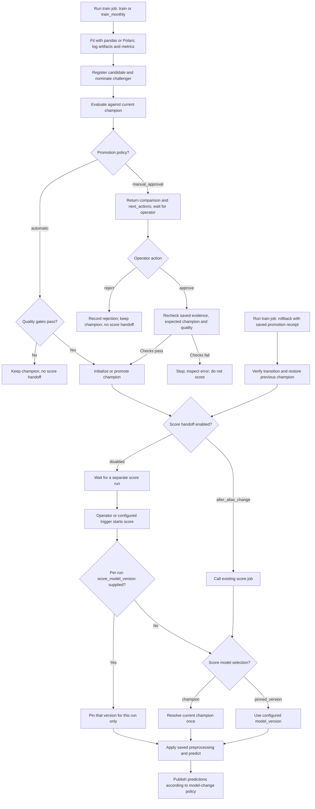
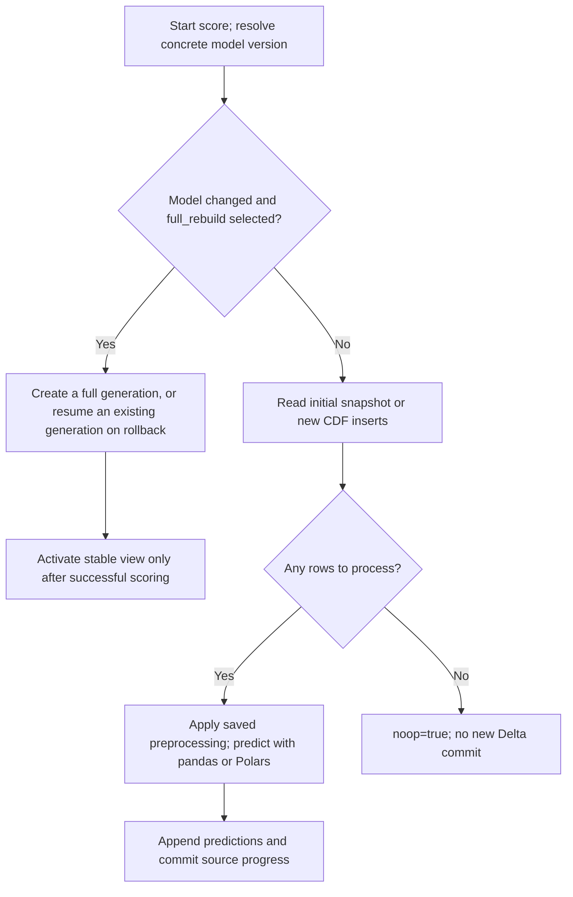

# Using the Databricks Bundle

This walkthrough explains the local-engine Bundle from an operator's point of
view. Training and prediction use pandas or Polars; Spark reads bounded Delta
data and writes predictions. Start with the [Bundle configuration guide](databricks_bundle.md)
for installation, target bindings and source requirements.

## Three independent decisions

Configure these in the generated project's `config/workflow.json`:

| Setting | Choice | What it controls |
| --- | --- | --- |
| `promotion_policy` | `manual_approval` | Training creates/evaluates a candidate; an operator reviews and approves or rejects it |
| `promotion_policy` | `automatic` | Training applies the configured quality gates and promotes a qualifying candidate |
| `score_model_selection` | `champion` | Each score run resolves the current controlled champion to one concrete version |
| `score_model_selection` | `pinned_version` | Each score run uses the explicitly configured `model_version` |
| `score_handoff` | `after_alias_change` | Successful champion initialization, promotion or rollback requests score immediately |
| `score_handoff` | `disabled` | A champion change does not start score; run score explicitly or through a separately configured trigger |

For example, manual approval + champion scoring + handoff means: train v2,
review it, approve it, then automatically score using v2. Manual refers to
the approval decision; it does not require manual scoring afterward.

Automatic promotion + disabled handoff means: train v2, promote it if its
quality passes, and leave prediction output unchanged until score runs.

With pinned scoring, promotion of v2 does not change a pin to v1. Even an
automatic handoff still scores with v1. Select champion scoring when the
prediction model should follow promotions and rollbacks.

With `score_model_selection=champion`, the configured `model_version` pin is
ignored. If champion changes from v1 to v2, the next score run loads v2 without
redeployment. A score run already in progress keeps the version it resolved at
its start. Handoff controls whether the next run starts immediately; selection
controls which model that run loads.

A pin can also select a registered version that has not become champion.
Approval governs the champion alias; it does not automatically gate an
explicit pinned scoring choice.

For a **single score run**, open the `score` job's **Run with different
settings** form. Set `score_model_version=2` to use registered v2 for that
run, or leave it empty to follow `score_model_selection`. No model upload or
Bundle redeployment is needed. This does not promote v2 or modify the saved
pin. Automatic lifecycle handoff clears this override and follows the saved
selection policy. Supplying it to the lifecycle job is rejected.

The model-change policy still applies: `incremental_append` keeps existing
predictions and scores new rows only; `full_rebuild` uses a separate model
generation. A one-run pin with full rebuild can therefore change the active
prediction view even though champion does not change. The next normal score
run follows the configured selector again.

The readable score report identifies **Selected model for this run**. If no
new data exists, it also shows the model recorded by the **previous write**;
those versions can legitimately differ. Changing model version alone does
not cause an incremental run to rewrite existing predictions.



## The two jobs and their tasks

The resource keys are `train` and `score`; their visible names include the
project name and target/user prefix. Deployment creates two jobs, not a job
for each action. It does not train or create prediction tables by itself.

| Job/task | Purpose |
| --- | --- |
| `train` job, `train` task | Runs the selected lifecycle action: train, train_monthly, approve, reject or rollback |
| `train` job, `should_score` task | Reads the action's boolean `score_requested` output |
| `train` job, `score_after_lifecycle` task | Calls the existing score job when the condition is true |
| `score` job, `score` task | Loads the selected model/artifact, predicts and publishes rows |

Each job queues runs and permits one active run. The lifecycle job is the
single writer for aliases. The fixed score notebook ignores inherited lifecycle parameters and never
dispatches alias actions. Role/action override attempts are rejected.
These controls still require appropriate registry/table permissions; another
independent job or a direct Catalog alias edit can violate writer ownership.

## Prepare the project

Use `record_key_columns` for source record identities and
`result_available_at_column` for the source column indicating when each
target became available. `event_column` identifies the observation timestamp.
These are column mappings, not date values; the boundaries are separate.
Use a newly generated project and models trained with these field names.
Earlier experimental projects and training evidence are not automatically converted.

1. Set the task, engine, existing source tables, row keys, features, target, pipeline,
   model name, prediction name, training split and bounded read limits.
   For manual training, replace the unset snapshot/date fields with an actual
   `training_version` and timezone-aware `start < holdout_start < cutoff`.
   For strings, local-clock timestamps or dates, configure `event_time_parsing`
   and `result_time_parsing` using the [source-date examples](databricks_bundle.md#source-date-formats-and-timezones).
   Source timezones and the cron timezone are separate.
   Review the local validation and migration examples in the
   [configuration guide](databricks_bundle.md#configuration-validation-and-migration).
2. Select the three policies above. For learning the approval flow, use:

   ```json
   {
     "promotion_policy": "manual_approval",
     "score_model_selection": "champion",
     "score_handoff": "after_alias_change"
   }
   ```

3. Configure `metric`, `quality_threshold` and `min_improvement` **before
   training**. For `heldout_rmse`, a threshold of `5.0` means RMSE must be at
   most five target units. A minimum improvement of `0.1` means RMSE must fall
   by at least 0.1, not 10%. A tie never qualifies. Manual approval also
   verifies quality; it is not a way to bypass the gates.
4. Place the matching Skyulf wheel in `dist/`, then validate and deploy:

   ```powershell
   databricks bundle validate --strict -t dev --profile <profile>
   databricks bundle deploy -t dev --profile <profile>
   ```

The source must already exist and have Change Data Feed enabled. Training and
scoring may reference the same source table. Prediction output is created by
score when needed. No default admission/control table is created.

Configuration changes require deploying the changed project. Choosing an
operator action or supplying its evidence through Run now does not require
redeployment. Do not switch shared configuration while jobs are running.

## Train a candidate in the UI

1. Open **Jobs & Pipelines** and select the project's `train` job.
2. Choose **Run with different settings** (also called **Run now with different
   parameters** in some UI versions).
3. Set `lifecycle_action=train`. Leave all operator-evidence fields empty.
4. Open the completed run, then the `train` task output.
5. Read `result`: model version, MLflow run and comparison. Follow the MLflow
   experiment to inspect metrics, artifacts and input provenance.

With manual approval, training returns `next_actions.approve` and
`next_actions.reject`. `score_requested=false`; the score call is skipped.
A registered candidate can be `challenger` even when its comparison is worse
than champion. Alias nomination and quality approval are different events.

With automatic promotion, a qualifying model becomes champion and the optional
score handoff runs. A tied/worse candidate stays challenger with its validation
status/reason; champion is unchanged and score is not triggered.

## Understanding the run settings form

The train job exposes the same five parameters for all lifecycle actions. Most
are intentionally empty because ordinary training needs no operator evidence.
The form does **not** discover or populate the latest candidate automatically.
Leaving `lifecycle_action=train` starts another training run and can register
another version; it does not approve the candidate you just inspected.

| Field | Meaning | When to fill it |
| --- | --- | --- |
| `lifecycle_action` | Operation to execute on this run | `train`, `train_monthly`, `approve`, `reject` or `rollback` |
| `candidate_version` | Registered model version to approve/reject; not a job run ID or MLflow run ID | Copy from the candidate's `next_actions` for approve/reject |
| `expected_champion_version` | Champion version that must still be current when the operation executes | Copy for approve/reject/rollback; literal `none` only for first-champion approval/rejection |
| `promotion_receipt_json` | Saved JSON receipt identifying a completed promotion to reverse | Rollback only |
| `rejection_reason` | Your explanation for rejecting this candidate | Reject only |

For training, leave the four other fields empty. For approve/reject/rollback,
start with the matching `next_actions` values and clear fields belonging to
another action. Add your own reason when rejecting. These are **run overrides**;
they do not change the deployed job defaults or the Bundle promotion policy.

Older deployments also show `comparison_sha256`. After updating both the wheel
and notebook/job definitions, leave that field empty or regenerate the Bundle
to remove it. A supplied full digest remains supported for API callers and
older automation. Never copy only a shortened digest.

### Why the comparison still has a SHA-256 digest

The digest is a fingerprint of the saved evaluation report, not a metric,
password or model version. The operator chooses the candidate and expected
champion. The Bundle retrieves the **full** digest from that candidate's active,
committed lifecycle receipt, then the strict Core service verifies the saved
report against it. It does not choose the latest model or blindly trust an
artifact's current contents. Changed reports, stale aliases and missing or
uncommitted receipts are refused. Quality gates are still rechecked.

This convenience relies on the same controlled registry writer and permissions
as the lifecycle workflow. It removes manual hash copying, not the full proof
check. Direct Core approval/rejection APIs still require their explicit digest.

## Reading the notebook result

Both notebook entrypoints use the shared Core output renderer. The executed
cell shows an operation summary, champion version change when relevant, metric
comparison for training, prediction counts for scoring, and **Available action**
parameter tables. Expand **Technical details (JSON)** for the full result.
If HTML display is unavailable, the notebook prints indented JSON instead.

Databricks may also show **Notebook exited:** followed by JSON. This is the
normal return value of `dbutils.notebook.exit`, not an error. We keep that JSON
for Jobs API consumers. The readable report is in the **first cell**; a separate
final cell returns the JSON. Keeping them separate prevents notebook exit from
replacing the same cell's report.
See the [Databricks exit reference](https://docs.databricks.com/aws/en/dev-tools/databricks-utils#exit-command-dbutilsnotebookexit).

**Scoring requested** means the lifecycle action requested a child score job.
Check that child run for success. For a no-op, the manifest in the technical
result describes the **previous prediction write**; its model version can be
older than today's champion. No new rows or model provenance were written.

## Where to find `next_actions`

`next_actions` is a key in the completed **train task's JSON output**. It is not
a menu, a Catalog alias, an MLflow tag or an extra field in the run settings
form. You do not need another training run to retrieve it.

1. Close the new-run settings dialog and open the train job's **Runs** tab.
2. Open the completed training run you want to review.
3. In that run's task graph/list, click **train**. Do not select `should_score`
   or `score_after_lifecycle`; those tasks do not contain the comparison.
4. Open the task's executed notebook/output and inspect the **first cell's report**.
   Use the **Available action: approve/reject** parameter table. The equivalent
   `next_actions` JSON is under **Technical details (JSON)** and in the notebook
   exit result. Older runs still show the old single-line JSON; updating the
   Bundle does not rewrite historical output. Opening the source notebook from
   Workspace shows the code, not this historical run's output.
5. Copy the values inside `next_actions.approve` or `next_actions.reject` into
   the run settings form on the **same train job**. After a successful promotion,
   save `next_actions.rollback` from that promotion run for a possible rollback.

For a manual candidate, the output has this shape:

```json
{
  "action": "train",
  "result": {
    "model_version": "2",
    "comparison": {
      "candidate_version": "2",
      "champion_version": "1",
      "metric": "heldout_rmse",
      "eligible": true,
      "reason": "candidate_improved"
    }
  },
  "score_requested": false,
  "next_actions": {
    "approve": {
      "lifecycle_action": "approve",
      "candidate_version": "2",
      "expected_champion_version": "1"
    }
  }
}
```

Before approving, inspect these values:

| Output path | What to check |
| --- | --- |
| `result.model_version` | The candidate version you intend to review |
| `result.comparison.champion_version` | The existing champion used for the comparison |
| `result.comparison.metric` | The metric used for the promotion decision |
| `result.comparison.candidate_metrics` / `champion_metrics` | Candidate and champion performance on the comparison data; for RMSE, lower is better |
| `result.comparison.eligible` / `reason` | Whether the candidate passed the configured gates and why |
| `score_requested` | Whether this action requests scoring; false while waiting for manual approval |

For a CLI fallback, use the **train task run ID**, not the multi-task parent run
ID:

```powershell
databricks jobs get-run-output <train-task-run-id> --profile <profile>
```

The returned `notebook_output.result` is a JSON string containing `result` and
`next_actions`. UI labels can differ; Databricks documents navigation from a
job run to its task output in [Monitor Lakeflow Jobs](https://docs.databricks.com/aws/en/jobs/monitor).

## Approve without training again

Review the comparison first. On the **same train job**, choose **Run now with
different parameters**, then copy values from `next_actions.approve`:

| Parameter | Value |
| --- | --- |
| `lifecycle_action` | `approve` |
| `candidate_version` | Exact candidate version from the output |
| `expected_champion_version` | Expected concrete champion version, or the literal `none` for bootstrap |
| `rejection_reason` | Empty |
| `promotion_receipt_json` | Empty |

The Bundle resolves the saved comparison proof automatically. `none`
explicitly means that no champion should exist. Blank does not
mean the same thing. If someone has changed champion since evaluation, the
action refuses the stale evidence.

Approval reloads the candidate's evidence and pinned evaluation data and
rechecks the gates. It does not fit, register or upload a new model. A first
champion requires the absolute gate; later champions also need improvement.
An unchanged successful approval can be retried without creating a version.

When handoff is enabled, inspect all three lifecycle tasks and follow the
linked child score run. When disabled, run the score job yourself. You do not
need to redeploy merely because champion moved to another version.

## Reject a candidate

Use `next_actions.reject` in the train job's Run now parameters and add a
nonempty `rejection_reason` of at most 256 UTF-8 bytes. Clear the rollback
receipt field. Rejection records `approval_status=rejected` and a readable
reason, preserves champion and never requests score.

The challenger alias may still point to the rejected candidate. Its status
explains why it is not champion; the next nomination replaces the pointer.
There is no reopen action here. Do not approve an explicitly rejected version.

## Roll back a completed promotion

The report's **If rollback is needed** section is optional guidance, not a
scheduled next step. It shows the **Required current champion** separately from
the **Restore version**. For a v1-to-v5 promotion, rollback requires champion
to still be v5 and restores v1. The report does not execute rollback.

Expand **Show parameters only if you want to roll back** to see the form values.
The complete receipt, including its technical comparison digest, stays collapsed
until needed. Do not remove or edit fields inside that receipt; its exact value
is still required by the rollback API.

Save `next_actions.rollback` from the successful promotion output. In the
train job's Run now parameters, use:

| Parameter | Value |
| --- | --- |
| `lifecycle_action` | `rollback` |
| `expected_champion_version` | The promoted version that should still be champion |
| `promotion_receipt_json` | The complete JSON string value from the saved output |
| Other operator fields | Empty |

Copy the receipt's value without an extra outer JSON-string quoting layer.
The receipt names the exact transition to reverse. Rollback verifies that
transition and restores its previous champion. It cannot reverse first-champion
initialization because there is no earlier champion. An incompatible current
alias state is refused. Repeating a still-current completed rollback returns
the same receipt.

Rollback does not retrain or delete a model. A separate contender is retained.
It can request score if handoff is enabled. Champion scoring follows the
restored version; a pinned scorer keeps its pin.

## What happens to existing predictions?

Changing champion alone does not rewrite prediction rows. A later score run
uses `model_change_mode`:

| Mode | After the selected model changes |
| --- | --- |
| `incremental_append` | Keep existing predictions and score only new source inserts with the selected version |
| `full_rebuild` | Score the full bounded source into a version-specific generation, then switch the stable view after success |

In append mode, a handoff can be a successful no-op when no new rows exist.
That does not mean promotion failed. It means there were no rows to predict.
The first score processes the initial snapshot; subsequent runs follow the
committed Delta/CDF progress, without manually entering monthly dates.



For an insert test, add rows with new valid keys to the existing scoring source,
run score and inspect the added predictions. Repeating score without more data
should return a no-op. Do not insert duplicate keys or change historical source
rows to simulate a supported append; updates/deletes need their own recovery
policy.

## Aliases and results to inspect

| Item | Meaning |
| --- | --- |
| `champion` | Current controlled winner |
| `challenger` | Most recently nominated contender, possibly failed/rejected |
| `previous_champion` | Previous winner recorded by a promotion |
| `previous_challenger` | Last displaced contender, not a complete version history |
| `validation_status` / `validation_reason` | Evaluation outcome |
| `approval_status` / `approval_reason` | Explicit operator decision, when present |
| `score_requested` | Whether this lifecycle action requests the score job |
| `next_actions` | Copyable evidence-bound operator parameters |
| `noop` in score result | No new prediction write was necessary |

History aliases are cleared when needed to avoid pointing to a conflicting
current role. Model versions and earlier evidence remain. Do not edit technical
receipt tags or move controlled aliases directly through Catalog UI.

## Recovery and schedules

- If training fails, inspect registration/evaluation evidence before retrying;
  another training attempt can create another candidate version.
- If approval/rollback reports an uncertain alias write, reconcile its pending
  evidence before retrying. Do not force a competing alias update.
- If promotion succeeds and the child score fails, fix scoring and run the
  score job again. Do not retrain to repair a prediction failure.
- Optional monthly training starts paused. Its cron/timezone are Bundle
  settings; choosing handoff does not itself create a scoring schedule.
- Full-rebuild rollback can revisit an earlier generation. It follows that
  generation's committed progress; it does not erase previously written data.

Platform references: [job parameters](https://docs.databricks.com/aws/en/jobs/parameters)
and [Run Job tasks](https://docs.databricks.com/aws/en/jobs/tasks/run-job).
