# How inference works: pandas, Polars and Spark

**Status: 0.9.0 development branch, SM-10 complete.** This guide explains how
fitted feature engineering (FE) and a trained model are reused on new data.

The principle is the same in each path: **learn during training → save an
artifact → apply the saved transformations → predict with the trained model.**
Inference does not refit the imputer, scaler or model.

Supported pandas/Polars-to-Spark paths are tested to preserve the prediction
function. This does not imply that every Python pipeline automatically works
on Spark. Compatibility depends on each FE implementation, the recorded schema
and the runtime environment.

## 1. What training saves



[Editable Mermaid source](../assets/diagrams/inference/training.mmd)

Suppose we train this pipeline using pandas or Polars:

```text
SimpleImputer(mean) → StandardScaler → LinearRegression
```

The bundle contains the fitted FE state and input contract alongside the model:

| Part | Saved information | Purpose during inference |
| --- | --- | --- |
| `features.json` | Step order, columns, learned fill values and scaler statistics | Reapply the same transformations |
| `model.pkl` | The fitted sklearn estimator and learned parameters | Call the trained model's `predict` method |
| `manifest.json` | Raw/model columns, order, dtypes, versions, output contract and content identities | Detect invalid inputs and incompatible packages |

JSON does not translate Python code into Spark code. **We implement the code
that applies the saved state.** For example, the Spark StandardScaler applier
constructs native Spark expressions using the saved means and scales.

The model is not converted into a Spark MLlib model. It remains the trained
Python/sklearn estimator. In distributed inference, it runs on Spark workers.
Model training here still uses the local pandas/Polars path. Fitting FE on Spark
and training a model across a cluster are separate capabilities.

## 2. Why the same row should receive the same prediction

Consider two training rows: `amount=[10.0, 30.0]`, `target=[100.0, 300.0]`.
The learned values in this example are:

```text
Imputer: replace missing amount with 20.
Scaler:  z = (amount - 20) / 10
Model:   prediction = 100 × z + 200
```

Each inference path should apply these same learned values to new data:

| Row key | New amount | After imputation | After scaling: z | Prediction |
| --- | --- | --- | --- | --- |
| 101 | 40.0 | 40.0 | 2.0 | 400.0 |
| 102 | missing | 20.0 | 0.0 | 200.0 |

Spark does not calculate a new mean for each partition. Workers do not train
separate models. Each row uses the saved `20`, `10` and the same model parameters.
Floating-point results are compared within appropriate numerical tolerances;
bit-for-bit equality is not a universal guarantee.

## 3. Local inference — available



[Editable Mermaid source](../assets/diagrams/inference/local.mmd)

`predict_local(frame, bundle)` runs in one Python process:

1. Validate the bundle and input schema.
2. For an `input_stage="raw"` bundle, apply the saved FE to pandas/Polars input.
3. Validate the resulting model columns and their order, then predict.
4. Return a pandas DataFrame.

An `input_stage="features"` bundle expects already prepared model features and
bypasses FE. Applying the scaler again to `z=2` would produce the wrong model
input. The raw/features distinction makes the caller's responsibility explicit;
the system cannot determine from numbers alone whether scaling already happened.

The new bundle API's initial support is narrower than the existing local pipeline
API. Existing local transformations have not been removed because they are not
yet supported by this new format.

## 4. Native Spark FE + Python model — available



[Editable Mermaid source](../assets/diagrams/inference/spark_native.mmd)

Solid arrows show data flow. Dashed arrows show saved FE state or model payload
transfer. Raw data is not collected into a pandas DataFrame on the driver.

`predict_spark(..., mode="native_features")` follows these steps:

1. The driver validates the bundle and execution request: supported FE, raw input,
   a regression or classification model, column order/dtypes and compatible package versions.
2. Spark FE appliers turn the learned rules into Spark expressions. Their model
   output schema is checked before any data action.
3. Spark validates unique, non-null row keys and applies FE across the distributed
   frame. Key and row preservation are checked as well.
4. Only prepared model features and row keys reach the Python workers.
5. Each worker iterator loads the same model payload. It predicts on its
   pandas/NumPy batches without applying FE again.
6. The result is a Spark DataFrame containing `row_keys + prediction`; classifiers
   also expose probability columns in the manifest class order.

**Pandas describes the small piece being processed inside a worker.** The entire
Spark table is not collected to the driver for local prediction. Spark continues
distributing partitions across workers. The two workers in the diagram are
illustrative; Spark determines the actual task and worker count.

The model is loaded once per iterator and reused across prediction chunks.
A new task, retry or later action may load it again. Spark does not guarantee
physical row order, so results are matched by keys such as `id`. Keys do not
automatically become model features.

Validation executes some distributed actions and returns only bounded control
results to the driver. Prediction remains a lazy Spark DataFrame: an action such
as `show`, `collect` or writing to a sink executes model prediction. The runner
does not itself write a table or schedule a monthly job.

## 5. Python FE + model inside workers — available in SM-10/SM-11



[Editable Mermaid source](../assets/diagrams/inference/spark_python_planned.mmd)

`mode="python_pipeline"` distributes raw batches and runs compatible fitted
Python FE together with the model inside each worker. The worker restores the
frozen portable state once per iterator, applies it to each pandas batch, and
then predicts with the same serialized regression model.

This also keeps the dataset distributed. The distinction is where FE executes:
native Spark expressions or Python code inside worker batches.

Not every Python transformation is independent of batch boundaries:

- **Apply saved, fixed bin boundaries:** each row can be handled independently,
  provided the required state format, adapter and compatibility tests exist.
- **Learn new bin boundaries from each batch:** changes the training transformation
  and must not happen during inference.
- **Rolling/lag:** a required preceding row may belong to another partition.
  Independent batches can give incorrect results without explicit ordering and
  window context.

Being batch-independent does not automatically make a node supported today.
Packaging, execution and compatibility checks must also be implemented. An
unsupported native FE step will not silently fall back to this worker path.
The current worker path accepts portable SimpleImputer `mean`/`constant`,
StandardScaler and an empty FE chain. Regression and classification are both
supported; classifiers preserve string, integer or boolean labels and the saved
threshold decision rule.

## 6. What compatibility means

**Training with pandas or Polars is not itself a problem.** When FE semantics,
model features and the trained estimator are preserved, supported paths are
expected and tested to produce matching predictions.

The limitation concerns arbitrary operations inside arbitrary artifacts:

| Situation | Current behavior |
| --- | --- |
| Supported imputer/scaler, compatible schema and runtime | Local/Spark prediction parity is tested |
| FE without a supported Spark applier or portable-state codec | Unsupported by the new bundle/native path; no silent fallback |
| Wrong feature order, missing columns or a different native FE output dtype | Error instead of silent correction |
| Incompatible model/runtime versions | Error; prepare compatible driver and worker environments |
| Nullable integer/boolean model-feature or Python-worker raw schema | The initial Spark runner rejects it before actions due to Arrow conversion risks |
| An existing backend artifact dictionary supplied as a new bundle | Rejected; the backend adapter is planned for SM-18 |

Current native FE support covers **SimpleImputer mean/constant and StandardScaler**;
an empty FE chain is also supported. The first Spark model runner accepts **raw
input and regression**. Local bundle classification support does not mean that
distributed classification is complete; that validation gate is SM-11.

Row keys can be integer/string/boolean. Integer/boolean model features require
a non-nullable Spark schema; keys have a separate non-null value check.
See the [bundle guide](inference_bundles.md) for detailed dtype, input-stage and
runtime-version requirements.

## 7. Relationship to existing artifacts

Saving and loading the model together with fitted FE already existed in Skyulf.
That principle is preserved. The new bundle carries the same kind of information
with an explicit contract that the distributed runner can validate and execute.

Existing `SkyulfPipeline.save/load` and backend `.joblib` paths remain available.
This does not make every old file a direct `predict_spark` input. Building a new
standalone bundle requires recorded schemas and supported FE; adapting the old
backend artifact format is a separate delivery.

| Inference path | Where FE runs | Where the model runs | Status |
| --- | --- | --- | --- |
| Local raw | Local pandas/Polars | The same local Python process | Available |
| Local prepared features | Already prepared; FE is bypassed here | Local Python process | Available |
| Spark native features | Native Spark operations | Spark Python worker batches | SM-11: raw regression/classification |
| Spark Python pipeline | Python FE inside a Spark worker | Python model in the same worker | SM-11: raw regression/classification |

Local/Spark describes where and how computation runs. Monthly batch scheduling,
HTTP endpoints and SQL access describe how it is invoked; they are separate from
the training or FE algorithm. MLflow packaging and registry loading are available;
both Spark modes have passed a real Databricks serverless regression probe using
a Polars-trained model from Unity Catalog. The monthly Delta runner has separate
publication checks. Endpoints and reusable templates remain later stages.

For runnable code, see the [Spark batch inference example](inference_bundles.md#native-spark-fe-and-worker-model-inference).
The SVG diagrams on this page display without Mermaid support; each has an
editable source linked above.
