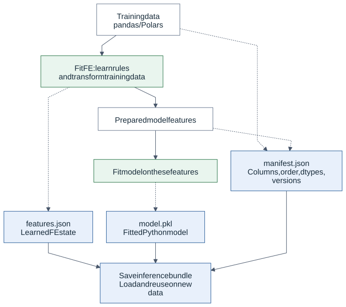
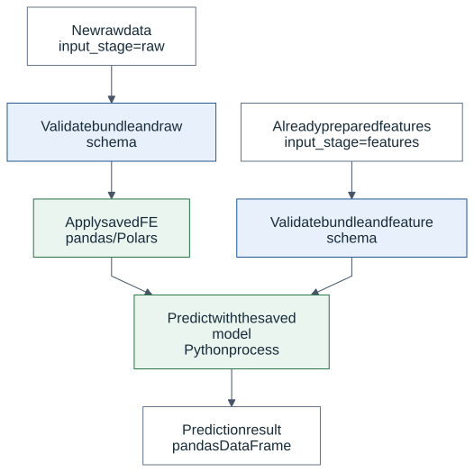
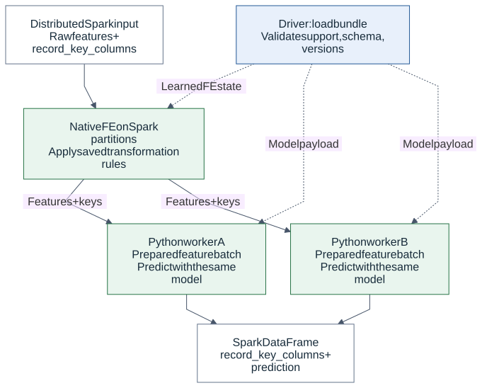
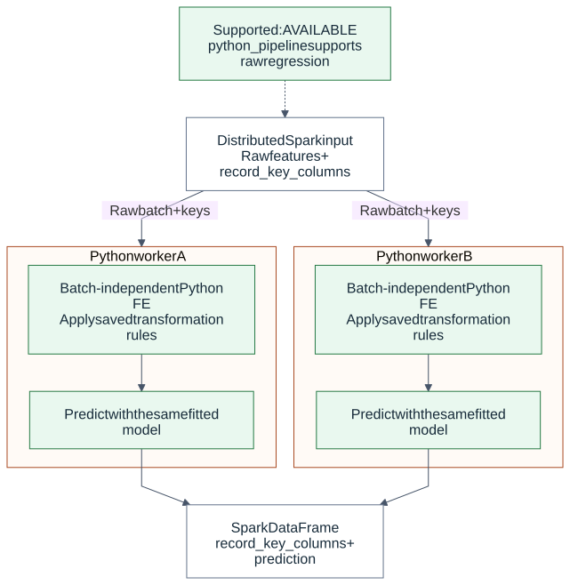

# How inference works: pandas, Polars and Spark

Inference reuses the preprocessing and model learned during training. The
execution choice determines where those saved transformations run and which
artifacts can be used. It does not fit a new imputer, scaler or model.

For a runnable starting point, use the [Python SDK example](databricks_sdk.md#fit-and-score-a-small-batch)
for a bounded frame, or the [Spark bundle example](inference_bundles.md#native-spark-fe-and-worker-model-inference)
for distributed input. Install the model's recorded dependencies in each
process that loads it.

## What training saves



[Editable diagram source](../assets/diagrams/inference/training.mmd)

A fitted pipeline artifact keeps the complete `SkyulfPipeline`, its fit engine,
raw and model-feature schemas, dependency versions and content identities. Use
`save_pipeline` and `load_pipeline` from `skyulf.inference.fitted_pipeline` for
this format. `score_pipeline` from `skyulf.inference.pipeline_scoring` applies
saved project scoring rules as well as the fitted preprocessing and model.

An `InferenceBundle` uses a separate portable representation: `features.json`
contains supported learned preprocessing state, `model.pkl` contains the fitted
estimator, and `manifest.json` records schemas, versions and output contracts.
Its explicit native Spark appliers turn saved state into Spark expressions;
JSON does not translate arbitrary Python code into Spark code.

Both formats contain trusted model payloads. Load artifacts only from controlled
producers. A checksum detects changed bytes; it does not make pickle safe.

## The same learned transformation

For training values `amount=[10.0, 30.0]` and `target=[100.0, 300.0]`, an imputer,
standard scaler and linear regressor can learn:

```text
Fill missing amount with 20.
z = (amount - 20) / 10
prediction = 100 * z + 200
```

| Row key | New amount | After imputation | After scaling | Prediction |
| --- | --- | --- | --- | --- |
| 101 | 40.0 | 40.0 | 2.0 | 400.0 |
| 102 | missing | 20.0 | 0.0 | 200.0 |

Supported execution paths reuse these same values. Workers do not compute a new
mean per partition or train separate estimators. Floating-point comparisons use
appropriate tolerances; universal bit-for-bit equality is not promised.

## Whole-frame Python execution



[Editable diagram source](../assets/diagrams/inference/whole_frame.mmd)

`score_pipeline(frame, artifact)` handles a pandas or Polars frame in one Python
process. It validates the saved input contract and uses the recorded fit engine.
This can be a workstation, a Databricks driver, or a cloud job. Supply the entire
intended request within the configured row and byte budget.

The portable bundle API uses `predict_local(frame, bundle)` and returns a pandas
DataFrame. For `input_stage="raw"`, it applies saved preprocessing first. A
`features` bundle expects already prepared model features and bypasses
preprocessing. Applying a scaler twice gives the wrong input; the API cannot
infer from numeric values whether a column has already been scaled.

`runtime="standalone"` in `WorkflowConfig` selects general Python integration
on any compute. `runtime="databricks"` enables Databricks integration and is
required for UC Delta publication. The pandas/Polars `engine` and Bundle
`inference_mode="local"`/`"spark"` are independent choices. The old SDK
`runtime="local"` value is rejected; update existing workflow configurations.

## Native Spark preprocessing and a Python model



[Editable diagram source](../assets/diagrams/inference/spark_native.mmd)

`predict_spark(..., mode="native_features")` accepts a raw-input portable bundle:

1. The driver checks supported transformations, schemas, versions and output contracts.
2. Native Spark expressions apply the saved preprocessing state.
3. Distributed checks validate unique, non-null row keys and row preservation.
4. Worker iterators load the fitted model and predict on prepared feature batches.
5. The result is a Spark DataFrame containing record keys and predictions.

The supported portable preprocessing chain is SimpleImputer `mean`/`constant`,
StandardScaler, or an empty chain. Regression and classification are supported;
classification returns probability columns in the saved class order and applies
the saved threshold decisions. Unsupported native steps fail explicitly.

The whole table remains distributed. Only worker batches become pandas/NumPy
inputs; there is no implicit collection into a driver frame. Model-call batch
size does not cap Arrow transport allocation or total worker memory. Install
compatible dependencies on both driver and workers.

Prediction is lazy until a Spark action or sink write. Validation may execute
separate distributed actions, returning bounded control results. Spark preserves
key identity, not physical row order; downstream consumers join by keys.

## Python preprocessing inside workers



[Editable diagram source](../assets/diagrams/inference/spark_python_planned.mmd)

`predict_spark(..., mode="python_pipeline")` applies the portable bundle's
supported preprocessing and model together within independent worker batches.
It has the same portable preprocessing scope and supports regression and
classification. Choosing this mode does not admit arbitrary fitted Python nodes.

A separate [certified MLflow pyfunc path](databricks_bundle.md#distributed-inference-settings)
uses inspected pandas fitted-pipeline packages. Its admission rules include the
exact fitted recipe, estimator, schema, source identity and worker environment.
Its supported recipes differ from the portable bundle's native Spark appliers.
Neither path silently falls back to collecting a distributed frame.

## Rows, groups, windows and history

The required context is the other data needed **at inference time**:

| Context | Caller responsibility | Example |
| --- | --- | --- |
| `row` | Supply the row and the saved model state | Imputation using a saved mean |
| `group` | Supply the complete intended current group | A callback subtracting the current request's group mean |
| `window` | Supply ordering and required prior/neighboring observations | Lag and rolling features |
| `global` | Preserve the intended complete request population | Population-dependent fallback or active deduplication |
| `unknown` | Inspect and validate the actual implementation | An undeclared custom callback |

A fitted GroupImputer is commonly `row`: training already saved the per-group
statistics and fallback. Looking up one row's group does not require the new
request to contain all members of that group. A callback recomputing the group
mean from incoming rows has a different contract.

Built-in lag/rolling steps in carry mode can use
`score_pipeline_with_history(..., history_state=...)`, which returns predictions
and detached continuation state. The caller persists both atomically and controls
concurrent writers. Whole-frame scoring preserves the frame supplied by the
caller; it cannot discover missing group members or fetch earlier events.
See [preprocessing diagnostics and context](preprocessing_context.md) for a
runnable continuation example and the diagnostic's `requires_context` outcome.

A passing sample diagnostic does not authorize independent Spark partitions or
single-row endpoint requests. Declared row context, supported serialization and
the execution adapter's fitted-state checks are separate requirements.

## Choosing an artifact and execution path

| Need | Entry point | Practical boundary |
| --- | --- | --- |
| Bounded pandas/Polars pipeline scoring | `score_pipeline` | Preserve required whole-frame context and the recorded fit engine |
| Continued built-in temporal history | `score_pipeline_with_history` | Caller owns history storage and atomic publication |
| Portable bundle in one process | `predict_local` | Supported portable state, raw or prepared-feature contract |
| Portable Spark inference | `predict_spark` | Raw input, admitted portable preprocessing, keyed distributed output |
| Certified fitted pandas model on Spark | Bundle `inference_mode="spark"` | Exact fitted recipe, model and worker environment must pass admission |

Existing `SkyulfPipeline.save/load` and backend `.joblib` files remain valid for
their original consumers. A backend artifact dictionary is not an
`InferenceBundle`; do not pass it directly to `build_bundle`. See
[artifact formats and compatibility](inference_bundles.md#current-support-and-legacy-adapters).

Scheduling, Delta publication, HTTP serving and SQL invocation are separate
integration choices. Use the [batch publication guide](databricks_batch.md),
[MLflow packaging guide](mlflow_models.md) and [Bundle guide](databricks_bundle.md)
for the corresponding contracts.
