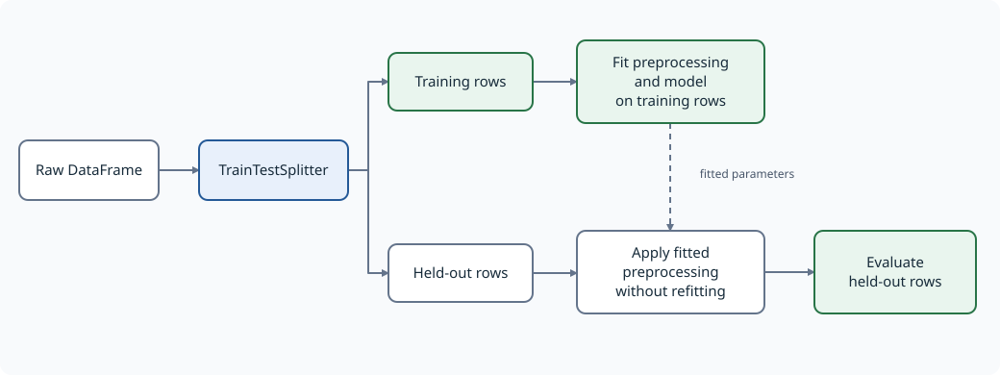
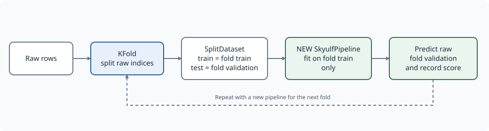
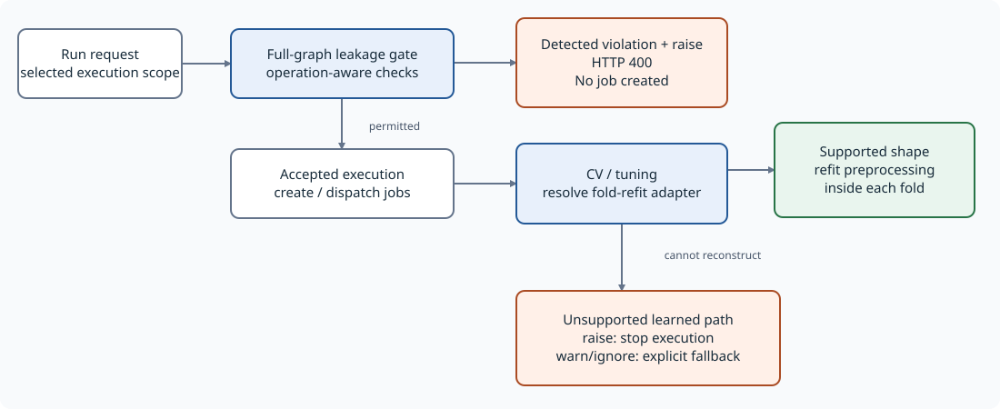
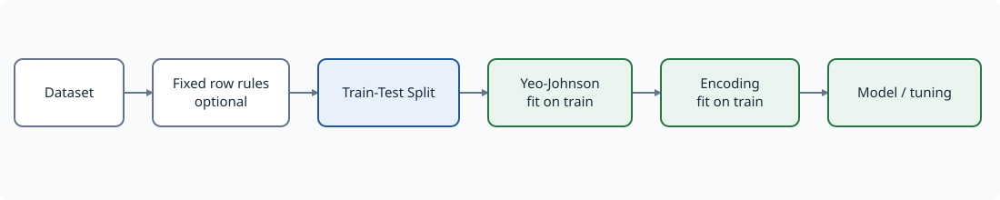
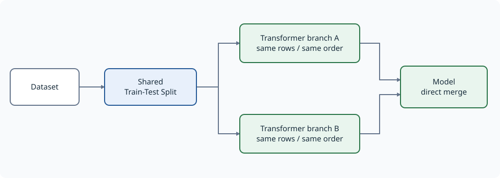
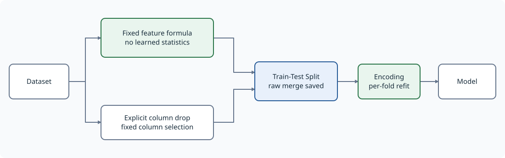

# Leakage safety: core and backend

A practical guide to **what is checked**, **which pipeline shapes work**, and
**which current limitations require extra care**.

This page distinguishes the standalone core API from the backend/canvas graph
executor. They share the same operation-aware leakage classification, but they do not execute the
same representation: core uses an ordered preprocessing list; the backend
executes a directed graph.

> **Classify the operation, not just the node name.**
> Yeo-Johnson and Box-Cox learn parameters; log and square do not.
> Core and backend now share an operation-aware classifier, and frontend
> preflight mirrors those rules. Fixed formulas are not rejected merely
> because another mode of the same node learns statistics.

The diagrams use blue for a split/check boundary, green for the recommended
training path, and orange for a rejected, unsafe, or unsupported situation.
SVG previews work without Mermaid support; each diagram also includes its
editable Mermaid source.

## 1. Two different guarantees

| Question | Leakage admission check | Per-fold refit capability |
|---|---|---|
| What does it inspect? | Step ordering, branch protection, and configured exceptions | Whether preprocessing can be reconstructed inside each CV/tuning fold |
| What does a definite violation mean? | A learned transform can see held-out rows before the boundary | Not applicable: an unsupported shape is a reconstruction limitation |
| Default failure behavior | Raise before fitting; backend submission returns HTTP 400 before jobs | Unsupported learned paths fail by default; explicit warn/ignore permits fallback |
| Does passing prove every operation is safe? | No: classification and operation semantics still matter | No: compatible graph structure is necessary, not a universal safety proof |

**Outer train/test safety is not the same as inner CV safety.** Fitting an
encoder once on the entire outer training partition can preserve the untouched
test partition, while still exposing each inner CV validation fold to learned
categories from that fold.

The `feature_target_split` / Feature-Target Split node only separates features
(X) and target (y). It does **not** partition rows into train and test.

## 2. Standalone core: one ordered preprocessing pipeline

### 2.1 Put the split before learned preprocessing



[Editable Mermaid source](../assets/diagrams/leakage/core_holdout.mmd)

With raw input, `SkyulfPipeline.fit()` checks the configuration before fitting
preprocessing or a model. `get_fitted_split()` applies the same policy before
fitting its throwaway preprocessing chain.

A configured splitter creates the row boundary. Downstream transformers fit on
the training partition and apply those fitted parameters to held-out partitions.

Fixed, row-local operations may precede the splitter. This is a property of the
**configured operation**, not merely its display name. For example, an explicit
column deletion is fixed; selecting columns by missing-value percentage is not.

### 2.2 A complete core example with Yeo-Johnson

This example uses the dedicated `PowerTransformer`, which is registered as a
learner, and places it after the splitter. It requires only the core library.

```python
import pandas as pd

from skyulf import SkyulfPipeline

data = pd.DataFrame({
    "x": [1.0, 2.0, 3.0, 4.0, 5.0, 6.0, 7.0, 8.0, 20.0, 30.0, 50.0, 80.0],
    "target": [3.0, 5.0, 7.0, 9.0, 11.0, 13.0, 15.0, 17.0, 41.0, 61.0, 101.0, 161.0],
})
config = {
    "preprocessing": [
        {
            "name": "split",
            "transformer": "TrainTestSplitter",
            "params": {
                "test_size": 0.25,
                "random_state": 42,
                "target_column": "target",
            },
        },
        {
            "name": "power",
            "transformer": "PowerTransformer",
            "params": {
                "columns": ["x"],
                "method": "yeo-johnson",
                "standardize": True,
            },
        },
    ],
    "modeling": {"type": "linear_regression"},
}

pipeline = SkyulfPipeline(config)
metrics = pipeline.fit(data, target_column="target")
predictions = pipeline.predict(pd.DataFrame({"x": [9.0, 10.0]}))
```

`pipeline` is an ordinary variable containing a `SkyulfPipeline` instance.
It is not a special mode. The example demonstrates preprocessing boundaries,
not a claim that this transform/model combination is optimal for these data.

To use the canvas-equivalent transform in a core config, replace the power step
with the following **in the same post-split position**:

```python
{
    "name": "power",
    "transformer": "GeneralTransformation",
    "params": {
        "transformations": [
            {"column": "x", "method": "yeo-johnson"},
        ],
    },
}
```

Both implementations learn power parameters. Both now reject this operation
before the splitter under the default policy. Pure mathematical operations in
GeneralTransformation remain allowed.

### 2.3 Choose the leakage policy explicitly only when necessary

| Mode | Config-only diagnostic, definite violation | fit / get_fitted_split, definite violation |
|---|---|---|
| `raise` (default) | Raises `ValueError` | Stops before any fitting |
| `warn` | Returns warning strings | Logs warnings, then continues |
| `ignore` | Returns an empty list | Continues without leakage warnings |

```python
messages = pipeline.validate_leakage_safety(on_leakage="warn")
# Only if deliberately accepting an unsafe fit:
# pipeline.fit(data, target_column="target", on_leakage="warn")
```

Only `raise`, `warn`, and `ignore` are accepted. The latter two do not repair
leakage, create a splitter, enable CV, or make an unsupported backend graph
refittable. They do not suppress unrelated errors.

A config with **no splitter** receives an advisory under `raise` and `warn`,
rather than a definite-violation exception. Silence under `ignore` is not a
safety verdict.

### 2.4 Supply a SplitDataset, or create one per CV fold

Passing an existing `SplitDataset` supplies the boundary externally. Configure
the transformations without another train/test splitter. The caller is
responsible for creating disjoint **raw** partitions; the container cannot undo
preprocessing already fitted on the combined data.



[Editable Mermaid source](../assets/diagrams/leakage/core_cv.mmd)

For core-only CV, split raw indices and create a new pipeline inside every fold:

```python
from copy import deepcopy

from sklearn.model_selection import KFold

from skyulf.data.dataset import SplitDataset

fold_config = deepcopy(config)
fold_config["preprocessing"] = [
    step for step in fold_config["preprocessing"]
    if step["transformer"] != "TrainTestSplitter"
]

for train_indices, validation_indices in KFold(
    n_splits=3, shuffle=True, random_state=42
).split(data):
    fold_data = SplitDataset(
        train=data.iloc[train_indices].copy(),
        test=data.iloc[validation_indices].copy(),
    )
    fold_pipeline = SkyulfPipeline(deepcopy(fold_config))
    fold_pipeline.fit(fold_data, target_column="target")
    fold_predictions = fold_pipeline.predict(
        fold_data.test.drop(columns=["target"])
    )
    # Score fold_predictions against fold_data.test["target"].
```

Do not transform the full dataset first and then hand its transformed rows to
KFold. Do not reuse the same fitted pipeline across folds. If CV is used for
model selection, retain an additional untouched final test set.

The interactive notebook `skyulf-core/examples/09_leakage_safety.ipynb` includes
computed CV scores, prediction tables, and numerical train-only scaling checks.

### 2.5 Native core tuning also refits preprocessing per fold

For automatic tuning, keep the same safe preprocessing and replace modeling:

```python
tuning_config = deepcopy(config)
tuning_config["modeling"] = {
    "type": "hyperparameter_tuner",
    "base_model": {"type": "ridge_regression"},
    "strategy": "grid",
    "metric": "r2",
    "search_space": {"alpha": [0.1, 1.0]},
    "cv_folds": 3,
    "random_state": 42,
}
tuned_pipeline = SkyulfPipeline(tuning_config)
tuning_metrics = tuned_pipeline.fit(data, target_column="target")
```

These settings are flat modeling keys, not a nested tuning/params object.
Without an explicit validation partition, each candidate fits a fresh
preprocessor on each inner fold's raw training rows. Final refitting learns
one preprocessor on the full outer training partition; serving reuses exactly
that instance's fitted state. An explicit validation partition selects holdout
tuning instead. Threshold tuning receives final transformed validation data,
not raw features. OOF target encodings and training-only row changes retain
their final training representation for evaluation.

An outer splitter still belongs before learned preprocessing. Inner CV does
not excuse contaminating the outer test partition before tuning begins.

## 3. Backend: graph validation and execution are separate stages

### 3.1 Where the decisions happen



[Editable Mermaid source](../assets/diagrams/leakage/backend_decisions.mmd)

The submission router checks the full graph before partitioning it into jobs.
For a selected model, the check scopes execution to that model and its ancestors,
while retaining the graph context needed for branch protection.

If a detected definite violation uses the default `raise` policy, submission
returns HTTP 400 and creates no jobs. The frontend displays the server detail;
its own preflight is not a replacement for this server-side gate.

When a CV/tuning run reaches the fold-preprocessing resolver, that resolver
separately builds a reconstruction adapter from raw training rows. It uses the
first actual row splitter, not Feature-Target Split or a later repeated splitter.

If reconstruction is unsupported and upstream preprocessing learns from data,
the default policy stops execution instead of reporting contaminated CV scores.
Explicit `metadata.on_leakage="warn"` or `"ignore"` permits the legacy fallback;
its `fold_refit_fallback` diagnostics still describe the missing guarantee.
An execution-time capability failure can occur after a job exists; it is
different from the admission gate's HTTP 400/no-job outcome.

Composite feature-engineering nodes are inspected step by step, not treated as
opaque safe containers. Target-only exemptions use unambiguous branch context;
a target name from an unrelated sibling branch cannot exempt feature encoding.

**Read admission and reconstruction outcomes independently.** Neither can
validate the provenance of features computed outside the graph.

### 3.2 Recommended linear graph



[Editable Mermaid source](../assets/diagrams/leakage/backend_linear.mmd)

For the graph discussed here, move Yeo-Johnson **after** Train-Test Split.
For ordinary sequential feature generation and column deletion, a linear
chain is simplest. Safe parallel branches merging at the first row splitter
are also supported under the requirements below.

A linear upstream chain is supported provided its steps and payload meet the
resolver's other requirements. Learned preprocessing before the split is still
wrong even in a perfectly linear graph.

Multiple handles from the **same source node**, such as X/y handles, are
deduplicated for the ancestor-shape check. They are not the same as two distinct
upstream nodes merging into a splitter.

### 3.3 Supported parallel branches



[Editable Mermaid source](../assets/diagrams/leakage/backend_fork_join.mmd)

The supported fork-join form has one shared loader/trunk, a common splitter as
the fork point, and transformer branches merging **directly into the model**.

Requirements include:

- Each branch is a linear transformer chain.
- There are no nested merges along those chains.
- Branches contain no additional splitters or disallowed row-changing steps.
- Branches preserve the row alignment required by the merge.
- Trunk preprocessing before the splitter is genuinely safe.
- Branch column selection and merge order preserve the intended features.

The positional merge rejects `ManualBounds`, `LagFeatures(drop_na=True)` and
`LagFeatures`/`RollingAggregate` with a configured `sort_by`. These settings
can filter or reorder observations in one branch independently of the others.
Lag and rolling features with sorting and filtering disabled remain supported.
The same check runs in the Core merged-fold adapter and backend reconstruction
path; CV/tuning is blocked by default for an unsupported learned graph.
An explicit `on_leakage="warn"` or `"ignore"` retains the documented legacy
fallback and records `fold_refit_fallback="row_changing_branch_step"`.
Single-branch adapters retain their existing sorting/filtering behavior.

Overlapping columns can be replaced according to merge order. Prefer disjoint
feature outputs where appropriate; topology support alone does not establish
correct merge semantics.

Merging into an intermediate encoder and then connecting that encoder to the
model is not the same currently supported shape as merging directly into the
model.

### 3.4 The screenshot's merge-at-splitter shape



[Editable Mermaid source](../assets/diagrams/leakage/backend_pre_split_merge.mmd)

A splitter with two distinct parents is not linear. This case now has a
dedicated reconstruction path: save its merged raw input, retain the outer
training row selection, and fit downstream learned steps inside each fold.

Requirements include a common loader, genuinely fixed upstream operations,
and a reconstructable downstream chain. Composite nodes containing the first
row split use the same boundary rule. This does not enable arbitrary nested
post-split joins or merges from unrelated datasets.

| Pre-split transformation | Admission under raise | Fold reconstruction |
|---|---|---|
| Fixed arithmetic plus explicit column deletion | Allowed | Supported when the requirements above hold |
| GeneralTransformation Yeo-Johnson or Box-Cox | Rejected | Move the learned step after the split |
| PowerTransformer | Rejected | Move it after the split |
| FeatureGeneration group_agg | Rejected | Fit the group mapping after the split |

Replacing arithmetic with Yeo-Johnson changes the learning semantics even
when the graph looks identical. The safe version of your graph is either
fixed branches merging at the splitter, or a linear chain with Yeo-Johnson
after the splitter.

`unsupported_graph` remains a capability diagnostic, not a successful
leakage check. Selecting warn/ignore does not make that shape refittable.

## 4. Operation-level behavior and limits

The complete [per-node audit](preprocessing_leakage_audit.md) lists all
62 registered preprocessing IDs, including the two row-splitter registrations.

| Node/configuration | Actual behavior | Placement |
|---|---|---|
| GeneralTransformation log/sqrt/square and other fixed formulas | Row-local function | May precede split |
| GeneralTransformation Yeo-Johnson/Box-Cox | Fits lambda and scaling statistics | After split |
| FeatureGeneration arithmetic/ratio/similarity/datetime | Fixed feature calculation | May precede split |
| FeatureGeneration group_agg | Fits group lookup on train; reuses it on held-out rows | After split |
| Casting category/categorical | Fits category vocabulary | After split |
| Casting float/string/datetime | Fixed type conversion | May precede split |
| CustomBinning with explicit columns | Fixed configured edges and selection | May precede split |
| CustomBinning with omitted/null columns | Selects numeric columns using observed values | After split |
| DropMissingColumns without positive threshold | Fixed deletion | May precede split |
| DropMissingColumns with positive threshold | Learns missingness-based deletion | After split |
| SimpleImputer constant | Configured fill | May precede split |
| SimpleImputer mean/median/most_frequent | Learns fill statistics | After split |
| OrdinalEncoder omitted/null columns | Auto-selects and learns feature categories | After split |
| LabelEncoder default or explicit target-only encoding | Target labels, not feature statistics | Exempt with correct target context |
| Count/TFIDF nonempty feature selection | Learns vocabulary/IDF | After split |
| Count/TFIDF omitted/null/empty selection | No-op, not text auto-detection | Exempt |

An explicit empty selection is a no-op only where the implementation says so.
MissingIndicator and selectors can interpret it as automatic discovery.
Mixed operation lists remain learned if any constituent operation learns.

Group aggregates now reuse a training lookup. Unknown groups become missing,
rather than acquiring statistics from the test batch. Configure downstream
missing-value handling when the model requires it. Legacy group artifacts
without a fitted lookup require refitting.

A row-local formula can still leak if it references the target or information
unavailable at prediction time. Lag/rolling features also require the correct
time order, grouping, prediction horizon, and split strategy. The guard does
not prove feature provenance, entity independence, or absence of future data.
Report-only statistics are not the same as fitted model features.

## 5. What the tests establish

The shared JSON fixtures are:

- `skyulf-core/tests/test_cases/leakage/registry_nodes.json`: registry inventory and placement/policy contracts.
- `skyulf-core/tests/test_cases/leakage/operation_modes.json`: expectations derived from actual fit/apply behavior, independent of registry flags.

Core and backend have separate integration matrices for raise, warn, ignore,
before/after split, and missing/unprotected boundaries. Backend submission
tests exercise the actual FastAPI route while replacing external job dispatch;
graph tests execute real preprocessing and model/CV paths.

Per-family regressions exercise train-only statistics, held-out perturbations,
batch versus singleton application, unseen categories/groups, null/infinite
values, empty selections, configuration mutation, target exclusion, row
alignment, and artifact replay. Core native tuning tests count real scaler
fits inside candidate folds across grid, random, halving, and Optuna paths.

Coverage is deliberately not described as every possible edge case.
Pretrained sentence embedding tests use a deterministic model double; they
do not download and validate every external model. The per-node audit records
compatibility and temporal/provenance limitations.

## 6. Practical checklist

1. Identify the serialized transformer and its operation, not only its canvas label.
2. Put Yeo-Johnson, learned encoding, imputation, and scaling after the row split.
3. Treat X/y separation as different from a train/test split.
4. Use a supported linear, direct post-split fork-join, or safe merge-at-splitter graph.
5. Inspect both leakage diagnostics and fold-refit/fallback information.
6. Prefer correcting ordering and graph shape to selecting `warn` or `ignore`.
7. For core-only CV, fit a fresh pipeline on each fold's raw training partition.

See also [SplitDataset & Leakage](splitdataset_and_leakage.md) and
[Cross-Validation](cross_validation.md).

For the complete before/after-split decision tables, see
[Preprocessing Placement](preprocessing_placement.md). Canvas users can access
the searchable inventory in **How pipelines work > Preprocessing & Leakage**.
