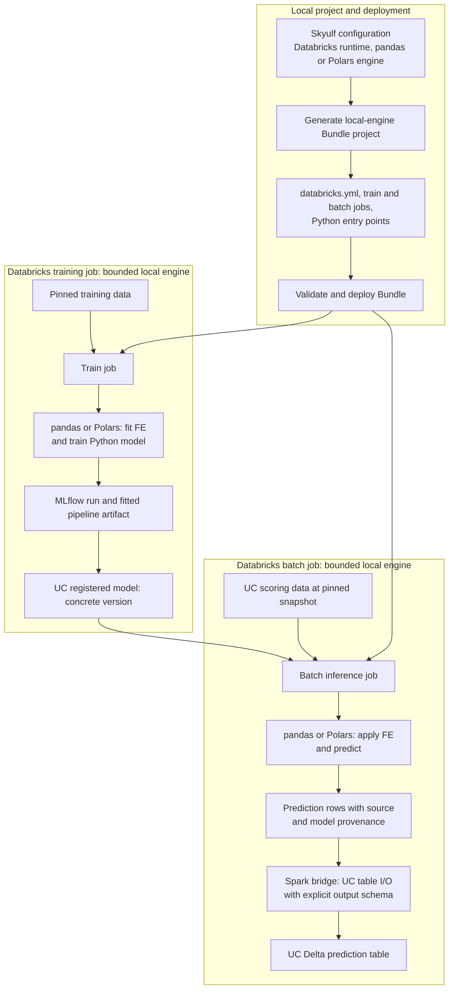

# SM-20: local-first Databricks Bundle, then Spark enhancement

Updated: 2026-09-24. The first local-engine Bundle is implemented and validated;
see [SM-20a live evidence](21-sm20a-local-bundle-validation-report.md). SM-15L
proved explicit-period writes and SM-15I proved automatic new-row scoring.
The [open queue](OPEN_QUEUE.md) owns status and task order.

## Outcome and engine boundary

The first generated project runs fitted feature engineering and model prediction
in pandas or Polars on bounded data inside a Databricks job. Spark may read a
versioned UC source and write the final prediction rows to a UC Delta table;
it does not transform features or score the model in this first variant.
The model is logged through MLflow and loaded from a pinned Unity Catalog
version. The generated project has its own `databricks.yml`; Skyulf's repository
root does not need one.



[Download the rendered SVG](diagrams/local-engine-bundle.svg). The diagram
shows the first local-engine Bundle end to end; the scoring job is independent
of a particular schedule or period-publication policy.

This separates the prediction engine from table I/O. Databricks documents
[`spark.createDataFrame` from local data on serverless](https://docs.databricks.com/aws/en/compute/serverless/limitations)
and [atomic selective Delta overwrite](https://docs.databricks.com/aws/en/delta/selective-overwrite).
The [SM-15L live test](11-sm15l-live-validation-report.md) passed the
Skyulf bridge, explicit schema, replay and monthly publication checks.
The SQL Connector is an alternative, not a required part of the first Bundle.

## SM-20a prerequisites and generated project

1. SM-26 proves local fitted pipeline save/load/MLflow prediction parity.
2. SM-25 selects pandas or Polars, a pinned model version, bounded source,
   output table and publication mode before the job starts.
3. SM-24a exposes a local training and batch prediction entry point.
4. [SM-15L](11-sm15l-live-validation-report.md) proves explicit-period local
   prediction -> UC Delta publication, replay and shared admission.
5. [SM-15I](12-sm15i-incremental-scoring-plan.md) adds automatic first-snapshot
   and subsequent new-row scoring with an append-safe, committed source
   watermark. The current `replaceWhere` path cannot accept only new rows
   when they overlap a previously written period.

6. SM-22a/b produce a read-only candidate/champion comparison and separate,
   version-checked promotion/rollback operations.
7. SM-28a trains and registers a label-aware candidate from a pinned snapshot,
   then compares it without automatic promotion. The optional monthly schedule
   is wired in SM-28b after the Bundle exists.

The delivered custom template generates a project with these responsibilities:

```text
templates/databricks/databricks_template_schema.json
templates/databricks/template/{{.project_name}}/databricks.yml.tmpl
templates/databricks/template/{{.project_name}}/config/workflow.json.tmpl
templates/databricks/template/{{.project_name}}/resources/workflow.jobs.yml
templates/databricks/template/{{.project_name}}/src/workflow.py
templates/databricks/template/{{.project_name}}/README.md.tmpl
```

The generated Python entry point calls Skyulf services; it does not copy FE, model,
MLflow, comparison, promotion or Delta publication implementations. Separate
train, compare, explicit-promote and score jobs preserve the decision boundary.
The first verified cross-job
artifact path uses MLflow and a concrete UC model version. Tracking-off and
registry-off variants need their own durable artifact-handoff test before they
are offered. Configuration includes source/target table names, a globally
unique row key, maximum local rows/bytes, a pinned model version, compute
environment and schedule. The job derives source versions from committed
receipts; scheduled runs need no period or source-version input. Credentials
are resolved by the platform, not generated into files. Serverless Python job tasks declare the
required environment and package dependencies.

## Two-run incremental UC table rehearsal

Use an isolated test catalog.schema and a source Delta table with compatible
Change Data Feed available before the test inserts. Provision an empty prediction
table and shared admission authority. Train one fixed model and pin its UC
version for both runs. The job configuration contains source/model/target and
local size limits once; it does not contain dates or changing source versions.

| Step | Action | Required observation |
| --- | --- | --- |
| Setup | Put two keyed rows in the source; create an empty target | Source table identity and current version visible to the job |
| First run | Start the generated scoring job with no period/version parameters | Both existing rows predicted, values equal local gold; committed receipt records source high version and target version |
| New data | Append two new keyed rows to the source | New source version; both inserted keys were absent from first run |
| Second run | Start the same job, again without period/version parameters | Only the two new rows scored; target now has four rows; both first-run predictions and metadata unchanged |
| Replay/no-op | Retry the same work or run again with no source inserts | No duplicate predictions or new target commit |
| Failure | Force an output failure before commit, then retry | Committed source watermark stays unchanged until predictions commit |

A source with no date column must work. When an event timestamp exists, also
test a late-arriving row with an older timestamp. The source change-version
range, not the job start date or event timestamp, determines which rows are
new. The output may retain event timestamps for analysis. An
explicit `period_update` remains available for controlled backfills, but it
is not the scheduled default. Source updates/deletes are rejected until their
policy is defined and tested.

## Selectable scoring and retraining extensions

The first Bundle implements automatic `incremental_append` as its scheduled
default. SM-15L's `period_update` remains an explicit backfill operation.
SM-27 later adds an explicit `full_rebuild` mode; neither is triggered by
the schedule or a moved model alias.

| Mode | Input and publication | Typical use |
| --- | --- | --- |
| `incremental_append` (scheduled default) | Initial bounded snapshot, then only new source inserts since the last committed source version; append predictions with an atomic receipt | Routine jobs when new records arrive |
| `period_update` (explicit) | Score one selected period from a pinned source version and replace exactly that period | Controlled backfill or correction |
| `full_rebuild` (later SM-27) | Recompute a pinned, bounded historical scope into a new validated generation and explicitly activate it | Model migration or revised historical view |

The full rebuild must keep its source snapshot, model version, `as_of`, row
scope, generation ID and activation receipt. Its failure must leave the old
generation active. Historical decision-time predictions remain available;
rescores using later information must be labeled as current-state results.
SM-27 adds a separate rehearsal: rescore all four rows into a new
generation, activate it, and verify rollback.

SM-28a adds label-aware candidate training and uses SM-22a/b before the
Bundle is generated. SM-28b later wires its optional monthly schedule.
Comparison never promotes implicitly. The scoring job pins the chosen concrete model
version once per run. A new champion does not retroactively alter previous
months; `full_rebuild` remains a separate request.

## Acceptance and later expansion

Offline checks cover template generation, imports, config preflight and
`databricks bundle validate`. A separate live check deploys the generated dev
target, runs training and two automatic incremental scoring steps, then
compares rows by key, model/version metadata and Delta history. The Bundle is complete only when
the generated project itself passes those checks; an SDK-only smoke is not
sufficient. The first generated project does not need endpoints, `ai_query`,
online feature lookup, monitoring or dynamic Jobs API helpers.

SM-20b follows the accepted local Bundle. It adds a Spark inference choice
only for artifact, FE, model and runtime combinations verified by SM-24c and
the relevant SM-17 slices. The same two-run incremental rehearsal then runs against
that Spark variant. The pandas/Polars choice remains available.
