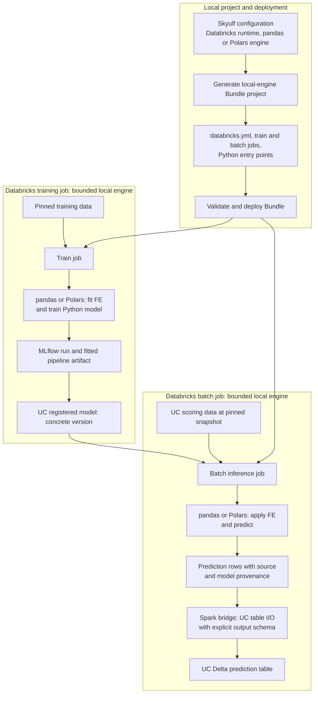

# SM-20: local-first Databricks Bundle, then Spark enhancement

Updated: 2026-09-23. Planning only; no generated project has been created
by this plan. The SM-15L local monthly writer passed its separate live gate.
The [open queue](OPEN_QUEUE.md) owns status and task order.

## Outcome and engine boundary

The first generated project runs fitted feature engineering and model prediction
in pandas or Polars on bounded data inside a Databricks job. Spark may read a
versioned UC source and write the final prediction rows to a UC Delta table;
it does not transform features or score the model in this first variant.
The model is logged through MLflow and loaded from a pinned Unity Catalog
version. The generated project has its own `databricks.yml`; Skyulf's repository
root does not need one.



[Download the rendered SVG](diagrams/local-engine-bundle.svg). The diagram
shows the first local-engine Bundle end to end; the scoring job is independent
of a particular schedule or period-publication policy.

This separates the prediction engine from table I/O. Databricks documents
[`spark.createDataFrame` from local data on serverless](https://docs.databricks.com/aws/en/compute/serverless/limitations)
and [atomic selective Delta overwrite](https://docs.databricks.com/aws/en/delta/selective-overwrite).
The [SM-15L live test](11-sm15l-live-validation-report.md) passed the
Skyulf bridge, explicit schema, replay and monthly publication checks.
The SQL Connector is an alternative, not a required part of the first Bundle.

## SM-20a prerequisites and generated project

1. SM-26 proves local fitted pipeline save/load/MLflow prediction parity.
2. SM-25 selects pandas or Polars, a pinned model version, bounded source,
   output table and publication mode before the job starts.
3. SM-24a exposes a local training and batch prediction entry point.
4. [SM-15L](11-sm15l-live-validation-report.md) proves local prediction -> UC
   Delta publication, including replay, stale requests and reuse of the
   previously tested shared admission. The current `run_batch` performs
   Spark inference and cannot be called as if it performed local prediction.
   Its `publish_replace_period` logic is reused by `run_local_batch` with a
   truthful local request contract and explicit final-result conversion.

The custom template should generate a project with these responsibilities:

```text
templates/databricks/databricks_template_schema.json
templates/databricks/template/{{.project_name}}/databricks.yml.tmpl
templates/databricks/template/{{.project_name}}/resources/train_job.yml.tmpl
templates/databricks/template/{{.project_name}}/resources/batch_job.yml.tmpl
templates/databricks/template/{{.project_name}}/src/train.py.tmpl
templates/databricks/template/{{.project_name}}/src/score_month.py.tmpl
templates/databricks/template/{{.project_name}}/README.md.tmpl
```

The generated Python files call Skyulf services; they do not copy FE, model,
MLflow or Delta publication implementations. The first verified cross-job
artifact path uses MLflow and a concrete UC model version. Tracking-off and
registry-off variants need their own durable artifact-handoff test before they
are offered. Configuration includes source/target table names, row keys,
period column, business timezone, maximum local rows/bytes, model version,
compute environment and optional schedule. Credentials are resolved by the
platform, not generated into files. Serverless Python job tasks declare the
required environment and package dependencies.

## Two-month UC table rehearsal

Use an isolated test catalog.schema. Provision the input and prediction tables
explicitly; keep training data separate from the scoring rows. Train one fixed
model and pin its UC version for both scoring runs so this test isolates
publication behavior. Let `M1` and `M2` be consecutive business months, and
`S1`/`S2` the source Delta versions after each month's data arrives. Each
scoring job runs after the corresponding month closes.

| Step | Action | Required observation |
| --- | --- | --- |
| Setup | Put two keyed `M1` rows in the source table; create an empty prediction table | Source version `S1`; output schema and initial target version recorded |
| First monthly run | After `M1` closes, filter and score only `M1` at `S1` with pinned model version and run ID `R1` | Exactly two persisted `M1` predictions; values equal direct pandas/Polars gold results; receipt names `S1`, model and target version |
| Next month's data | Append two keyed `M2` rows to the same source table | New source version `S2`; original `M1` source rows remain |
| Second monthly run | After `M2` closes, filter and score only `M2` at `S2` with run ID `R2` and expected target version from `R1` | Two new `M2` predictions; target now has four rows across two months; both `M1` prediction values and run metadata remain unchanged |
| Replay | Repeat the exact `R2` request | Return the recorded receipt without another target commit or changed rows |
| Stale conflict | Submit a new logical request with the old expected target version | Reject it without changing the prediction table |

The output is a persisted UC Delta table, but the second job computes only
`M2`; it does not materialize or re-score both months. The period-scoped Delta
write behaves like an append for a new month and replaces only that month on
an explicit rerun. A late-arriving row in `M1` requires a separate `M1`
backfill request; it must not be picked up silently by the `M2` job. Require
unique row keys within each month, stable column order, explicit null/dtype
conversion and a bounded month-filtered local read. Capture source versions
and `as_of` after their commits rather than guessing availability. No
production table is used.

## Selectable scoring and retraining extensions

The first Bundle implements `period_update` only. SM-27 later adds an explicit
`full_rebuild` mode to the generated local-engine project. The selection is a
job parameter with preflight, not an automatic reaction to new data or a moved
model alias.

| Mode | Input and publication | Typical use |
| --- | --- | --- |
| `period_update` (default) | Score one requested month from a pinned source version; idempotently replace that month's output; retain all other periods and their model versions | Monthly forecasts and auditable past decisions |
| `full_rebuild` (explicit) | Score a pinned, bounded historical scope with one model version; publish a new validated prediction generation and explicitly activate it | Recompute a current-state view, corrected data, or a model migration |

The full rebuild must keep its source snapshot, model version, `as_of`, row
scope, generation ID and activation receipt. Its failure must leave the old
generation active. Historical decision-time predictions remain available;
rescores using later information must be labeled as current-state results.
The rehearsal adds a third run only after SM-27: score `M1` and `M2` at `S2`
into a new generation, compare four rows, activate it, and verify rollback.

SM-28 separately adds optional monthly retraining after labels are available.
It trains a candidate, uses SM-22 to compare against a pinned champion, and
requires explicit promotion. The scoring job pins the chosen concrete model
version once per run. A new champion does not retroactively alter previous
months; `full_rebuild` remains a separate request.

## Acceptance and later expansion

Offline checks cover template generation, imports, config preflight and
`databricks bundle validate`. A separate live check deploys the generated dev
target, runs training and both monthly scoring steps, then compares rows by
key and month, model/version metadata and Delta history. The Bundle is complete only when
the generated project itself passes those checks; an SDK-only smoke is not
sufficient. The first generated project does not need endpoints, `ai_query`,
online feature lookup, monitoring or dynamic Jobs API helpers.

SM-20b follows the accepted local Bundle. It adds a Spark inference choice
only for artifact, FE, model and runtime combinations verified by SM-24c and
the relevant SM-17 slices. The same two-month rehearsal then runs against
that Spark variant. The pandas/Polars choice remains available.
