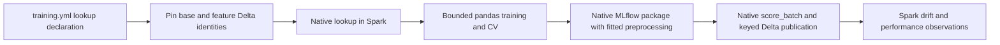

# Direct YAML projects and native feature lifecycle

Continuation after local commit `f4cd2d32`. The user confirmed there are no existing
generated projects to migrate. This change starts new projects directly with YAML
and continues SM-21a. It does not delete or redeploy any workspace resources.

## Project layout

New single-model, competition and multi-target Bundles emit:

- `config/training.yml`: shared defaults, named models, tuning and CV settings.
- `config/inference.yml`: scoring, promotion handoff and optional set composition.
- `config/features.yml`: optional feature production; empty groups add no feature job.
- `src/features/`: custom transformations and business logic that belong in Python.

Generated `workflow.json`, Python model declarations and `migrate_config.py` are
removed. `projects/yaml_migration.py` is also removed. Existing library readers
for saved/legacy projects remain; new projects have one authoritative owner for
each setting. Tools, job parameters, graph refresh, smoke checks and operator
documentation use `config/training.yml` directly.

The loader also rejects duplicate configuration ownership. Per-model defaults do
not leak from the representative first model into another branch. JSON flow
values inside generated YAML preserve scientific notation and Unicode values.

See [YAML evidence](182-yaml-defaults-evidence.md) for exact files and checks.

## SM-21a implementation

The optional `feature_lookup` declaration connects the ordinary lifecycle to
native Feature Engineering. It is absent by default. Activation and an example
are in the generated [FEATURE_TABLES guide](../../skyulf-core/templates/databricks/template/%7B%7B.project_name%7D%7D/FEATURE_TABLES.md).



`feature_store/lifecycle_config.py` validates declarations and immutable bindings.
`training.py` retains lookup controls needed by splitting, pins feature evidence,
and reconstructs native TrainingSets across job boundaries. `table_checks.py`
checks actual feature primary-key uniqueness/nulls and key/time types against
Unity Catalog metadata. `snapshots.py` checks Delta table IDs and versions.

Training materialization uses a metadata-preserving native set; logging uses the
same base snapshot and lookups with metadata excluded from model inputs. The
binding travels in saved frame receipts and the candidate training specification.
Prepared frames from different feature history are rejected before fitting.
Existing training row/byte budgets and fitted preprocessing behavior remain.

Single and competition logging package fitted bytes through native Feature
Engineering. Winner adoption preserves the complete wrapper instead of dropping
its lookup specification. Compatible model-set components produce one union
lookup package. Conflicting snapshots or feature meanings are rejected, including
a feature fetched by one branch but treated as a direct input by another.

The MLflow integration validates the native envelope, raw fitted artifact,
signature, feature specification, worker wheel and existing safety certificate.
SDK enumeration order may differ from model input order; exact named input types
are checked and the fitted model signature retains its own order. Native SDK
logging is republished under an explicit `runs:/.../model` path for the existing
registry lifecycle. [Packaging evidence](182-feature-packaging-evidence.md)
distinguishes the injected SDK boundary from real local MLflow operations.

Scoring uses a concrete resolved model URI, native `score_batch`, exact named
prediction output and distributed record-key/cardinality validation. Both single
and set receipts retain feature evidence. Feature-only changes are checked even
when the base Delta source would otherwise return an incremental no-op.

Spark monitoring joins the saved prediction keys to their base snapshots and
reconstructs the model's feature values with matching lookup/feature-table
evidence. A component can match its subset of a model-set receipt. Production
performance baselines distinguish changed feature table identities/semantics.
Ordinary non-feature observation and training routes retain their existing behavior.

## Operational boundaries

- Native workspace acceptance is **pending by the user's prior decision**. No
  cloud model, table, alias, job, online store or dashboard was changed here.
- Add `databricks-feature-engineering==0.18.1` to the generated shared
  `deployment/requirements.txt` before enabling native lookup. The library extra
  minimum and lockfile match the inspected SDK. Offline smoke does not validate
  this optional deployment dependency; runtime imports fail with an explicit hint.
- Native feature tables require existing UC primary/TIMESERIES metadata. Ordinary
  feature-group Delta outputs do not gain catalog constraints automatically.
- Initial policy is `training_snapshot`: feature IDs/versions must match training.
  Refreshing feature tables requires refreshed training and an explicit prediction
  rebuild/new target. Prevent concurrent feature writes during execution. The SDK
  exposes no lookup `versionAsOf`; guards detect changes but are not locks.
- Native lookup training is pandas, scoring is Spark, and monitoring is Spark
  batch. Nullable primitive transport requiring a post-lookup encoder is rejected.
  The native SDK does not expose that hook. Existing partition-safety restrictions
  on estimators, transformations and set composition continue to apply.
- Active MLflow tracking/registry URIs must match the explicit scoring stores.
  Local pandas fitting/tuning is still bounded; distributed scoring does not make
  a pandas estimator's fit distributed. SM-21b online stores remain optional/LATER.

## Verification record

Focused test-first checks exposed and corrected source projection, internal Spark
count-column validation, template binding/default isolation and native package
environment/specification issues. Full local repository suites and cloud tests
were not run; commands and relevant code states are recorded in the companion
evidence documents and the explicit test file groups below.

- Root training consumers: 76 passed across six explicit files; later root changes
  were the documented helper extraction/formatting and additional monitoring paths.
- Real Spark feature table checks: 6 passed after the internal count-column repair.
  The known Windows JVM cleanup warning appeared after pytest success.
- Real bounded fit plus native source/monitoring contract checks: 11 passed.
- Final root union: 71 passed across ten explicit feature, monitoring and
  competition files (`tmp_repro_artifacts/task182/root-final.log`). Counts overlap
  the earlier focused checks and must not be added as unique cases.
- YAML/template union: 614 passed and one incomplete new test fixture failed;
  after repairing the fixture, its full YAML file passed 22 tests. This covers
  615 unique cases at that state. The final shared-explanation inheritance fix
  passed its 40-case affected set, including three new layout regressions: 618
  distinct cases covered overall. Full commands are in the YAML evidence document.
- Model-set union/ordinary package transport/project/auto-release: 33 passed.
- The subsequent model-set post-log snapshot check passed all 11 feature-set
  helper tests, including a reproduced changed-table failure during logging.
- Scoring consumers: 132 passed; shared snapshot extraction subsequently passed
  its 27 focused checks. The independent final real-MLflow envelope test passed
  `test_mlflow_spark_model.py::test_real_feature_envelope_passes_raw_spark_contract_and_rejects_binding_drift`:
  exact raw Spark admission succeeds and a substituted feature binding fails.
  This probe uses a simulated Feature Engineering boundary and no JVM/cloud.
- Final native packaging/API group: 67 passed (20 package/contract tests plus 47
  SDK helper tests). Earlier ordinary logger/model-set/nullable/registry consumers
  passed in the 296-pass group. Its one new adoption failure exposed MLflow 3
  logged-model/run-artifact name ambiguity; the SDK now receives a distinct
  internal name, and final adoption checks pass. Caller `MLFLOW_RUN_ID` restoration
  and conflicting lookback windows for the same table have focused regressions.
- Final full Ruff, format (1,579 files), CI Ty scope and CCN<=10 gates passed
  after the coordinated native context/specification and YAML corrections.
- Template schema, offline lock consistency and diff checks passed. The final
  wheel builds and contains exactly 544 current Python paths with identical source
  bytes and no removed migration module. A stale copy in the ignored local build
  directory was removed before rebuilding; no source or user data was deleted.

Root's final affected command used `.venv/Scripts/python.exe -m pytest`, these
paths relative to `skyulf-core/tests/integration/platforms`, and
`-q -o addopts= -p no:cacheprovider --basetemp=tmp_repro_artifacts/task182/root-final`:

```text
test_feature_training_lifecycle.py
test_feature_training_source.py
test_feature_lookup_binding.py
test_feature_monitoring.py
test_spark_monitoring_windows.py
test_spark_monitoring_runtime_guards.py
test_spark_monitoring_reference.py
test_monitoring_performance.py
test_monitoring_reference.py
test_competition_lifecycle.py
```

The earlier 76-case command selected the first three files above plus
`test_databricks_local_retraining.py`, `test_training_nodes.py` and
`test_branch_training_nodes.py`. The real Spark command used
`.venv-spark/Scripts/python.exe -m pytest skyulf-core/tests/spark/test_feature_table_checks.py`
with the same pytest options, its own workspace basetemp, official JDK17 and
`SKYULF_REQUIRE_SPARK=1`. All tests are scoped to changed behavior/direct consumers.

Root independently inspected YAML ownership and native envelope paths. The YAML
agent reviewed training/table validation and approval/logging consumers; the Spark
agent reviewed native monitoring receipt compatibility and found the post-log
set guard gap, which was reproduced and repaired. The UC and Spark reviews also
found the per-table lookback limitation, now rejected before native SDK use.

## Remaining acceptance

SM-21a remains PARTIAL until a real Databricks run proves native historical lookup,
native FeatureSpec serialization/lineage, registration and serverless `score_batch`
for single, competition and a compatible model set, plus its monitoring chain.
Verify changed-feature no-op rejection, wrong/missing key handling and timestamp
boundaries there. Classic virtualenv behavior and SDK-specific runtime compatibility
must be reported separately. Do not label injected SDK tests as cloud acceptance.

No commit or push has been made for this continuation.
