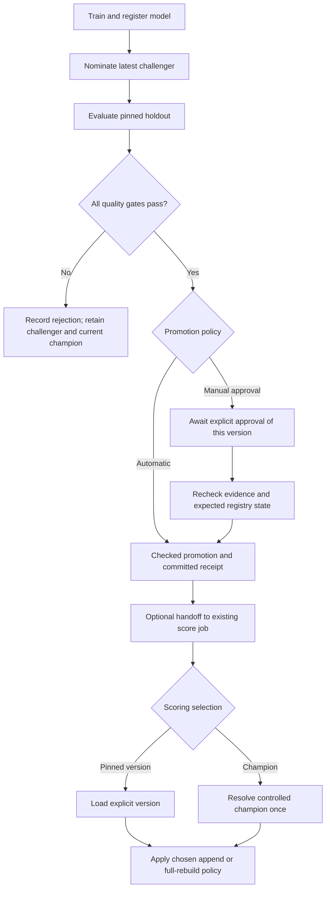

# Independent model selection and approval

Date: 2026-09-24. User-approved direction for SM-32/SM-33.
Status: SM-32 policies/operator actions are implemented and verified live;
SM-33 runtime overrides and broader migration validation remain planned.
Parent: [local Bundle improvement program](37-local-bundle-improvement-program.md).

## Two independent decisions

`score_model_selection` decides which model a score run uses:

- `pinned_version`: load the configured concrete version; a permitted runtime
  override is recorded and applies only to that run unless explicitly persisted.
- `champion`: resolve the controlled champion to a concrete version once at
  run start. An alias move during execution does not change that run's model.

`promotion_policy` decides how the registry champion changes:

- `manual_approval`: train/register/nominate/evaluate, then await an explicit
  approve or reject lifecycle action on that existing model version.
- `automatic`: promote after all configured quality and improvement checks
  pass; a failed check leaves champion unchanged and retains the challenger.

| Scoring selection | Promotion policy | Expected behavior |
| --- | --- | --- |
| pinned_version | manual_approval | Human approval governs registry aliases; scoring remains on its explicit pin |
| pinned_version | automatic | Registry champion may advance automatically; scoring still keeps its explicit pin |
| champion | manual_approval | Training produces a contender; scoring follows the old champion until approval |
| champion | automatic | Passing contender becomes champion; the next score follows it |

The promotion operation does not silently rewrite a scoring pin. For a
champion-following project with no champion, score fails clearly before writing.
An initial candidate still needs the absolute-quality gate and the configured
manual/automatic decision; no implicit ungated bootstrap.

## Lifecycle and job ownership

### Recent challenger history (requested follow-up)

Add previous_challenger as a pointer to the last contender displaced by a
new nomination. It is not the complete model history or an automatic fallback.
This extension is implemented locally in SM-32; see
[history implementation evidence](47-sm32-challenger-history-progress.md).
Matching Bundle wiring and personal-serverless validation passed; see
[live evidence](51-sm32-live-validation-report.md).

| Transition | Champion | Challenger | Previous challenger |
| --- | --- | --- | --- |
| Before a new candidate | v2 | v3 | unset |
| Nominate v4 | v2 | v4 | v3 |
| Promote v4 | v4 | unset | v3 |

The old champion becomes previous_champion through the existing promotion
path. Promotion itself must not move the new champion into previous_challenger.
Another contender replacing v4 before promotion replaces that history pointer
with v4; all older version evidence remains available.

All changes use the same serialized writer, expected-version checks and
durable receipts. Repeated nomination must not rotate history. Partial writes
must remain reconcilable. Promotion or rollback involving the history version
must explicitly reconcile the pointer so current and historical roles do not
silently conflict. Add tests for replacement, retry, promotion, rollback,
uncontrolled history pointers and unknown write outcomes.

### Serialized lifecycle actions

Keep two persistent jobs. The lifecycle job accepts train, approve, reject or
rollback; the score job owns prediction publication. All lifecycle mutations
share the same serialized writer identity and job queue. Operator actions must
not create a third independent writer that races scheduled training.

Manual approval inputs identify the existing candidate version, expected
champion and pinned evaluation/policy evidence. Approval loads those artifacts
and rechecks them; it must not call fit, register another version or upload
another model. Repeated successful requests return/reconcile the original
receipt rather than causing another transition. Stale, rejected, forged or
incompatible evidence is refused.

A manual rejection records the decision and reason without changing champion.
The challenger remains the latest contender until replaced by a newer one.
Approval does not offer an implicit force override. If business exceptions
are later needed, they require a separately designed policy and audit path.

After promotion, the old champion becomes previous_champion. A promoted model
stops being challenger. Retained candidates and rollback interactions must
not lose version history. Controlled rollback uses the same writer and can
hand off to score using its configured selector/output policy.

## Compatibility and failure behavior

- Migrate old `auto_champion` explicitly to champion selection plus automatic
  promotion. Preserve pinned mode's lack of implicit promotion; document the
  new manual action rather than silently changing old configurations.
- Code/model uploads are not required for an alias-only approved change.
  New code, dependencies or project configuration still require deployment.
- The generated job graph and effective configuration must agree about score
  handoff; reject incompatible partial migrations.
- Raw Catalog UI alias edits are not a replacement for controlled approval.
  Alias/receipt disagreement stops the controlled workflow pending reconciliation.
- Promotion and prediction publication remain separate transactions. If score
  fails, preserve prior output and retry score without retraining or reapproval.
- Unknown alias outcomes do not trigger blind mutation retries. Persist the
  pending/committed receipt and expose the operator recovery action.
- A pinned override cannot bypass trusted artifact, schema, budget or target
  compatibility checks. It deliberately chooses a version rather than claiming
  that version passed automatic promotion criteria.

## Acceptance scenarios

1. v2 champion, tied v3 challenger: manual or automatic score still uses v2.
2. A passing v4 waits in manual mode; approval moves champion without training.
3. Pinned v2 remains selected even after automatic promotion of v4.
4. Two concurrent approval/train requests are serialized and stale evidence
   cannot overwrite the latest decision.
5. New source rows score without retraining; no new rows produce a no-op.
6. Full rebuild publishes only a complete compatible generation; append keeps
   old-version rows and records the new version on later predictions.
7. First champion requires quality approval; absent champion never loads latest
   as an undocumented fallback.
8. Failed score can be retried, uncertain alias writes require reconciliation,
   and rollback works with the retained-challenger semantics.
