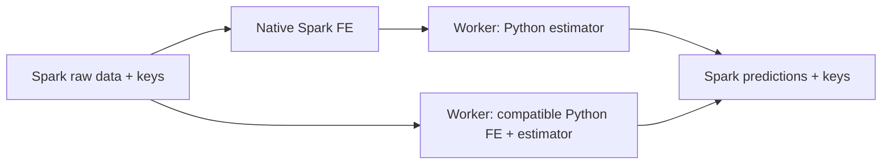

# Mimari ve kapsam sözleşmesi

Durum: uygulama için önerilen tasarım, 2026-09-21. Yeni dosya ve API adları
bu belgede **planlanan** arayüzlerdir; mevcut destek beyanı değildir.

## 1. Birbirinden bağımsız seçimler

| Boyut | İlk destek hedefi | Kural |
| --- | --- | --- |
| Ortam | local, Databricks | Spark local testte de çalışabilir |
| FE engine | pandas, Polars, Spark | Veri tipinden çözümleme; açık tercihle çelişirse hata |
| Model eğitimi | mevcut local estimator'lar | Spark girdisi örtük olarak local'e çevrilmez |
| Inference | local Python, Spark üzerinde Python | Spark-native model eğitimi ayrı kapsam |
| Tracking | off, MLflow | Core importunda MLflow zorunlu değil |
| Registry | mevcut local yol, MLflow/UC | Tracking URI ile registry URI ayrı |
| Çalıştırma | ad hoc, zamanlanmış batch | Aylık çalıştırma engine değildir |
| Giriş biçimi | SDK/job; daha sonra HTTP/SQL | Endpoint son aşama |

İleride wizard local için Polars, Databricks için Spark önerebilir; pandas ve
Databricks üzerinde küçük local veri seçimi açık kalır. Bu öneri mevcut SDK'nın
varsayılanını sessizce değiştirmez. `cloud` isimli bir engine eklenmez.

## 2. Korunacak kurallar

1. Calculator fit yalnız eğitim verisinden state öğrenir; Applier tekrar fit etmez.
2. Spark girdisi native işlemlerde Spark'ta kalır. Ham veri için örtük
   `collect`, `toPandas`, `to_numpy`, driver iteration yok.
3. Küçük aggregate sonuçlarını driver'a almak mümkündür: scaler için O(kolon),
   önceden belirlenmiş state boyutu sınırıyla. Bu, ham veri collect etmek değildir.
4. Engine'ler arası taşınabilirlik node ve operation bazındadır; zorunlu ortak
   payda değildir. Spark'a özgü yetenek Spark-only olarak kalabilir.
5. Bilinmeyen veya desteklenmeyen engine/operation, action başlamadan reddedilir.
6. Mevcut local pipeline/save/load çağrıları korunur. Yeni state formatı opt-in
   eklenir; eski pickle dosyaları otomatik yeniden yazılmaz.
7. Config bilinmeyen yeni anahtarları sessizce yutmaz. Yeni runtime config kendi
   katı doğrulamasına sahiptir; eski node config'lerinin toplu daraltılması ayrı iş.
8. Core'da Databricks credentials, endpoint provisioning veya tablo yazma yan
   etkisi olmaz. Harici I/O opsiyonel integration katmanında olur.
9. Dtype, kategori sırası, null/NaN, feature sırası, label/probability sırası ve
   threshold metadata'sı model paketinin sözleşmesidir.
10. Spark performans iddiası için gerçek action, plan ve bellek ölçümü gerekir;
    lazy frame oluşturmak başarılı distributed execution kanıtı değildir.

## 3. Veri ve satır kimliği

İlk Spark teslimatı flat tabular veri içindir. Nested array/map/struct ve Decimal
otomatik float'a çevrilmez; operation desteklemiyorsa açık hata alınır. Tarihler
ve timestamp timezone dönüşümleri yalnız ilgili node teslimatında etkinleşir.

Spark inference girdisinde kullanıcının seçtiği benzersiz, null olmayan `row_keys`
zorunludur. Entity tek başına benzersiz değilse entity + event_id gibi birleşik
anahtar kullanılır. Anahtarlar modele feature olarak kendiliğinden verilmez.
Çıktı sırası garanti edilmez; sonuç anahtarla eşleştirilir. `monotonically_increasing_id`
veya partition numarası kalıcı iş anahtarı yerine kullanılamaz.

Training için target aynı Spark frame'de isimli kolondur. Ayrı Spark X/y frame'leri
pozisyonla birleştirilmez. Local X/y API'si korunur; Spark sınırında `FrameSpec`
ile target ve keys ayrılır. Başlangıçta row-preserving işlemler desteklenir.
Row drop/resampling ve DAG branch merge yetenekleri açık ret verir.

Doğrulama, duplicate/null key için distributed action gerektirebilir; bu maliyet
runner girişinde bir kez ölçülür. Her node'da tekrar count yapılmaz. Lazy source
değişebiliyorsa giriş snapshot/persist politikası runner sorumluluğundadır.

Planlanan küçük tipler (`skyulf/core/execution.py`):

```python
from dataclasses import dataclass

@dataclass(frozen=True)
class FrameSpec:
    row_keys: tuple[str, ...]
    target: str | None = None

@dataclass(frozen=True)
class ExecutionOptions:
    engine: str
    state_max_bytes: int = 8 * 1024 * 1024
    python_batch_rows: int = 4096
    model_max_bytes: int = 256 * 1024 * 1024
```

Bunlar başlangıç koruma limitleridir, performans garantisi değildir. Her değer
pozitif olmalı; model/batch limitleri hedef ortam ölçümünde düşürülebilir.
Batch satır sınırı byte sınırı değildir; geniş satırlarda bellek ayrıca ölçülür.
Spark session açık parametreyle adapter'a verilir; state/model içine konmaz.

## 4. Capability ve state

`skyulf/core/capabilities.py` için planlanan sorgu:

```python
def require_capability(
    node_type: str, operation: str, engine: str, *, config: dict
) -> None:
    # Destek yoksa UnsupportedExecutionError: node/operation/engine/reason.
    ...
```

Kayıtlar fit/apply ayrı, config stratejisi ayrı ve şu özelliklerle tutulur:
`execution_kind` (native/python_batch/local), `row_effect`
(preserve/filter/expand), `context` (row/group/window/global), state codec sürümü.
Yeni `NodeRegistry` kopyası oluşturulmaz; mevcut kayıt anahtarlarıyla ilişkilendirilir.
Spark desteği ilan edilmemiş bütün kayıtlar açıkça unsupported sayılır.
Operation-level öğrenme ve leakage metadata'sı mevcut mekanizma ile uyumlu kalır.

`skyulf/core/portable_state.py` SM-04 v1 envelope alanları:

```text
format_version=1, node_type, codec_version=1, ordered_columns,
learned_parameters, semantic_digest
```

Envelope mevcut artifact dict'lerini codec üzerinden taşır; Calculator'ın tüm
return tipleri bir seferde değiştirilmez. İlk codec'ler SimpleImputer(mean/constant)
ve StandardScaler. JSON NaN/Infinity ve dtype değerleri için açık tagged encoding
kullanılır; `repr` veya pickle bytes üzerinden semantic digest üretilmez.
Enum/version bilinmiyorsa deserialize etmeden hata verilir.

V1 API yalnız node_type ve mevcut params alır; gerçek input/output schema veya
producer bilgisi bu girdiden çıkarılamaz. Bu alanlar uydurulmaz. Semantic options
mevcut artifact içindeki with_mean/with_std/strategy gibi alanlarda korunur.
Schema, producer ve compatibility metadata daha sonraki bundle aşamasına aittir.
Mevcut pipeline seal formatı değiştirilmez; portable checksum ayrı versioned
tagged JSON üzerinden hesaplanır. Checksum imza/authenticity garantisi değildir.
Decode byte limiti parse öncesi gelen payload'a uygulanır; wire byte bütçesi
process memory bütçesi değildir. Codec herhangi bir Spark action veya I/O yapmaz.

Küçük state inline taşınabilir. Büyük kategori/group state için immutable tablo
referansı, schema ve içerik kimliği gerekir; bu SM-17 kapsamıdır. Küçük state
codec'i büyük tabloları driver'a indirmez. Python estimator nesneleri portable
numeric state gibi sunulmaz; sürümlenmiş model paketi içinde ayrı payload olur.

## 5. İki inference yolu



Yol A'da worker yalnız model girişini alır; FE ikinci kez uygulanmaz. Yol B'de
batch-independent Python pipeline çalışır. Bundle `input_stage=raw|features`
ve `feature_order` alanları bu ayrımı doğrular. Sırf row sayısı korundu diye
rolling/group/global işlemler Yol B'ye kabul edilmez.

Planlanan `skyulf/inference/spark.py` giriş noktası:

```python
def predict_spark(frame, bundle, *, frame_spec, options, mode):
    # mode: native_features | python_pipeline; returns Spark DataFrame
    ...
```

İlk Python modeli sklearn regression; ardından classification/proba/threshold
semantiği. Worker'da model bir iterator çağrısında bir kez yüklenir; task retry
tekrar yükleyebilir. UDF içinde tracking, registry mutation veya çıktı tablosuna
yazma olmaz. Model/model state limitleri uygulanır. Desteklenmeyen pipeline
driver preflight'ta reddedilir. Çalışan kod her worker'a kurulmuş wheel'dedir.

## 6. Eğitim ve bağlamsal işlemler

Spark FE ile distributed training aynı şey değildir. İlk model yerel, açıkça
seçilmiş eğitim verisiyle mevcut API'den eğitilir; inference Spark'ta çalışır.
Spark dataframe'i sklearn fit'e verilirse hata alınır. Bounded local training
export ancak açık row/byte limiti ve sample/selection provenance ile SM-17'de
eklenebilir. Distributed XGBoost/Spark ML estimator'ları ilk release sözü değildir.

Rolling/lag için group + total order + geçmiş pencere gerekir. Zaman aralığı
ve geçmiş ayrı parametrelerdir. Target/WOE encoding train tarafında OOF state
ve leakage koruması gerektirir. SMOTE'nin yerine Spark sample konulmaz.
SHAP, tuning ve EDA için explicit bounded local yol veya unsupported sonucu
seçilir; native Spark desteği varsayılmaz. Ayrıntılı aile matrisi rapordadır.

## 7. Dosya sorumlulukları

| Mevcut dosyalar | Planlanan değişiklik |
| --- | --- |
| `skyulf-core/skyulf/engines/registry.py`, `protocol.py`, `__init__.py` | Spark kimliği; lazy adapter; local/distributed sınırı |
| `skyulf-core/skyulf/preprocessing/dispatcher.py`, `base.py`, `pipeline.py` | capability preflight; Spark input; action-free ölçüm varsayılanı |
| `skyulf-core/skyulf/preprocessing/scaling/standard.py` | Spark aggregate fit ve expression apply |
| `skyulf-core/skyulf/preprocessing/imputation/simple.py` | ilk mean/constant Spark branch'leri |
| `skyulf-core/skyulf/core/artifacts.py`, `core/schema.py` | mevcut tiplerle envelope/schema uyumu |
| `skyulf-core/skyulf/pipeline/_pipeline.py`, `seal.py`, `utils.py` | yeni yollar; save/load uyumu; istatistik ve fingerprint sınırı |
| `skyulf-core/setup.py`, `skyulf-core/pyproject.toml` ve mevcut requirements dosyaları | optional extra ve test ortamı tutarlılığı |

| Yeni modül | Sorumluluk |
| --- | --- |
| `skyulf-core/skyulf/core/execution.py` | FrameSpec/ExecutionOptions ve doğrulama |
| `skyulf-core/skyulf/core/capabilities.py` | node/operation destek kararı |
| `skyulf-core/skyulf/core/portable_state.py` | versioned state codec |
| `skyulf-core/skyulf/engines/spark_engine.py` | Spark dataframe tanıma ve desteklenen işlemler |
| `skyulf-core/skyulf/preprocessing/_spark.py` | Spark kolon/schema/aggregate yardımcıları |
| `skyulf-core/skyulf/inference/bundle.py` | Python model paketi, giriş/çıkış sözleşmesi |
| `skyulf-core/skyulf/inference/spark.py` | iki dağıtık inference yolu |
| `skyulf-core/skyulf/integrations/mlflow/{tracking,model,registry}.py` | opsiyonel run, pyfunc ve registry adapter'ları |
| `skyulf-core/skyulf/integrations/databricks/{batch,delta}.py` | platform I/O ve batch sonucu yayınlama |

Yeni paketlerde `__init__.py` yalnız hafif public export içerir. Spark/MLflow
ithalatı ihtiyaç anında yapılır. `core/compute.py` seam'i native node uygulaması
yerine kullanılmaz. `core/serialization.py` ve `core/model_registry.py` mevcut
sözleşmelerle uyumu incelenmeden remote registry yükleme aracı gibi kullanılmaz.

## 8. Bilinmeyen ortam bilgileri için karar kapısı

DBR/Python/Spark sürümü, classic/serverless compute, Connect ihtiyacı, izinli
catalog/schema ve tahmini veri genişliği henüz doğrulanmış değil. SM-00 yerel
geliştirme hedefini mevcut Python >=3.12 paket koşuluyla sabitler; SM-16 gerçek
ortam sürümlerini kaydeder ve bağımlılık uyumunu test eder. Sadece bu kapı
ortam bilgisine bağlıdır; core tasarımı ve yerel testler bekletilmez.

Referanslar: [Spark mapInPandas](https://spark.apache.org/docs/latest/api/python/reference/pyspark.sql/api/pyspark.sql.DataFrame.mapInPandas.html),
[MLflow pyfunc](https://mlflow.org/docs/latest/api_reference/python_api/mlflow.pyfunc.html),
[UC model signature](https://docs.databricks.com/aws/en/machine-learning/manage-model-lifecycle/migrate-to-uc).
Sürümler bu latest sayfalardan tahmin edilmez; hedef runtime üzerinde doğrulanır.
