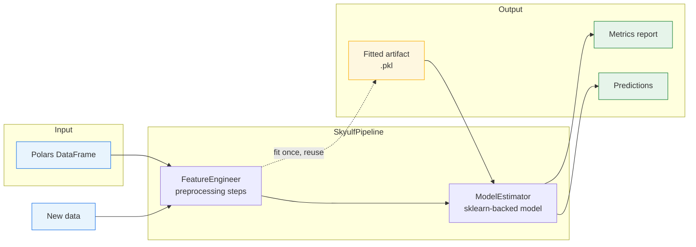
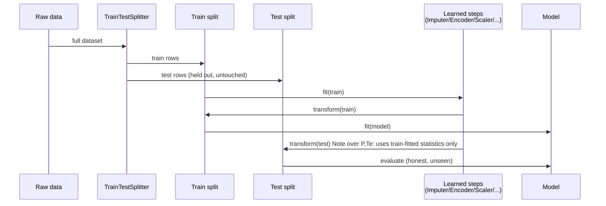
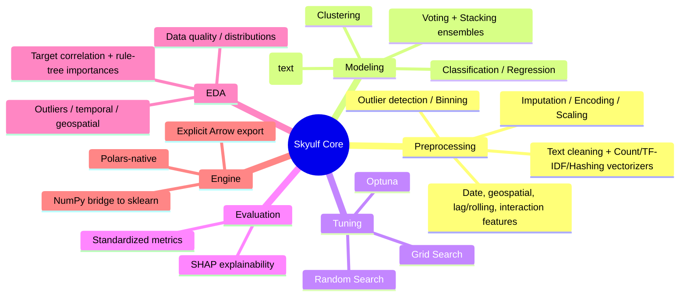

# Skyulf Core

**Skyulf Core** (`skyulf-core`) is a standalone, installable Python ML library
for teams who want sklearn's dependable estimators with a cohesive,
Polars-friendly pipeline layer around them. It unifies preprocessing,
classification, regression, clustering, text models, hyperparameter tuning,
evaluation, and optional SHAP explanations behind one composable API.

Use it when you want to move from a notebook to a repeatable model artifact
without assembling a different interface for every transformer and estimator.
Skyulf builds on and is validated against scikit-learn rather than replacing
it: sklearn remains the modeling foundation while Skyulf provides pipeline
configuration, artifacts, metrics, and safe execution conventions.

<!-- Quick badges + links -->
[](https://flyingriverhorse.github.io/Skyulf) [](https://pypi.org/project/skyulf-core) [](LICENSE)
[](https://pypi.org/project/skyulf-core) [](https://github.com/flyingriverhorse/Skyulf/issues) [](https://github.com/flyingriverhorse/Skyulf/graphs/contributors)

**Website & Documentation**

- Project site / docs: https://www.skyulf.com
- Repository: https://github.com/flyingriverhorse/Skyulf
- PyPI package: https://pypi.org/project/skyulf-core

## Installation

Skyulf Core currently packages for Python 3.12+.

```bash
pip install skyulf-core

# EDA-focused install (core EDA + optional advanced EDA + visualization)
pip install skyulf-core[eda,viz]

# For visualization support (Rich dashboard + Matplotlib plots)
pip install skyulf-core[viz]

# For advanced EDA add-ons (sentiment + causal discovery)
pip install skyulf-core[eda]

# For hyperparameter tuning engines
pip install skyulf-core[tuning]

# For SHAP explainability
pip install skyulf-core[explainability]

# For dense SentenceEmbedder support
pip install skyulf-core[nlp]

# For imbalance-aware preprocessing (e.g., SMOTE)
pip install skyulf-core[preprocessing-imbalanced]

# For XGBoost modeling nodes
pip install skyulf-core[modeling-xgboost]

# For LightGBM modeling nodes
pip install skyulf-core[modeling-lightgbm]

# For geospatial feature engineering (H3 indexing, spatial stats)
pip install skyulf-core[geo]

# For text sentiment features
pip install skyulf-core[text]
```

## Quick start

```python
import polars as pl
from skyulf import SkyulfPipeline

customers = pl.read_csv("customers.csv")  # contains a `purchased` target
pipeline = SkyulfPipeline(
    {
        "preprocessing": [
            {
                "name": "split",
                "transformer": "TrainTestSplitter",
                "params": {"target_column": "purchased", "test_size": 0.2, "random_state": 42},
            },
            {
                "name": "impute_income",
                "transformer": "SimpleImputer",
                "params": {"columns": ["income"], "strategy": "median"},
            },
            {
                "name": "encode_city",
                "transformer": "OneHotEncoder",
                "params": {"columns": ["city"], "drop_original": True, "handle_unknown": "ignore"},
            },
        ],
        "modeling": {
            "type": "logistic_regression",
            "params": {"max_iter": 500, "random_state": 42},
        },
    }
)

pipeline.fit(customers, target_column="purchased")
pipeline.save("customer_model.pkl")
predictions = SkyulfPipeline.load("customer_model.pkl").predict(
    pl.read_csv("new_customers.csv")
)
```

See [`examples/00_quickstart.ipynb`](examples/00_quickstart.ipynb) for a
complete, executed save/load round trip.

## How it fits together



`SkyulfPipeline` wraps two collaborators: a `FeatureEngineer` that runs the
declared preprocessing steps in order, and a `ModelEstimator` that fits/
applies the configured sklearn-backed model. `fit()` runs both once and
returns a metrics report; `predict()` re-applies the *already-fitted*
preprocessing artifacts (no re-fitting, no leakage) before calling the
model.

## Data leakage safety

**Split before any data-dependent preprocessing.** Fitting an imputer, scaler,
learned encoder, feature selector, learned binning step, outlier detector, or
Count/TF-IDF vectorizer on rows that include validation/test data contaminates
evaluation. Put `TrainTestSplitter` first in a pipeline, or explicitly create
a `SplitDataset` first and then fit `FeatureEngineer`/`SkyulfPipeline`.

The larger Skyulf platform validates DAGs and hard-blocks data-dependent nodes
upstream of a train/test split. Skyulf Core is also useful on its own, so the
same ordering is an essential API-level contract.



Any step that *learns* a statistic (imputer medians, encoder categories,
scaler mean/std, TF-IDF vocabulary, feature selectors, outlier detectors,
learned binning) must come **after** the split in the preprocessing list.
Deterministic, row-independent parses (string splitting, unit conversions,
date-part extraction) are safe before the split. Read and run
[`examples/01_house_prices_regression.ipynb`](examples/01_house_prices_regression.ipynb)
to see this pattern applied to a real Kaggle dataset, including a
deliberate pre-split/post-split split of "safe" vs. "learned" feature steps.

## Polars-native, no hidden pandas

Users can pass `polars.DataFrame` inputs directly. `PolarsEngine` and
`SklearnBridge` convert Polars straight to NumPy at the sklearn boundary—there
is no user-facing pandas round trip. Arrow integrations use the explicit
`to_arrow()` path (and therefore `pyarrow`). Every notebook in
[`examples/`](examples/) uses Polars + NumPy only — no pandas import appears
anywhere in the example code.

## Examples

Runnable Jupyter notebooks in [`examples/`](examples/), covering the full
feature set end-to-end on real datasets. Open with `jupyter lab` or
`jupyter notebook` from the repository root — see
[`examples/README.md`](examples/README.md) for dataset sourcing notes and a
per-notebook breakdown of what's demonstrated.

| # | Notebook | Dataset | Task | Highlights |
|---|----------|---------|------|------------|
| 00 | [`00_quickstart.ipynb`](examples/00_quickstart.ipynb) | Synthetic | Classification | Config, fit, save/load, predict |
| 01 | [`01_house_prices_regression.ipynb`](examples/01_house_prices_regression.ipynb) | Kaggle House Prices | Regression | EDA, leakage-safe null handling, Optuna tuning, SHAP, Kaggle submission |
| 02 | [`02_disaster_tweets_text_classification.ipynb`](examples/02_disaster_tweets_text_classification.ipynb) | Kaggle Disaster Tweets | Text classification | TF-IDF, hash encoding, Naive Bayes vs. tuned LogReg, Kaggle submission |
| 03 | [`03_mall_customers_segmentation.ipynb`](examples/03_mall_customers_segmentation.ipynb) | Mall Customers | Clustering | Unsupervised EDA, k-selection by silhouette, multi-algorithm comparison |
| 04 | [`04_forest_cover_multiclass_ensemble.ipynb`](examples/04_forest_cover_multiclass_ensemble.ipynb) | Covertype | Multiclass | Ensembles, tuning, per-class metrics |
| 05 | [`05_santander_imbalanced_classification.ipynb`](examples/05_santander_imbalanced_classification.ipynb) | Santander | Imbalanced classification | Drift checks, resampling-aware evaluation |
| 06 | [`06_credit_card_fraud_extreme_imbalance.ipynb`](examples/06_credit_card_fraud_extreme_imbalance.ipynb) | Credit Card Fraud | Extreme imbalance | PR-AUC focus, precision/recall tradeoffs |
| 07 | [`07_spaceship_titanic_classification.ipynb`](examples/07_spaceship_titanic_classification.ipynb) | Kaggle Spaceship Titanic | Classification | Structured-string feature parsing, voting + stacking ensembles, Kaggle submission |
| 08 | [`08_online_retail_customer_segmentation.ipynb`](examples/08_online_retail_customer_segmentation.ipynb) | UCI Online Retail | Clustering (RFM segmentation) | Raw-transaction-to-RFM feature engineering, 4-algorithm comparison, business-named segments |

Notebooks 01, 02, and 07 generate real `submission.csv` files ready to
upload to their respective Kaggle competitions.

## Automated EDA

Skyulf Core includes automated exploratory data analysis for Polars frames —
data quality, distributions, outliers, correlations/target-association,
optional temporal/geospatial analysis, and a PCA-based exploratory
clustering pass, all from one `.analyze()` call.

```python
import polars as pl
from skyulf.profiling.analyzer import EDAAnalyzer
from skyulf.profiling.visualizer import EDAVisualizer

df = pl.read_csv("data.csv")
profile = EDAAnalyzer(df).analyze(
    target_col="target",     # Optional: unlocks target-association analysis
    date_col="timestamp",    # Optional: unlocks temporal analysis
    lat_col="latitude",      # Optional: unlocks geospatial analysis
    lon_col="longitude",     # Optional
)

EDAVisualizer(profile, df).summary()  # Rich terminal dashboard (skyulf-core[viz])
EDAVisualizer(profile, df).plot()     # Matplotlib figures (skyulf-core[viz])
```

Everything the visualizer renders is also available as plain data on
`profile`, so you can build your own dashboards, logs, or CI gates:

```python
print(f"Rows: {profile.row_count}  Missing cells: {profile.missing_cells_percentage:.2f}%")

# Human-readable, prioritized data-quality findings
for alert in profile.alerts[:5]:
    print("-", alert.message)

# Actionable next-step suggestions (e.g. "consider log-transforming X")
for rec in profile.recommendations[:5]:
    print(f"- [{rec.action}] {rec.column or ''}: {rec.reason} -> {rec.suggestion}")

# Outlier detection (IsolationForest by default) across numeric columns
if profile.outliers is not None:
    print(f"Outliers: {profile.outliers.outlier_percentage:.1f}% ({profile.outliers.method})")

# Feature-vs-target association (ANOVA-style p-value + boxplot data)
income_interaction = next(
    (ti for ti in (profile.target_interactions or []) if ti.feature == "income"), None
)
if income_interaction is not None and income_interaction.p_value is not None:
    print(f"income vs target -> p-value: {income_interaction.p_value:.2e}")

# Rule-tree feature importances (a fast, model-free "what matters" signal)
if profile.rule_tree is not None:
    top = sorted(profile.rule_tree.feature_importances, key=lambda d: -d["importance"])[:5]
    for f in top:
        print(f"  {f['feature']:20s} {f['importance']:.4f}")
```

See any of [`examples/00_quickstart.ipynb`](examples/00_quickstart.ipynb)
through [`08_online_retail_customer_segmentation.ipynb`](examples/08_online_retail_customer_segmentation.ipynb)
for the full EDA pass run against real datasets, both with and without a
target column.

## Features



- **Unified pipelines**: Serializable preprocessing and model artifacts with
  readable descriptions, fingerprints, model cards, and prediction APIs.
- **Leakage-aware execution**: Split-first guidance and platform validation
  guard against fitting learned preprocessing on held-out rows.
- **Preprocessing and feature engineering**: Cleaning, casting, imputation,
  encoders, scalers, outliers, selection, binning, dates, geospatial features,
  time-series lags/rolling windows, and interactions.
- **Modeling**: sklearn-backed classification, regression, segmentation, and
  Voting/Stacking ensembles, plus text-specific Naive Bayes models.
- **Tuning and evaluation**: Grid Search, Random Search, Optuna, standardized
  classification/regression/clustering metrics, and optional SHAP.
- **Automated EDA**: Data quality, distributions, outliers, temporal,
  geospatial, and target analysis for Polars data.
- **Polars and Arrow**: Native Polars support with direct NumPy bridging for
  sklearn and an explicit Arrow export path.

## License

This project is licensed under the terms of the Apache 2.0 license.
