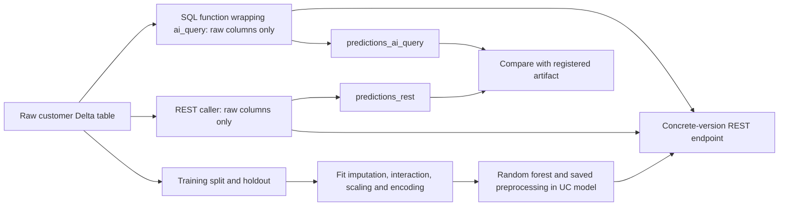

# Raw customer model: REST and SQL predictions

Train one model from a raw Delta table, deploy its complete fitted pipeline,
then create two prediction tables by calling the same endpoint. This is a
small executable example using the library, not a replacement for the main
project template.



`config.yml` is the only model recipe. The raw input is `age`, `income`,
`tenure`, `segment`. The pipeline fills categories, fills income using
training-derived segment means, fills numeric values, generates
`income_x_tenure`, scales numeric columns and encodes categories before
fitting the classifier. The fitted state is packaged with the model.
Neither caller supplies the generated feature or learns preprocessing again.
The SQL wrapper preserves missing numeric values through `ai_query` so that
the model's fitted imputation is applied. Native validation compares null-input
predictions as well as ordinary rows; a successful table write alone is not
treated as proof of prediction parity.

This demo passes `config.yml`'s `pipeline` directly to `fit_workflow`.
It does **not** use the main Bundle configuration loader. Do not copy its
`pipeline.preprocessing` or `pipeline.modeling` into a generated project's
`config/training.yml`: that loader rejects inline preprocessing and model
definitions. In a generated project, YAML selects the recipe and model;
`config/preprocessing.yml` supplies the ordered steps;
`src/features/preprocessing.py` contains only custom functions. The main template's
[preprocessing guide](../../templates/databricks/template/%7B%7B.project_name%7D%7D/PREPROCESSING.md)
shows this same six-step example in the supported layout, including custom steps.

The synthetic table has 512 development rows and 128 scoring rows. A
stratified 25% holdout is reserved from the development cohort before fitting
preprocessing. The scoring cohort includes nulls and a category absent from
training. IDs exceed `2**53`; callers retain these exact integer keys outside
the model inputs. This example demonstrates behavior, not business accuracy.

## Optional batch predictions during training

```yaml
write_batch_predictions: false
```

With the default, `train` fits, evaluates and registers the model, and creates
**no batch prediction table**. Set this to the YAML boolean `true` only to also
create `batch_predictions`. REST/SQL calls do not write tables themselves:
the later example tasks explicitly write `predictions_rest` and
`predictions_ai_query` because this demonstration requests those outputs.

The training output explains the skipped write without an empty table field:

```yaml
training_batch_predictions:
  status: skipped
  reason: write_batch_predictions is false
```

When enabled, it reports `status: written`, the actual `table` and `rows`.
This replaces the demo's earlier `batch_publication: {enabled: false, table: null}`
wording. Neither output field nor `write_batch_predictions` is a main-template
configuration setting. This choice controls only the training task's optional
write; the separate REST and SQL prediction tasks have their own outputs.

An already registered model may require its original exact Skyulf runtime.
Keep that wheel for inspection and prediction. If a later SQL compiler fixes
the function definition, export its `function.create_sql` to a trusted workspace
file and set the optional Bundle variable `sql_function_ddl_path` to that file.
Use a notebook-readable `/Workspace/...` path. The definition must create
`<namespace>.predict_customer_v<model_version>`, the function this example calls.
The SQL task executes that reviewed definition after the original runtime has
checked the pinned model and endpoint. This does not change the model package
or disable its source checks. With the variable empty, the installed library
generates the function as usual. Treat the file as executable SQL, not user data.

The main template already separates training and scoring through
`score_handoff: disabled` and `scoring_mode: manual`. This example does not
change those defaults or introduce a mandatory prediction sink.

## Deploy and run

Build and upload a wheel from the checkout containing the serving SQL and
FeatureInteraction admission changes. Use one exact wheel for training and
serving preparation. In this directory, select a new schema and endpoint:

```powershell
$demoVars = 'schema_name=my_raw_customer_demo,endpoint_name=my-raw-customer-v1,wheel_path=/Volumes/workspace/my_schema/packages/skyulf_core-0.9.2-py3-none-any.whl'
databricks bundle validate --profile skyulf --var $demoVars
databricks bundle deploy --profile skyulf --var $demoVars
databricks bundle run raw_serving_demo --profile skyulf --var $demoVars
```

The example uses serverless job compute and a CPU Small endpoint with
scale-to-zero enabled. The selected identity needs permission to create the
schema, tables, model, experiment, endpoint and UC function. No grants or
existing endpoint routes are changed. Initial endpoint provisioning can take
several minutes; the `deploy` task prints state while waiting.

Tasks are `raw_data → train → deploy → predict_rest → predict_sql → verify`.
The raw Delta version and registered model version pass through task values.
The SQL function returns a struct containing `prediction`, `probability_0`,
and `probability_1`. The example uses binary labels 0 and 1, matching that
probability-column order. `verify` checks both persisted tables against the
registered local artifact, including keys, versions and probabilities.

`raw_data` uses `CREATE SCHEMA` and refuses an existing schema. Prediction
tables and the function are also create-only. Do not rerun the entire job
against the same schema. Inspect a failed task's output and repair only steps
whose writes have not completed, or deploy another isolated namespace.
For endpoint-only use, run through `deploy`; the prediction tasks are optional
consumers, not required parts of serving.

## Call the deployed model

An application can send raw values without writing a table. After preparing
`plan` for the concrete endpoint using the serving guide:

```python
from skyulf.integrations.databricks.serving import query_named_records

response = query_named_records(client, plan, [
    {"age": 35.0, "income": None, "tenure": 12.0, "segment": "Mass"}
])
print(response.predictions)
```

The fitted income replacement and generated interaction happen inside the
model. `client` is the authenticated Databricks SDK client; `plan` is the
prepared, version-specific `PinnedEndpointPlan` used in `scoring.py`.

After the example creates its SQL function, an analyst can query the raw table:

```sql
SELECT raw.customer_id,
       workspace.my_raw_customer_demo.predict_customer_v1(
         age => raw.age, income => raw.income,
         tenure => raw.tenure, segment => raw.segment
       ) AS result
FROM workspace.my_raw_customer_demo.raw_customers AS raw
WHERE raw.cohort = 'score';
```

Replace the namespace with the one you deployed. This SELECT returns rows;
writing another table is a separate, optional `CREATE TABLE ... AS SELECT`.
The function's body calls Databricks `ai_query` against the same endpoint as
the REST request. The notebook prints the exact SQL used by the example.

## Files and boundaries

| File | Responsibility |
|---|---|
| `databricks.yml` | Six visible job tasks and pinned environment |
| `config.yml` | Preprocessing/model recipe and optional batch write |
| `src/notebook.py` | Stage selection, task values, readable failure output |
| `src/raw_serving_demo/data.py` | Synthetic Spark data and pinned Delta reads |
| `src/raw_serving_demo/training.py` | Holdout split, fit, metrics, MLflow registration |
| `src/raw_serving_demo/scoring.py` | Endpoint, REST, SQL publication and comparison |

Spark generates/reads/writes tables; training and endpoint prediction use the
pandas pipeline. The REST example deliberately collects a bounded small
cohort and sends 32-row requests; it is not a distributed production REST
runner. SQL `ai_query` executes from Spark against the endpoint.

This raw-input model contains row-local features and training-fitted
transformations. It does not automatically package arbitrary Spark joins,
historical window aggregations or feature-table pipelines. Such features need
their own data preparation or lookup design. No tuning, promotion, monitoring
enrollment or retraining is added by this focused example.

Partition admission inspects supported saved state before remote execution;
the existing preprocessing appliers still perform every transformation.
Admission is not a sandbox for untrusted pickle files. The seven currently
admitted preprocessing nodes own their saved-state validation beside their
existing implementation. Inference calls those methods; it does not implement
another imputer, scaler, encoder or feature generator. Unsupported/custom local
steps are not automatically admitted to remote execution by this refactor.

See [Databricks ai_query](https://docs.databricks.com/aws/en/sql/language-manual/functions/ai_query)
for SQL request and result behavior.
