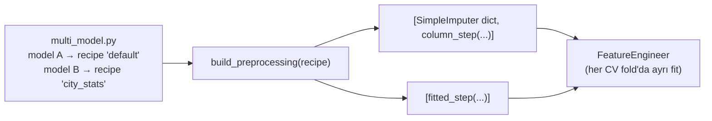
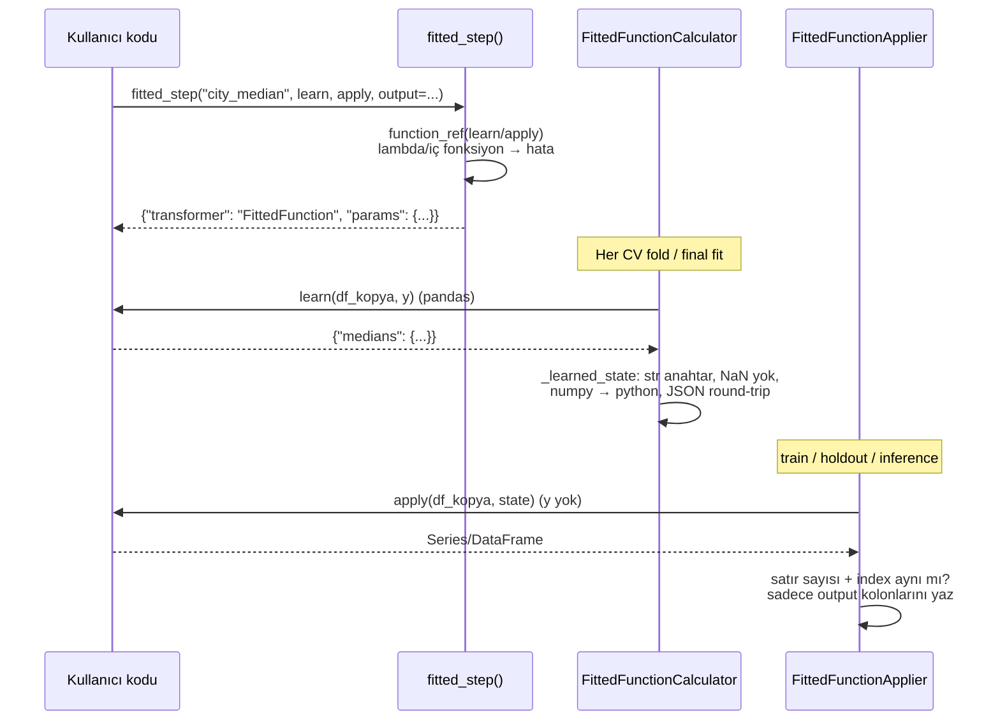

# Bundle'da custom feature yazmayı kolaylaştırma (test edilmiş plan)

> Durum: **prototip core'da çalışıyor ve test edildi** (branch `091`, commit yok).
> Bu belge tasarımı, gerçek kodu, mevcut node'larla kıyas sonuçlarını, bulunan
> edge-case hatalarını ve kalan işleri anlatır.

## 1. Özet

Bugün Bundle'da custom bir adım yazmak için `Calculator` + `Applier` sınıfları,
`@fit_method`/`@apply_method`, `custom_step(...)`, pandas **ve** polars kod yolu
gerekiyor (template'deki `frequency_encoding` ≈ 90 satır). Yeni başlayan biri için
zor.

Yeni yol: kullanıcı **sıradan pandas fonksiyonu** yazar, core'daki üç yardımcıdan
biriyle sarar:

| Yardımcı | Ne zaman | Kullanıcı ne yazar |
|---|---|---|
| `column_step` | Veriden bir şey öğrenmeyen yeni kolon | `fn(df) -> Series/DataFrame` |
| `fitted_step` | Eğitim verisinden öğrenip uygulayan dönüşüm | `learn(df, y) -> dict`, `apply(df, state) -> Series/DataFrame` |
| `filter_step` | Pre-split satır seçimi (scoring'de de yeniden kullanılır) | `fn(df) -> bool Series` |

Template'deki 90 satırlık `frequency_encoding` ile aynı sonucu veren sürüm:

```python
def learn_frequencies(df, y, params):
    return {c: (df[c].value_counts() / len(df)).to_dict() for c in params["columns"]}

def apply_frequencies(df, state, params):
    return pd.DataFrame({c: df[c].map(state[c]).fillna(0.0).astype(float) for c in state})

fitted_step("frequency_encoding", learn_frequencies, apply_frequencies,
            output=COLUMNS, replace=True, params={"columns": COLUMNS})
```

Birebir aynı sonucu verdiği test ile kanıtlı (bkz. §7).

## 2. Recipe'ler ile yardımcıların ilişkisi

Recipe sistemi **değişmiyor**. Recipe = isimli adım listesi; `multi_model.py`
her model için `preprocessing_recipe` / `pre_split_recipe` seçer. Yardımcılar bu
listelerin **içine giren adımları** üretir — core dict adımlarıyla yan yana:

```python
# src/features/preprocessing.py
from skyulf.preprocessing import column_step, fitted_step

def build_preprocessing(recipe="default"):
    recipes = {
        "default": lambda: [
            {"name": "impute", "transformer": "SimpleImputer",
             "params": {"columns": ["income"], "strategy": "median"}},
            column_step("ratio", income_per_age, output="income_per_age"),
        ],
        "city_stats": lambda: [
            fitted_step("city_median", learn_city_median, apply_city_median,
                        output="city_median_income"),
        ],
    }
    return recipes[recipe]()
```



Test: `test_named_recipes_give_models_different_features`.

## 3. Neden core'da (`skyulf.preprocessing`)

- `_validate_custom_classes` custom sınıfların proje modülünde
  (`_skyulf_project_*`) olmasını şart koşuyor; yardımcıları Bundle template'ine
  koysaydık her proje 3 sınıfı kopyalamak zorunda kalırdı.
- Core'da **genel** node'lar (`ColumnFunction`, `FittedFunction`,
  `RowFilterFunction`) var; kullanıcının fonksiyonu **referansla** saklanır
  (`"modül:fonksiyon"`). Bundle proje modülü adı kaynak digest'ini içerdiği için
  referans otomatik olarak o kaynak sürümüne sabitlenir.
- SDK kullanıcıları (Bundle dışı) da aynı yardımcıları kullanabilir.

## 4. Nasıl çalışır



Kurallar (kodla zorlanıyor):

- Kullanıcı her zaman **pandas** alır; polars girişte `to_pandas()` yapılır,
  sonuçta **sadece output kolonları** polars frame'e eklenir (diğer kolonların
  dtype'ı korunur).
- Kullanıcıya her zaman **kopya** verilir; `df["x"] = ...` pipeline verisini
  bozmaz.
- `apply` hiçbir zaman `y` görmez → inference'ta target gerekmez.
- Output kolonu zaten varsa `replace=True` zorunlu.
- Fonksiyon hata verirse mesaj fonksiyon adını içerir:
  `Project function m:double_income failed: KeyError: 'income'`.

## 5. `fitted_step` adım adım

### 5.1 Öğrenip uygulama (city median)

```python
def learn_city_median(df, y):
    """Eğitim satırlarından şehir başına medyan gelir."""
    return {"medians": df.groupby("city")["income"].median().to_dict()}

def apply_city_median(df, state):
    """Kayıtlı medyanları kullan; görülmemiş şehir NaN olur."""
    return df["city"].map(state["medians"]).astype(float)

fitted_step("city_median", learn_city_median, apply_city_median,
            output="city_median_income")
```

- Fit: `learn` sadece o fold'un train satırlarını görür
  (test: `test_fitted_step_learns_inside_every_cv_fold`, fold boyutları `[8, 8, 8]`).
- Kaydedilen artifact: `{..., "state": {"medians": {"A": 150.0, "B": 350.0}}}`.
- Inference: yeni batch kendi istatistiğini **kullanmaz**, kaydedilmiş state'i
  kullanır (test: `test_fitted_step_learns_once_and_reuses_state`).

### 5.2 Target kullanan öğrenme (target encoding)

```python
def learn_target_mean(df, y):
    return {"means": y.groupby(df["city"].to_numpy()).mean().to_dict()}

def apply_target_mean(df, state):
    return df["city"].map(state["means"]).astype(float)
```

`learn` `y` görür, `apply` görmez → leakage yok, inference'ta target yok.

### 5.3 `params` ile tekrar kullanılabilir adım (imputer)

```python
def learn_means(df, y, params):
    return {c: df[c].mean() for c in params["columns"]}

def fill_learned(df, state, params):
    return df[params["columns"]].fillna(state)

fitted_step("impute", learn_means, fill_learned,
            output=["income", "age"], replace=True,
            params={"columns": ["income", "age"]})
```

`params` verilirse fonksiyonlar 3. argüman olarak alır; verilmezse 2 argüman.

## 6. `filter_step`: pre-split ve scoring

```python
# src/features/pre_split.py
from skyulf.preprocessing import filter_step

def adult(df):
    return df["age"] >= 18

def build_pre_split_steps(recipe="default"):
    return [filter_step("adult_only", adult, columns=["age"])]
```

- `filter_step` otomatik olarak
  `pre_split={"effect": "filter", "required_columns": [...], "learns_from_data": False}`
  ekler → mevcut pre-split admission kurallarından geçer.
- Pre-split doğrulaması: değer değiştirmez, satır kimliği/sırası korunur.
- Scoring `reuse_pre_split=True` ile aynı filtreyi uygunluk kuralı olarak
  kullanır; elenen satır `scoring_status="excluded"`, neden `pre_split:adult_only`.
- `FeatureEngineer` inference'ta satır silen adımları atlar
  (`_ROW_DROPPING_TYPES` içinde `RowFilterFunction` var) → tahmin isteğindeki
  satır sessizce kaybolmaz.
- Sadece yüklü proje kaynağındaki fonksiyonlar kabul edilir
  (`is_project_filter_step`).

> Kural: filtre **satır-yerel** olmalı (her satır kendi değerlerine göre karar
> versin). `df.duplicated()` gibi diğer satırlara bakan bir kural, scoring
> batch'inde farklı sonuç verir. Bunun için core `Deduplicate` kullanılmalı.

## 7. Mevcut node'larla kıyas (aynı veri, aynı sonuç)

| Function versiyonu | Karşılaştırılan core node | Kapsam | Sonuç |
|---|---|---|---|
| `fitted_step` mean / median | `SimpleImputer` | pandas + polars, train + yeni batch | ✅ eşit |
| `fitted_step` most_frequent | `SimpleImputer(most_frequent)` | eşitlik (tie) durumu | ✅ eşit |
| `fitted_step` standard | `StandardScaler` | sabit kolon (std=0) dahil | ✅ eşit |
| `fitted_step` minmax | `MinMaxScaler` | sabit kolon dahil | ✅ eşit |
| imputer + scaler + ridge | aynı core recipe | model tahmini + 3-fold CV tuner | ✅ `rtol=1e-10` |
| `filter_step` notna | `DropMissingRows` | X + y hizalı, pandas + polars | ✅ eşit |
| `filter_step` between | `ManualBounds` | sınırlar dahil, NaN korunur | ✅ eşit |
| `filter_step` (Bundle) | `DropMissingRows`, `ManualBounds` | `apply_pre_split_step` + scoring exclusion reasons | ✅ eşit |
| template `frequency_encoding` (90 satır) | function versiyonu | train, scoring, unseen/null | ✅ eşit |
| template `minimum_completeness` | function versiyonu | pre-split survivors + scoring reasons | ✅ eşit |

## 8. Edge-case'ler: bulunan ve düzeltilen hatalar

Testler ilk çalıştırmada aşağıdaki **gerçek hataları** buldu; hepsi core'da
düzeltildi:

| # | Durum | Önceki davranış | Şimdi |
|---|---|---|---|
| 1 | Kullanıcı `df["age"] = ...` yazıyor | Pipeline verisi **değişiyordu** (pandas) | Fonksiyon kopya alır |
| 2 | Polars'ta dokunulmayan `Int64` (null'lı) kolon | `Float64`'e dönüşüyordu; Datetime/Boolean da bozulabiliyordu | Sadece output kolonları yazılır, şema korunur |
| 3 | `learn` → `df["x"].count()` (numpy int64) | "JSON değil" hatası | Otomatik python tipine çevrilir |
| 4 | `learn` → `{1: 2.0}` (int anahtar) | Kaydedip yükleyince `"1"` olup **sessizce NaN** üretecekti | Açık hata + `astype(str)` önerisi |
| 5 | Boş grup medyanı → NaN state | Belirsiz "JSON" hatası | "NaN or infinity" + çözüm önerisi |
| 6 | Batch'te kolon eksik | Çıplak `KeyError: 'income'` | `Project function m:fn failed: KeyError: 'income'` |
| 7 | Nullable mask (`<NA>`) | Genel "True/False" hatası | `.fillna(False)` önerisi |
| 8 | Gerçek pipeline'da target X içinde (`params["target_column"]`) | `learn` `y=None` alıyordu; target kolonu kullanıcı koduna görünüyordu (**leakage riski**) | `y` target kolonundan alınır; target `learn`/`apply`'dan gizlenir; target adına output yazmak reddedilir |
| 9 | `np.where(...)` gibi düz NumPy dizisi döndürmek | "Series/DataFrame döndür" hatası | Kabul edilir, `df` satır sırasına hizalanır |
| 10 | Adım içinde `sort_values` / `reset_index` | Yanlış mesaj: "satır sayısı değişti" | "different index or order" + çözüm önerisi |

Ayrıca doğrulanan (zaten doğru çalışan) durumlar: boş batch (0 satır), tek
satır, kolon sırası farklı batch, index'i bozulmuş mask reddi, tüm satırları
eleyen filtre (FeatureEngineer boş frame döner; Bundle eğitimi
"fewer than four eligible rows" ile durur), tekrar eden pandas index'te y
hizası, lambda / iç fonksiyon reddi, proje dışı filtre reddi.

## 8.1 Tüm core node'lar `fitted_step` (learn/apply) ile yazılabilir mi?

Her core preprocessing node'u, ilgili Calculator/Applier'ı `learn`/`apply`
içinde çağıran bir `fitted_step` ile sarıldı ve contract örnek verisiyle
çalıştırıldı (oturum harness'i, repoya eklenmedi).

| Sonuç | Node'lar | Neden |
|---|---|---|
| ✅ Çalışıyor (20) | AliasReplacement, FeatureGeneration, FeatureInteraction, FeatureMath, GeneralBinning, GeoDistance, HashEncoder, KBinsDiscretizer, MaxAbs/MinMax/Robust/StandardScaler, MissingIndicator, PolynomialFeatures(+Node), PowerTransformer, SimpleImputer, WOEEncoder, Winsorize, tokenizer | Küçük JSON state + sabit çıktı kolonları |
| ✅* Çalışıyor, örnek veride değişiklik yok (14) | Casting, CorrelationThreshold, CustomBinning, DateFeatures, Deduplicate, FeatureGenerationNode, GeneralTransformation, ManualBounds, SimpleTransformation, TextCleaning, UnivariateSelection, ValueReplacement, VarianceThreshold, feature_selection | Mekanik olarak geçiyor |
| ❌ State sklearn nesnesi (7) | IterativeImputer, KNNImputer, LabelEncoder, OrdinalEncoder, TargetEncoder, count/hashing/tfidf vectorizer | State JSON olamaz → sınıf (Calculator/Applier) gerekir |
| ❌ Kolon siler / çıktı dinamik (4) | OneHotEncoder, DummyEncoder, DropMissingColumns, ModelBasedSelection | Helper kolon silemez; çıktı adları öğrenmeden önce bilinmeli |
| ❌ Satır sayısını değiştirir (4) | DropMissingRows, EllipticEnvelope, IQR, ZScore | `filter_step` sadece pre-split ve öğrenmez |
| ❌ State'te NaN (1) | InvalidValueReplacement | JSON state NaN kabul etmez (bilinçli) |
| ❌ Sıra/index değiştirir (2) | LagFeatures, RollingAggregate | Temporal sıralama; helper sırayı korumayı şart koşar |

Olası helper genişletmeleri (kullanıcı kararı bekliyor):
1. `drop=[...]`: adımın girdi kolonlarını silebilmesi (one-hot benzeri).
2. Dinamik çıktı: `apply` adlandırılmış bir DataFrame döndürür, adlar state'e yazılır.
3. Öğrenen satır filtresi: sadece eğitim satırlarını eleyen, scoring'de atlanan adım.

Bu üçü yokken yukarıdaki ❌ durumlar için `advanced_class_step.py` yolu kullanılır.

**Karar (gerçek proje karşılaştırmasından sonra):** Bu genişletmeler
yapılmadı. Gerçek bir satış-lead projesindeki (dyac) adımların neredeyse hepsi
mevcut node'larla karşılanıyordu. Eksik çıkan iki ihtiyaç helper değil, yeni
node olarak eklendi; böylece canvas'ta ve Bundle'da kod yazmadan kullanılıyor:

| İhtiyaç | Yeni node | Neden helper değil |
|---|---|---|
| Sektöre göre ortalama/medyan ile doldurma, görülmemiş sektöre genel değer | `GroupImputer` | Sadece eğitimde öğrenmeli; scoring batch'inde hesaplanırsa sızıntı olur |
| Sabit sınırlara kırpma, satır silmeden | `ClipValues` | `ManualBounds` satır siler, `Winsorize` sınırı veriden öğrenir |

Kullanıcı ağırlığı (`sample_weight` kolonu) ayrı bir modelleme işidir, node değildir.

## 9. Güvenlik: backend bu node'ları kabul etmez

Function node'ları parametredeki fonksiyon adını çağırır. HTTP graph'ından kabul
edilseydi istek sunucuda hangi fonksiyonun çalışacağını seçebilirdi
(`"function": "os:system"`). Bu yüzden:

- `@node_meta(tags=["code_only"])` ile işaretli.
- `backend/ml_pipeline/_internal/_code_only_nodes.py`:
  - `NodeConfigModel` doğrulaması (API sınırı) reddeder — iç içe
    `feature_engineering.steps` dahil.
  - Engine (`_run_transformer`, `_run_feature_engineering`) de reddeder (kayıtlı /
    kuyruktaki işler için ikinci kat).
  - `/registry` endpoint'i bu node'ları listelemez.
- Frontend palette'i kendi el yazımı registry'sini kullandığı için canvas'ta
  zaten görünmezler.

## 10. Yeni başlayan için kısa kurallar

1. Fonksiyonu dosyada **üst seviye `def`** ile yaz (lambda yok, iç fonksiyon yok).
2. `df` pandas'tır; satır ekleme/silme yapma, aynı index ile döndür.
3. Veriden bir şey öğreniyorsan `fitted_step`: `learn` küçük bir `dict` döndürsün
   (anahtarlar `str`, NaN yok).
4. Var olan kolonu değiştiriyorsan `replace=True`.
5. Satır elemek sadece pre-split'te: `filter_step`, kural satır-yerel olsun.
6. Ayar değerlerini `params={...}` ile ver; aynı fonksiyonu farklı recipe'lerde
   kullan.

## 11. Değişen dosyalar

Core:
- `skyulf/preprocessing/function_steps.py` (yeni) — node'lar + yardımcılar.
- `skyulf/preprocessing/__init__.py` — export.
- `skyulf/preprocessing/pipeline.py` — `RowFilterFunction` inference'ta atlanır.
- `skyulf/inference/project_code.py` — `is_project_filter_step`, `project_step_source`.
- `skyulf/integrations/databricks/{local_pre_split,local_retraining,scoring_pre_split}.py`
  — function filtrelerini kabul eder.

Backend:
- `backend/ml_pipeline/_internal/_code_only_nodes.py` (yeni), `_schemas.py`,
  `_routers/meta.py`, `_execution/engine/{_feature_eng,_node_runners}.py`.

Testler:
- `skyulf-core/tests/unit/test_function_steps.py` (20)
- `skyulf-core/tests/unit/test_function_steps_parity.py` (30 — kıyas + edge-case)
- `skyulf-core/tests/integrations/test_function_steps_project.py` (21 — Bundle uçtan uca)
- `skyulf-core/tests/unit/test_registry_contract.py` — function node'ları gerçek
  fonksiyonlarla contract'a dahil.
- `skyulf-core/tests/test_cases/leakage/registry_nodes.json` — 3 node eklendi
  (`FittedFunction` learned → split öncesi leakage olarak yakalanır).
- `tests/integration/test_code_only_nodes.py` (8 — backend guard).
- `frontend/.../preprocessingSerializerAudit20260908.test.ts` — sayı 62 → 65.

## 12. Kalan işler

1. ~~Template güncellemesi~~ — yapıldı: function örnekleri, `example_*`
   recipe'leri, yorumlu asset örnekleri, `rare_categories` için function ve
   sınıf (`advanced_class_step.py`) ikizi.
2. **README "5 dakikada ilk feature"** bölümü (§10 kuralları + bir örnek).
3. `project_checks.py`: AST ile lambda / iç fonksiyon / eksik `replace=True`
   uyarısını Bundle `validate` aşamasında erken göstermek.
4. `preview.py`: function adımlarının çıktısını ilk N satırda göstermek.
5. Docs (`docs/`) + changelog (`changelog/<major>.<minor>.x.md`).
6. İsteğe bağlı kısa import: `from skyulf.project import column_step, ...`.

## 13. Testleri çalıştırma

```bash
cd skyulf-core
PYTHONPATH=$PWD python -m pytest \
  tests/unit/test_function_steps.py \
  tests/unit/test_function_steps_parity.py \
  tests/unit/test_registry_contract.py \
  tests/integrations/test_function_steps_project.py \
  tests/integration/test_leakage_fixture_contract.py -q
cd .. && python -m pytest tests/integration/test_code_only_nodes.py -q
```

> Not: yerel venv'de `skyulf` paket olarak kurulu değil; subprocess açan testler
> için `PYTHONPATH` gerekli.
