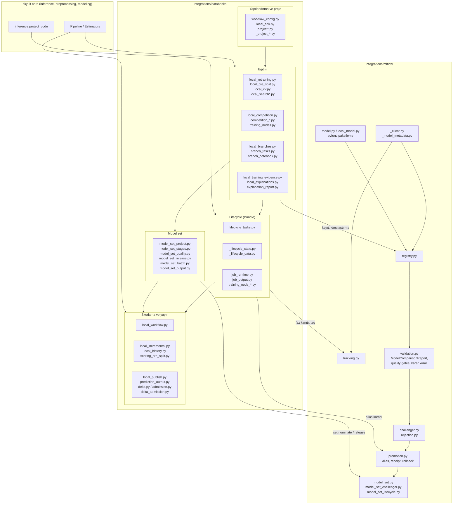
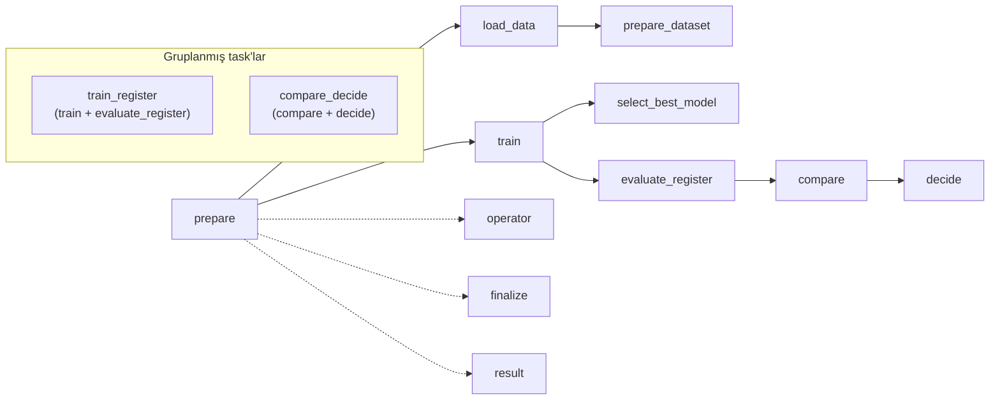
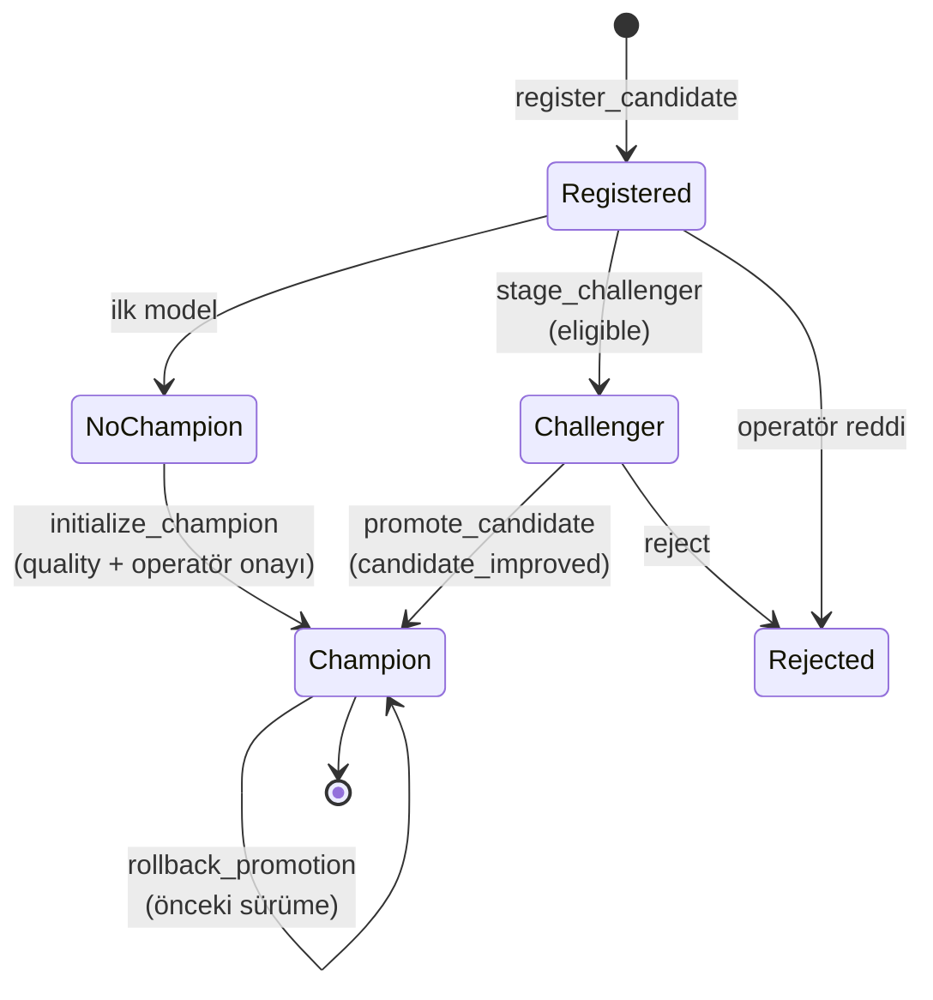
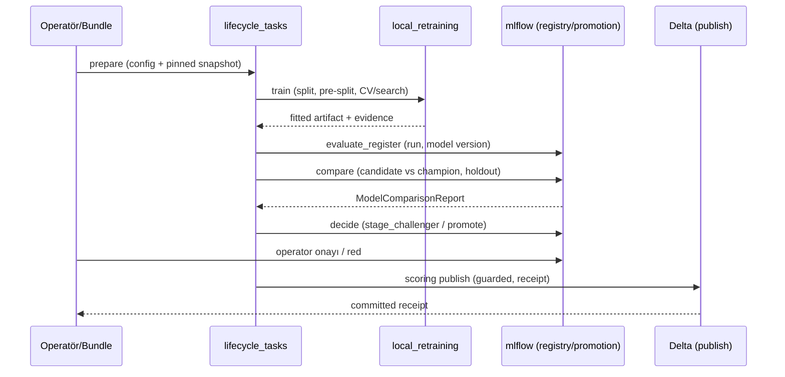

# Integrations haritası (mlflow + databricks)

Mermaid diyagramları VS Code'da "Markdown Preview" (Mermaid destekli) ile görüntülenir.
Kaynak: `skyulf-core/skyulf/integrations/` (databricks 52 modül, mlflow 13 modül).

## 1. Modül haritası

## 2. Lifecycle faz akışı (`PHASE_PREDECESSORS`)

Kesikli oklar: yalnızca `prepare` sonrası çalışma şartı (sıralama dışarıda zorlanır).
Her faz önce `attempt` tag'i yazar, sonra receipt üretir; belirsiz sonuçta retry
reddedilir (operatör incelemesi gerekir).

## 3. Champion / challenger / alias durumu

Karar nedenleri: `no_champion`, `quality_gate_failed`, `candidate_improved`,
`insufficient_improvement`. Planlanan: `guardrail_regression`,
`candidate_improved_secondary` (bkz. `GUARDRAIL_PLAN.md`).

## 4. Uçtan uca veri akışı

## 5. İyileştirme önerileri

| # | Öneri | Gerekçe | Öncelik |
|---|---|---|---|
| 1 | Çoklu metrik / guardrail kuralı | Tek metrik kararı diğer metriklerin düşüşünü yakalamıyor (`GUARDRAIL_PLAN.md`) | Yüksek |
| 2 | Drift izleme ve drift'ten retraining fazı | `profiling/drift.py` integrations'a bağlı değil; faz grafiğine `drift_check → retrain_trigger` eklenmeli | Yüksek |
| 3 | `local_retraining.py` (1700 satır) bölünmeli | Pre-split doğrulama yardımcıları (`_validate_*`, `_pre_split_*`) zaten `local_pre_split.py`'ye ait; sample/filter doğrulaması ve candidate fit/log ayrı modüllere alınabilir. CCN ve okunabilirlik | Yüksek |
| 4 | `promotion.py` (1035) ve `lifecycle_tasks.py` (875) bölünmeli | Alias event/receipt/rollback işleri ve faz yürütücüleri ayrı sorumluluklar | Orta |
| 5 | Faz grafiğini koddan üreten test | Dokümandaki diyagram ile `PHASE_PREDECESSORS` zamanla ayrışır; test Mermaid'i üretip doküman ile kıyaslasın | Orta |
| 6 | Belirsiz sonuç için operatör runbook'u | "Retry reddedilir, operatör incelemesi gerekir" ama nasıl inceleneceği tek yerde yazılı değil | Orta |
| 7 | `databricks/` düz yapısı alt paketlere ayrılabilir | 52 modül tek klasörde (`local_*` 25 adet). `training/`, `scoring/`, `model_set/`, `bundle/` gibi. `INTERNAL_API.md` alias yasakladığı için taşıma tek PR'da ve importlarla birlikte yapılmalı | Düşük (riskli) |
| 8 | Model-set için ortak karar kuralı | `evaluate_model_set_quality` her component'in geçmesini ister; guardrail/tie-break kuralı component bazında aynı çalışmalı | Orta |
| 9 | Local ve Bundle yolu arasında tekrar kontrolü | `local_workflow`/`local_sdk` ile `lifecycle_tasks` aynı eğitim/kanıt mantığını paylaşmalı (`local_training_evidence` doğru yön); yeni özellikler iki yola da uygulanmalı | Orta |

Önerilen sıra: 1 → 3 (guardrail eklemeden önce yer aç) → 2 → 8 → 5/6.
