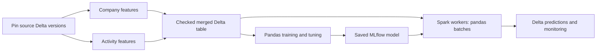

# Optional feature tables and pandas models on Spark

Keep the ready-table workflow when your input Delta table already contains the
required columns. `config/features.yml` starts with `groups: {}` and creates no
feature job. Model count and feature-group count are independent: four models can
share the same company/activity feature tables and one merged observation table.



## Configure data domains

Replace `config/features.yml` with a project-specific configuration. Use fully
qualified tables in the intended catalog/schema; this file currently uses exact
names, not deployment placeholders. Create the destination schema and grant the
job's Run-as identity access before running. Each output table must have one
owning producer, and must differ from every input and other output table.

```yaml
version: 1
base_table: workspace.demo.company_observations
output_table: workspace.demo.company_merged
keys: [company_id]
timestamp: observed_at
groups:
  company:
    source_table: workspace.demo.company_source
    output_table: workspace.demo.company_features
    transform: src/feature_groups/company.py:compute_features
    columns: [employee_count]
  activity:
    source_table: workspace.demo.activity_source
    output_table: workspace.demo.activity_features
    transform: src/feature_groups/activity.py:compute_features
    columns: [monthly_amount]
    lookup: asof
    allow_missing: false
```

The base table defines the observations and labels to preserve. Every base and
feature record must be unique and non-null on `(company_id, observed_at)`.
`observed_at` must already be a Spark date/timestamp of the same type in every
table. No implicit string parsing, timezone conversion or duplicate removal runs.

`exact` (the default) joins entity and timestamp. `asof` selects the most recent
feature row whose timestamp is at or before the observation. A feature timestamp
must represent when its values were valid and available for that observation;
this join does not infer historical availability from a separate arrival column.
No lookback bound is imposed by this first offline join implementation.

The merge retains all base columns and adds only the configured feature columns.
Names must be simple identifiers and distinct across all domains and the base
table. Missing matches fail unless `allow_missing: true`; an existing record with
a null feature value still counts as a match. Every join checks the original row
count, so losses or multiplication stop publication.

## Write Spark transformations

Create `src/feature_groups/company.py`:

```python
def compute_features(frame):
    """Return one row per company and observation time."""
    return frame.select("company_id", "observed_at", "employee_count")
```

Create `src/feature_groups/activity.py`:

```python
from pyspark.sql import functions as F

def compute_features(frame):
    """Aggregate transactions at the declared observation grain."""
    return frame.groupBy("company_id", "observed_at").agg(
        F.sum("amount").alias("monthly_amount")
    )
```

Each trusted function receives and returns a Spark DataFrame with exactly the
keys, timestamp and declared feature columns. Keep it deterministic and based on
that supplied frame. The job pins the declared input version and transform file
hash. It does not freeze undeclared helper files, external services or reads made
inside your function; package/version dependencies accordingly. The current
entry point is one contained Python module, not a general dependency graph.

Use these transformations for source joins, aggregations and fixed formulas.
Fit imputers, scalers, encoders and feature selectors inside training folds in
`src/features/`; do not learn their state from the entire merged table.

## Generate, deploy and run

```powershell
python src/tools/refresh_feature_graph.py
databricks bundle validate --strict -t test --profile YOUR_PROFILE
databricks bundle deploy -t test --profile YOUR_PROFILE
databricks bundle run features -t test --profile YOUR_PROFILE
```

The generator creates `resources/features.job.yml` and its thin notebook only
when groups are enabled, using the training job's
compute, runtime, Run-as/permissions, timeout and notification settings. The job
has `initialize_features`, one `feature_<group>` task per domain, and
`merge_features`. Independent domains can run concurrently when compute permits.
Re-run the generator after changing feature settings or inherited deployment
controls. A deployed graph/config mismatch fails before reading source records.

The job creates missing output Delta tables with change data feed enabled. Later
runs upsert changed keys and retain older observations. It does not delete records
removed from a source, replace entire table history or evolve schemas implicitly.
An existing output must have matching columns/types and CDF enabled. All inputs
must be Delta tables. Job evidence records source versions, transform hashes,
output versions, row counts and whether a group was reused.

Set `training_table` and `score_source_table` to the merged table in the project's
configuration, then run the normal training/scoring jobs. Feature production is a
separate upstream job; it does not automatically retrain or change model aliases.
Run this producer before the downstream jobs when fresh features are required.

For an ordinary full build, keep the `selected_groups` job parameter as `*`.
To recompute one domain, enter `company`; comma-separated names select several.
An empty value reuses every group and rebuilds only the merged observations.
Unselected groups must already exist: their Delta versions are pinned at
initialization. Tasks for reused groups report reuse without invoking transforms.

In Databricks **Repair run**, rerun a failed domain and its dependent merge task.
Repairs preserve the original input snapshot. If configuration or transform code
changed, start a new run; mixing changed code with prior task evidence is rejected.
External writes to the same feature destinations are unsupported: the job
serializes its own runs, but does not lock unrelated producers.

## Simplify training and inference settings

To convert an existing generated project to authoritative YAML files:

```powershell
python src/tools/migrate_config.py
python src/tools/smoke.py
python src/tools/preview.py --action train
python src/tools/refresh_training_graph.py
```

`training.yml` owns training/model/tuning settings and `inference.yml` owns
scoring settings. Common defaults can be shared by named models. Remaining
structural settings stay in `workflow.json`; moved settings must not also exist
there or in old Python model declarations. Migration preserves a byte-exact
`.skyulf-yaml-backup` and refuses custom factories it cannot safely translate.
Your Python preprocessing and business functions remain editable Python.
Existing JSON/Python projects continue to load until explicitly migrated.

For several models, keep shared values in `defaults` and list only differences.
For example, the following is an excerpt of a multi-target training configuration;
retain the source, split and registry settings created by migration:

```yaml
version: 1
defaults:
  training_layout: multi_target
  task: regression
  engine: pandas
  model:
    type: ridge_regression
    params: {alpha: 1.0}
models:
  revenue:
    target_column: revenue
    model_name: '{catalog}.{metadata_schema}.revenue{resource_suffix}'
  cost:
    target_column: cost
    model_name: '{catalog}.{metadata_schema}.cost{resource_suffix}'
    model:
      type: linear_regression
```

A per-model nested mapping replaces the entire shared mapping; it is not a deep
merge. Competition instead shares one target and evaluation split across its
candidate models. Tuning stays alongside each model as `tuning`, with the existing
`strategy`, `metric`, `n_trials` and `search_space` settings. Editing YAML changes
the next training run; saved models retain their original fitted configuration.

## Understand the scaling boundary

Use `engine: pandas` for training and `inference_mode: spark` for distributed
scoring (each setting belongs in its corresponding migrated YAML file).
The Bundle uses `mlflow.pyfunc.spark_udf`; model inputs arrive as pandas batches
on Spark workers. Saved preprocessing runs with fitted state before prediction;
it is not re-fitted on each batch. The library also has the separately scoped
`predict_spark`/`mapInPandas` interface.

`spark_udf_prediction_batch_rows: 10000` limits model-call chunk size inside a
worker, not total scoring rows and not every Arrow allocation. `max_rows` and
`max_input_mb` limit local training materialization. Distributed prediction does
not turn a local pandas estimator's `fit()` or tuning trial into distributed fit.
Spark still handles large reads, joins, aggregations and prediction distribution.

Newly certified exact sklearn estimators: DecisionTree, RandomForest and
ExtraTrees, each for regression and single-target classification. Plain and
tuned fitted variants are covered; custom subclasses/callbacks remain rejected.
Existing Linear/LogisticRegression and the previously admitted XGBRegressor
scope remain. Fitted MinMaxScaler now also supports pandas worker batches, with
finite affine state and saved column/range checks. Other preprocessing admission
is unchanged; this is not support for all Python estimators or every Skyulf node.

Model sets can use explicit row-local `weighted_sum`/`weighted_mean` outputs in
addition to independent component outputs. They require named numeric prediction
or probability inputs, finite weights and declared float64 outputs. Arbitrary
Python composition remains outside distributed admission.

For example, a model-set composition output can combine two numeric predictions:

```yaml
outputs:
  - name: combined_score
    version: '1'
    operation: weighted_mean
    params:
      inputs: [revenue__prediction, value__prediction]
      weights: [0.7, 0.3]
    columns:
      - name: combined_score
        dtype: float64
    required_components: [revenue, value]
```

In a migrated project, put this mapping under
`config/inference.yml` -> `model_set` -> `composition_config`, retaining the other
model-set destination/policy fields. Remove `combined_rules_path` when selecting
this declarative composition: both definitions cannot coexist. In a legacy
project, use the same `composition_config` in `src/modeling/model_set.py`.
Input names reference actual component keys; numeric weights cannot mix units into a
meaningful score automatically. Validate the business meaning of the combination.

## Unity Catalog lookup and online stores

The optional `skyulf-core[feature-store]` API exposes strict lookup specifications,
`create_feature_training_set`, `log_feature_model` and `score_feature_model`.
It uses the native Feature Engineering client and preserves TrainingSet lineage.
Time-series tables need the correct primary/TIMESERIES keys before SDK lookup.

These adapters are an initial SM-21a integration boundary. The generated lifecycle
still trains from its configured Delta table and uses its existing pyfunc scoring
route; it does not automatically switch to native Feature Engineering logging or
`score_batch`. Offline as-of joins above are separate from that service. Native
Feature Engineering acceptance remains pending. SM-21b online-store publication
and online serving lookup are not enabled by this change.

Platform references: [task dependencies and parallel execution](https://docs.databricks.com/aws/en/jobs/run-if),
[repairing selected tasks](https://docs.databricks.com/aws/en/jobs/repair-job-failures),
[Delta upserts](https://docs.delta.io/delta-update/), and
[Feature Engineering compatibility](https://docs.databricks.com/aws/en/release-notes/feature-store/databricks-feature-store).
