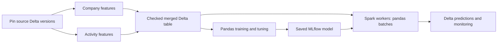

# Optional feature tables and pandas models on Spark

Keep the ready-table workflow when your input Delta table already contains the
required columns. `config/features.yml` starts with `groups: {}` and creates no
feature job. Model count and feature-group count are independent: four models can
share the same company/activity feature tables and one merged observation table.



## Configure data domains

`config/features.yml` includes the complete commented example below, wired to
the shipped `src/features/groups/company.py` and `activity.py` files. Replace
the two active disabled lines with that uncommented example; do not append
duplicate YAML keys. Adapt the configuration and both functions to your data.
The [groups README](src/features/groups/README.md) explains each file and field.
Use fully qualified tables in the intended catalog/schema; this file uses exact
names, not deployment placeholders. Create the destination schema and grant the
job's Run-as identity access before running. Each output table must have one
owning producer, and must differ from every input and other output table.

```yaml
version: 1
base_table: workspace.demo.company_observations
output_table: workspace.demo.company_merged
keys: [company_id]
timestamp: observed_at
groups:
  company:
    source_table: workspace.demo.company_source
    output_table: workspace.demo.company_features
    transform: src/features/groups/company.py:compute_features
    columns: [employee_count]
    lookup: exact
    allow_missing: false
  activity:
    source_table: workspace.demo.activity_source
    output_table: workspace.demo.activity_features
    transform: src/features/groups/activity.py:compute_features
    columns: [monthly_amount, transaction_count]
    lookup: asof
    allow_missing: false
```

Expected inputs are `company_observations(company_id, observed_at, churn)`,
`company_source(company_id, observed_at, employee_count)` and
`activity_source(company_id, observed_at, amount)`. `churn` is the example training
label; use your own target, or omit labels for a prediction observation table.
All three use the same key type and date type for `observed_at` in this example.
Activity input can contain many transactions per key/time. Its time must identify
the completed month's feature availability; it must not attach future totals to
an earlier event date. The example does not create a monthly window or infer late
arrival cutoffs. Add those rules explicitly for raw event data.

The base table defines the observations and labels to preserve. Every base and
feature record must be unique and non-null on `(company_id, observed_at)`.
`observed_at` must already be a Spark date/timestamp of the same type in every
table. No implicit string parsing, timezone conversion or duplicate removal runs.

`exact` (the default) joins entity and timestamp. `asof` selects the most recent
feature row whose timestamp is at or before the observation. A feature timestamp
must represent when its values were valid and available for that observation;
this join does not infer historical availability from a separate arrival column.
No lookback bound is imposed by this first offline join implementation.

The merge retains all base columns and adds only the configured feature columns.
Names must be simple identifiers and distinct across all domains and the base
table. Missing matches fail unless `allow_missing: true`; an existing record with
a null feature value still counts as a match. Every join checks the original row
count, so losses or multiplication stop publication.

## Write Spark transformations

All feature code lives under `src/features/`, with separate execution stages:

```text
src/features/
  groups/             Spark functions that produce shared Delta feature tables
    company.py        Shipped editable company-snapshot example
    activity.py       Shipped editable monthly-total/count example
  pre_split.py        Custom fixed row-filter functions
  preprocessing.py    Custom transformations fitted on training rows only
  scoring.py          Prediction eligibility and business outputs
  custom/             Scoring callbacks and advanced class examples
```

`base_table` supplies the observation rows, keys, timestamp and optional labels;
it is an existing input table, not a Python feature function. A group can select
existing columns or compute many new features from its `source_table`. Its
function returns the complete group DataFrame, and the feature job writes the
configured output table. You do not need one Python file per feature column.
The group name and filename need not match: `transform` connects them explicitly.

The shipped `src/features/groups/company.py` selects existing features:

```python
def compute_features(frame):
    """Return one row per company and observation time."""
    return frame.select("company_id", "observed_at", "employee_count")
```

The shipped `src/features/groups/activity.py` produces two features in one pass:

```python
from pyspark.sql import functions as F

def compute_features(frame):
    """Aggregate transactions at the declared observation grain."""
    return frame.groupBy("company_id", "observed_at").agg(
        F.sum("amount").alias("monthly_amount"),
        F.count(F.lit(1)).alias("transaction_count"),
    )
```

Each trusted function receives and returns a Spark DataFrame with exactly the
keys, timestamp and declared feature columns. Keep it deterministic and based on
that supplied frame. The job pins the declared input version and transform file
hash. It does not freeze undeclared helper files, external services or reads made
inside your function; package/version dependencies accordingly. The current
entry point is one contained Python module, not a general dependency graph.

Use these transformations for source joins, aggregations and fixed formulas.
Fixed operations such as type conversions or a known unit conversion may run here.
For historical features, use only information available at the observation time.
Fit imputers, scalers, learned encoders and feature selectors through
`config/preprocessing.yml` inside training folds; do not learn their state
from the entire merged table. For example, a missing-value mean learned from
both training and holdout rows would leak holdout information into the model.

A fixed formula used only by one model can instead be a preprocessing step.
Choose one owner for each transformation: do not compute the same conversion
again inside the model when the input table already contains it. Model recipes
in `config/preprocessing.yml` combine built-in steps and custom factories from
`src/features/preprocessing.py`; fixed filters live in `config/pre_split.yml`.

Only the root `groups/` directory is excluded from saved model source. Its
functions are executed and hashed by the feature job, not imported by the
model's recipe package. Keep custom model functions in their phase modules; do
not import from `groups/` in preprocessing or scoring. Keep Spark dependencies in
`deployment/requirements.txt`. Groups do not need `__init__.py`. Static smoke
still checks their Python syntax. Existing saved model versions keep their
original source snapshots.

## Generate, deploy and run

```powershell
python src/tools/refresh_feature_graph.py
databricks bundle validate --strict -t test --profile YOUR_PROFILE
databricks bundle deploy -t test --profile YOUR_PROFILE
databricks bundle run features -t test --profile YOUR_PROFILE
```

The generator creates `resources/features.job.yml` and its thin notebook only
when groups are enabled, using the training job's
compute, runtime, Run-as/permissions, timeout and notification settings. The job
has `initialize_features`, one `feature_<group>` task per domain, and
`merge_features`. Independent domains can run concurrently when compute permits.
Re-run the generator after changing feature settings or inherited deployment
controls. A deployed graph/config mismatch fails before reading source records.

The job creates missing output Delta tables with change data feed enabled. Later
runs upsert changed keys and retain older observations. It does not delete records
removed from a source, replace entire table history or evolve schemas implicitly.
An existing output must have matching columns/types and CDF enabled. All inputs
must be Delta tables. Job evidence records source versions, transform hashes,
output versions, row counts and whether a group was reused.

For this example, edit these fields in the existing `config/training.yml`
(retain its model, registry, split and other settings):

```yaml
defaults:
  training_table: workspace.demo.company_merged
  record_key_columns: [company_id, observed_at]
  input_columns: [employee_count, monthly_amount, transaction_count]
  target_column: churn
```

For independent-target projects, change overriding input/target settings under
`models.<name>` as needed. In `config/inference.yml`, set
`score_source_table: workspace.demo.company_merged`. The target is not a model
input; a separate unlabeled scoring base/merged table can be used when needed.
Put any learned missing-value handling in `config/preprocessing.yml`.

Run the normal training/scoring jobs after feature production. Feature production
is a separate upstream job; it does not automatically retrain or change model aliases.
Run this producer before the downstream jobs when fresh features are required.

For an ordinary full build, keep the `selected_groups` job parameter as `*`.
To recompute one domain, enter `company`; comma-separated names select several.
An empty value reuses every group and rebuilds only the merged observations.
Unselected groups must already exist: their Delta versions are pinned at
initialization. Tasks for reused groups report reuse without invoking transforms.

In Databricks **Repair run**, rerun a failed domain and its dependent merge task.
Repairs preserve the original input snapshot. If configuration or transform code
changed, start a new run; mixing changed code with prior task evidence is rejected.
External writes to the same feature destinations are unsupported: the job
serializes its own runs, but does not lock unrelated producers.

## Simplify training and inference settings

New projects already use `config/training.yml` and `config/inference.yml`.
There is no migration step and no generated Python model declaration file.
`training.yml` owns training/model/tuning settings; `inference.yml` owns scoring
settings and model-set publication. Ordered feature recipes live in
`config/pre_split.yml` and `config/preprocessing.yml`; custom functions remain
editable in `src/features/pre_split.py` and `preprocessing.py`. Duplicate setting
owners fail validation.

```powershell
python src/tools/smoke.py
python src/tools/preview.py --action train
python src/tools/refresh_training_graph.py
```

For several models, keep shared values in `defaults` and list only differences.
For example, the following is an excerpt of a multi-target training configuration;
retain the source, split and registry settings created by initialization:

```yaml
version: 1
defaults:
  training_layout: multi_target
  task: regression
  engine: pandas
  model:
    type: ridge_regression
    params: {alpha: 1.0}
models:
  revenue:
    target_column: revenue
    model_name: '{catalog}.{metadata_schema}.revenue{resource_suffix}'
  cost:
    target_column: cost
    model_name: '{catalog}.{metadata_schema}.cost{resource_suffix}'
    model:
      type: linear_regression
```

A per-model nested mapping replaces the entire shared mapping; it is not a deep
merge. Competition instead shares one target and evaluation split across its
candidate models. Tuning stays alongside each model as `tuning`, with the existing
`strategy`, `metric`, `n_trials` and `search_space` settings. Editing YAML changes
the next training run; saved models retain their original fitted configuration.

## Understand the scaling boundary

Use `engine: pandas` for training and `inference_mode: spark` for distributed
scoring (each setting belongs in its corresponding YAML file).
The Bundle uses `mlflow.pyfunc.spark_udf`; model inputs arrive as pandas batches
on Spark workers. Saved preprocessing runs with fitted state before prediction;
it is not re-fitted on each batch. The library also has the separately scoped
`predict_spark`/`mapInPandas` interface.

`spark_udf_prediction_batch_rows: 10000` limits model-call chunk size inside a
worker, not total scoring rows and not every Arrow allocation. `max_rows` and
`max_input_mb` limit local training materialization. Distributed prediction does
not turn a local pandas estimator's `fit()` or tuning trial into distributed fit.
Spark still handles large reads, joins, aggregations and prediction distribution.

Newly certified exact sklearn estimators: DecisionTree, RandomForest and
ExtraTrees, each for regression and single-target classification. Plain and
tuned fitted variants are covered; custom subclasses/callbacks remain rejected.
Existing Linear/LogisticRegression and the previously admitted XGBRegressor
scope remain. Fitted MinMaxScaler now also supports pandas worker batches, with
finite affine state and saved column/range checks. Other preprocessing admission
is unchanged; this is not support for all Python estimators or every Skyulf node.

Model sets can use explicit row-local `weighted_sum`/`weighted_mean` outputs in
addition to independent component outputs. They require named numeric prediction
or probability inputs, finite weights and declared float64 outputs. Arbitrary
Python composition remains outside distributed admission.

For example, a model-set composition output can combine two numeric predictions:

```yaml
outputs:
  - name: combined_score
    version: '1'
    operation: weighted_mean
    params:
      inputs: [revenue__prediction, value__prediction]
      weights: [0.7, 0.3]
    columns:
      - name: combined_score
        dtype: float64
    required_components: [revenue, value]
```

Put this mapping under
`config/inference.yml` -> `model_set` -> `composition_config`, retaining the other
model-set destination/policy fields. Remove `combined_rules_path` when selecting
this declarative composition: both definitions cannot coexist. Input names reference actual component keys; numeric weights cannot mix units into a
meaningful score automatically. Validate the business meaning of the combination.

## Unity Catalog lookup and online stores

Native feature lookup is optional. Without `feature_lookup`, the project continues
to train from its ready or merged Delta table and score through the ordinary
Skyulf pyfunc route. With `feature_lookup`, training uses Databricks Feature
Engineering and the saved model uses native `score_batch` for lookup and inference.
This is separate from the explicit merged-table workflow described above.

To enable it, add the following fields under `defaults` in `config/training.yml`
(or under an individual model for a multi-target project):

```yaml
engine: pandas
training_table: "{catalog}.{input_schema}.observations"
input_columns: [account_balance, recent_transactions]
feature_lookup:
  lookups:
    - table_name: "{catalog}.{input_schema}.customer_history"
      lookup_key: [customer_id]
      feature_names: [account_balance, recent_transactions]
      timestamp_lookup_key: observed_at
      timestamp_type: timestamp
      lookback_seconds: 2592000
```

Keep the model's target and record keys in the training configuration. The base
table must contain those columns plus `customer_id` and `observed_at`; it must
not already contain the fetched feature columns. Direct model inputs not listed
in a lookup must remain in the base table. Set `inference_mode: spark` in
`config/inference.yml` and point its `score_source_table` at the corresponding
unlabeled observations. For exact lookup, omit the timestamp and lookback fields.

Add `databricks-feature-engineering==0.18.1` to `deployment/requirements.txt`,
which all generated jobs share. The library's optional `feature-store` extra
requires SDK 0.18.1 or later within major version zero. The selected Databricks
runtime must support that SDK. Feature tables must already have real Unity
Catalog primary keys and, for historical lookup, a TIMESERIES primary key.
The feature-group job creates ordinary Delta tables; it does not declare these
catalog constraints automatically. Refer to the platform's
[point-in-time lookup setup](https://docs.databricks.com/aws/en/machine-learning/feature-store/time-series).

The lifecycle records the base Delta version and each feature table's ID/version
at preparation. It validates actual null/duplicate feature keys, key types and
timestamp types before SDK joins. Training keeps record/time/weight metadata for
splitting, then excludes it from the logged model's inputs. Separate tasks
reconstruct native TrainingSet lineage from the same frozen declaration. Fitted
preprocessing remains inside the model and is not fitted again during scoring.
Driver training row/byte limits still apply; lookup and batch scoring run in Spark.

Single-model and competition training retain this lineage when publishing the
winner. A model set combines compatible component lookups into one native package;
conflicting table versions, key/time semantics, or direct/fetched input meanings
are rejected. Scoring validates the complete package, exact named prediction
schema and record-key/cardinality preservation. Spark monitoring reconstructs
the feature values for scored keys from the same saved lookup evidence.

Current limits are explicit:

- The initial `training_snapshot` policy requires feature tables to remain at
  their training IDs/versions. Feature updates require refreshed training and an
  explicit prediction rebuild/new target; a base-table no-op cannot hide them.
- Prevent concurrent feature-table writes during training, scoring and monitoring.
  The native SDK has no lookup `versionAsOf` argument. Before/after guards detect
  changes but do not lock tables.
- Nullable integer/boolean transport requiring Skyulf's post-lookup encoder is
  rejected. The SDK currently provides no hook for that encoder.
- Configure the active MLflow tracking/registry URIs to match the project's
  explicit URIs before native scoring. The SDK downloads the concrete model URI
  in that context; aliases are resolved before execution.
- Local SDK and Spark checks are separate from native workspace acceptance,
  which is still pending. SM-21b online-store publication and serving lookup
  remain disabled. Native-feature monitoring currently supports Spark batch only.

Platform references: [task dependencies and parallel execution](https://docs.databricks.com/aws/en/jobs/run-if),
[repairing selected tasks](https://docs.databricks.com/aws/en/jobs/repair-job-failures),
[Delta upserts](https://docs.delta.io/delta-update/), and
[Feature Engineering compatibility](https://docs.databricks.com/aws/en/release-notes/feature-store/databricks-feature-store).
