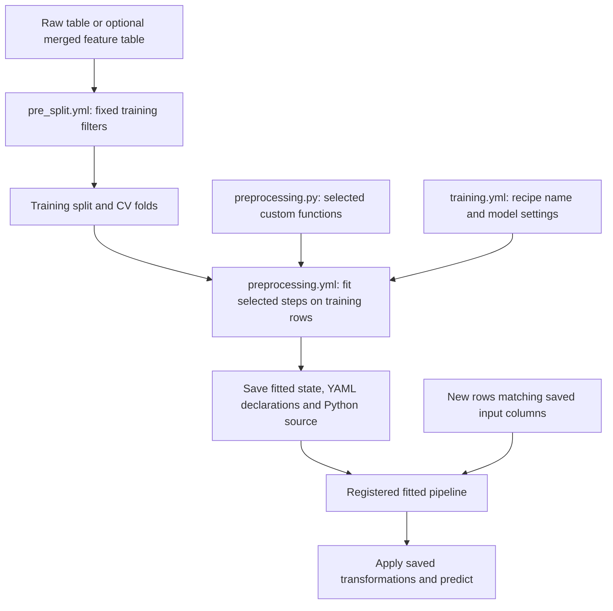

# Preprocessing and custom features

In this Bundle, **YAML defines ordered recipes; Python contains custom functions**.
Built-in and custom steps use the same list. There is no second implementation
of imputation, scaling or encoding in your project: each built-in dictionary
calls its existing Skyulf transformer.

## Which file should I edit?

| File | Purpose | Example |
| --- | --- | --- |
| `config/features.yml` + `src/features/groups/` | Optional Spark calculations producing shared Delta feature tables and a merged table | Customer transaction totals from another source |
| `config/pre_split.yml` | Ordered fixed eligibility filters before the training split; no learned statistics | Drop training rows with no known target |
| `config/preprocessing.yml` | Ordered built-in and custom transformations; fitted inside each training fold | Imputation, scaling, encoding, interaction |
| `src/features/preprocessing.py` | Implement your own transformation functions, used only when a recipe calls them | Frequency encoding or a business formula |
| `src/features/pre_split.py` | Implement your own fixed row filters, selected by `config/pre_split.yml` | Allow ages between fixed limits |
| `config/training.yml` | Select recipes, inputs, target, model, tuning and CV | `preprocessing_recipe: default` |
| `src/features/scoring.py` + `custom/scoring_custom.py` | Eligibility and business outputs around predictions | Skip ineligible rows; derive a score band |
| `config/inference.yml` | Batch scoring source, model selection and prediction destination | `prediction_table` |

Defining a Python function does not execute it. Select its factory with `custom`
in the matching YAML list; `params` supplies its keyword arguments. A `groups/`
function is selected separately by `features.yml`; its filename need not match a table name.
See [FEATURE_TABLES.md](FEATURE_TABLES.md) for that optional upstream workflow.



## The six-step customer example in this template

Start with a generated **single classification model**, `engine: pandas`, and
an input table containing `customer_id`, `age`, `income`, `tenure`, `segment`
and the target `churn`. Keep `customer_id` as a record key, outside model inputs.
No upstream feature group is needed for this example.

Update these fields in the existing `config/training.yml`. This is an excerpt:
retain the generated table, registry, record-key, split, quality and resource
settings. Use a classification quality metric. Remove an existing `tuning`
block if you want to fit exactly the fixed model below.

```yaml
version: 1
defaults:
  task: classification
  input_columns: [age, income, tenure, segment]
  target_column: churn
  preprocessing_recipe: default
  pre_split_recipe: none
models:
  main:
    model:
      type: random_forest_classifier
      params: {n_estimators: 60, max_depth: 6, n_jobs: 1, random_state: 42}
```

Replace `config/preprocessing.yml` with this declaration. The `default` recipe
runs because `training.yml` selects it above; `none` remains an empty alternative.

```yaml
version: 1
recipes:
  default:
    - name: segment_fill
      transformer: SimpleImputer
      params: {columns: [segment], strategy: most_frequent}
    - name: income_by_segment
      transformer: GroupImputer
      params: {columns: [income], group_by: segment, strategy: mean}
    - name: numeric_fill
      transformer: SimpleImputer
      params: {columns: [age, tenure], strategy: mean}
    - name: customer_interaction
      transformer: FeatureInteraction
      params: {columns: [income, tenure], degree: 2}
    - name: numeric_scale
      transformer: StandardScaler
      params: {columns: [age, income, tenure, income_x_tenure]}
    - name: segment_encoding
      transformer: OneHotEncoder
      params: {columns: [segment], handle_unknown: ignore, max_categories: null}
  none: []
```

`name` labels a step in reports; `transformer` selects the existing Skyulf node;
`params` configures it. None of these names requires a corresponding Python file.
Steps run top to bottom: fill the grouping column before using it, create
`income_x_tenure` before scaling it, then encode the category. YAML uses `null`
for an unset nullable parameter. Scaling is included to demonstrate preprocessing;
the random forest itself does not require scaled inputs.

## Where do my custom steps go?

For a built-in step, add its YAML dictionary above. For a custom calculation,
write the functions and factory in `src/features/preprocessing.py`. The shipped
`log_feature` example is already there. Add this entry immediately after
`income_by_segment` in the selected YAML list:

```yaml
- custom: preprocessing.log_feature
  params: {column: income}
```

The factory adds `log_income` by calling `column_step`. No import or duplicate
Python recipe list is needed. `custom` is a dotted path relative to the saved
feature package; it names a top-level factory, not a Python expression. The
factory returns one existing Core step. An optional `name` overrides its label.
A `fitted_step` has learning and apply functions: training saves learned state;
prediction only applies that state. Keep fixed row-filter factories in
`src/features/pre_split.py` and select them from `config/pre_split.yml`, for example:

```yaml
version: 1
recipes:
  default:
    - custom: pre_split.value_range
      params: {column: age, minimum: 0, maximum: 120}
  none: []
```

To activate this filter, change `pre_split_recipe: none` to `default` in the
training excerpt. Scoring's default `pre_split` mode reuses the saved filters;
filters that read the target need `SKIP_TARGET_PRE_SPLIT_STEPS=True` in `scoring.py`.

### Does `custom:` work for every custom function?

It is a general selector, not a special case for `log_feature`. The example calls
`src/features/preprocessing.py` -> `log_feature(column="income")` to **build one
step**. That factory returns `column_step(...)`; Skyulf later calls its calculation
function with the actual rows. YAML does not pass a DataFrame into the factory.

| Custom work | Factory returns | Selected from |
| --- | --- | --- |
| Fixed formula producing one or more columns | `column_step(...)` | `preprocessing.yml` |
| Transformation learning state from training rows | `fitted_step(...)` | `preprocessing.yml` |
| Fixed row eligibility mask | `filter_step(...)` | `pre_split.yml` |
| Advanced Calculator/Applier pair | `custom_step(...)` | Its supported phase; see `custom/advanced_class_step.py` |
| Spark aggregation producing a feature table | Spark DataFrame | `features.yml` -> `groups`, using `file.py:function` |

The factory must be a top-level function defined in the referenced captured
project module, accept the YAML `params` as keyword arguments, and return **one
valid Core step dictionary**. Select multiple factories as separate YAML entries.
A raw `def transform(df)` returning a DataFrame, a sklearn transformer instance,
a list of steps or a lambda is not a valid `custom:` factory. Wrap the calculation
using the matching helper; do not rewrite its business logic inside the loader.

Calculation functions used by the helpers must also be saved top-level functions.
`column_step`/`fitted_step` preserve rows and return one value per row per declared
output; their callbacks receive pandas frames. A fitted step separates learning
from applying a saved, JSON-compatible state dictionary. `filter_step` returns
one non-null Boolean per input row, uses fixed row-local rules and changes no
values. Pre-split is not a place to fit a scaler or learn population statistics.
Declare external dependencies in the project's deployment requirements and
package declared assets; YAML does not install packages or capture live services.

These custom examples work in the local pipeline. Spark batch and REST serving
require a supported fitted pipeline; an arbitrary custom function is not
automatically admitted for those runtimes. Check the scope in
[FEATURE_TABLES.md](FEATURE_TABLES.md) and [SERVING.md](SERVING.md).

Keep named recipes under `recipes` in each phase YAML file and select one
per model using `preprocessing_recipe`. Competition can select different
preprocessing recipes per candidate while sharing pre-split eligibility.
Independent-target projects can select preprocessing and pre-split recipes per
model. Both YAML files require `version: 1` and a `default` recipe; `none` means
no steps. Recipes prefixed `example_` remain inactive until selected. Do not add
Python `build_preprocessing` or `build_pre_split_steps` builders for a phase owned
by YAML. Existing Python-only projects continue to work without these YAML files.

Check the resolved project before training:

```powershell
python src/tools/smoke.py
python src/tools/preview.py --action train
python src/tools/preview.py --list-preprocessors
```

Smoke validates the declarations without calling custom factories; preview
resolves the selected recipes and executes trusted factories. Keep I/O out of
module imports and factories.

The saved model contains resolved steps, fitted state, captured YAML declarations
and project Python. Prediction does not re-read current recipe files or fit new
means.
Edits apply to newly trained model versions. Upstream Spark feature jobs are
separate: a model trained on a merged table still needs those input features;
it does not automatically execute the upstream joins from a raw table.

## Check saved preprocessing across request sizes

See [Preprocessing context and saved-model checks](PREPROCESSING_CONTEXT.md)
for the complete explanation, a runnable fit/save/load/probe example, custom
function/class declarations, and how to interpret each report status.

`artifact` is the loaded fitted pipeline; `sample` is a small frame matching its
input schema; `report` is diagnostic evidence about its preprocessing. The probe
compares existing apply behavior across request sizes without learning again.
A fitted group-mean lookup can be `row` context because the mean was already
saved during training. Request-time grouping or rolling calculations need their
actual groups/history and are reported separately.

The probe is explicitly invoked. It does not run automatically in training,
scoring or serving, and it does not grant Spark/REST eligibility.

## Why does the standalone serving demo have a different YAML shape?

The repository's `examples/databricks_raw_serving/config.yml` is a small Core API
demo. Its Python code passes `pipeline.preprocessing` and `pipeline.modeling`
directly to `fit_local_workflow`. The Bundle loader deliberately rejects those
nonempty inline definitions in `training.yml`: steps come from
`config/preprocessing.yml`, and the model comes from `models.<name>.model`.
Use the placement above for this generated project.
Do not define the same step in both YAML and Python.

## Is a prediction table required after training?

No. The main template separates `train` and `score`. Set `score_handoff: disabled`
in `config/inference.yml` to prevent automatic scoring after an alias change.
Choose `scoring_mode: manual` during initialization to omit a score-job schedule.
For an existing project, also update matching `deployed_score_handoff` parameters
in `resources/*.job.yml` and redeploy; the runtime rejects a YAML/job mismatch.
Check `resources/score.job.yml` for a schedule and remove it if scoring should
only run on demand. Redeploy that change as well.
The configured `prediction_table` is a destination for the separate score job;
its presence alone does not create or populate the table. Training may still
write its own dataset snapshots and lifecycle evidence.

The demo's `write_batch_predictions` switch and `training_batch_predictions`
output are demo-only. `status: skipped` means the optional training-time write
was not requested. It says nothing about the demo's separate REST/SQL tasks,
which explicitly create their own prediction tables. Endpoint callers can
consume predictions without writing any table; see [SERVING.md](SERVING.md).
